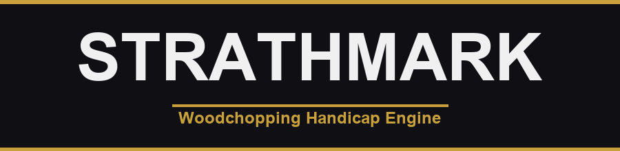

# STRATHMARK

Woodchopping handicap engine - pip-installable calculation core.

Extracted from STRATHEX (the full tournament management system) so that
external applications (scoring apps, tournament software, analysis tools)
can compute STRATHEX-compliant handicap marks without depending on the full
STRATHEX codebase.

## Status

Version 0.2.0 - fully implemented. All modules complete. 48 tests passing
(28 calculator + 13 variance + 7 integration).

## Install

```bash
pip install strathmark
# With HTTP API:
pip install strathmark[api]
# With local LLM (Ollama):
pip install strathmark[llm]
# Development:
pip install strathmark[dev]
```

## Quick start

```python
from strathmark import HandicapCalculator
from strathmark.predictor import CompetitorRecord, WoodProfile, HistoricalResult
from datetime import date

competitors = [
    CompetitorRecord(
        name="Alice",
        history=[
            HistoricalResult("SB", 28.4, "Pine", 300, 5, date(2025, 3, 1)),
            HistoricalResult("SB", 27.9, "Pine", 300, 5, date(2024, 11, 15)),
            HistoricalResult("SB", 29.1, "Pine", 300, 5, date(2024, 6, 20)),
        ],
    ),
    CompetitorRecord(
        name="Bob",
        history=[
            HistoricalResult("SB", 35.2, "Pine", 300, 5, date(2025, 3, 1)),
            HistoricalResult("SB", 36.0, "Pine", 300, 5, date(2024, 11, 15)),
        ],
        division="Open",
    ),
]

wood = WoodProfile(species="Pine", diameter_mm=300, quality=5)

calc = HandicapCalculator()
results = calc.calculate(competitors, wood, event_code="SB")
sheet = calc.build_start_sheet(results, event_name="300mm SB", event_code="SB", wood=wood)
print(sheet.render())
```

## Running tests

```bash
cd STRATHMARK
pip install -e ".[dev]"
pytest tests/ -v
```

## Design rules (enforced in all sessions)

- Mark floor: 3 seconds (never lower under any circumstances)
- Mark ceiling: 183 seconds system-wide (180s time limit + 3s minimum mark)
- Gap logic: slowest -> Mark 3; each second faster -> +1 mark; ceiling arithmetic (round UP)
- Variance: absolute +/- 3 seconds ONLY -- proportional variance is forbidden
- Prediction cascade: Manual > LLM > ML > Panel mark fallback
- Time-decay: exponential decay, 2-year half-life (730 days)
- Tournament weighting: same-tournament results = 97% weight, historical = 3%
- Output: plain text only, no emojis, no ANSI color codes
- Style: lean and simple, no unnecessary complexity

## Mark formula

```
gap = predicted_time(competitor) - predicted_time(front_marker)
mark = 3 + int(gap + 0.999)   # ceiling arithmetic
mark = min(mark, 183)          # system-wide ceiling
```

The `int(gap + 0.999)` pattern is used instead of `math.ceil()` to match
the legacy STRATHEX implementation exactly. Values within 0.001s of an
integer boundary are treated as exact (no rounding up).

## Package structure

```
strathmark/
    __init__.py         Public API (HandicapCalculator, CompetitorRecord, WoodProfile)
    calculator.py       Mark computation, gap logic, start sheet
    predictor.py        Prediction cascade (Manual > LLM > ML > panel fallback)
    variance.py         Absolute variance model, Monte Carlo simulation (2M races)
    wood.py             Species properties, diameter scaling, quality adjustment
    decay.py            Exponential time-decay weighting (2-year half-life)
    fallback.py         Panel marks and event baseline fallbacks
    config.py           All constants as frozen dataclasses
    store.py            SQLite local result store (~/.strathmark/results.db)
    db.py               Supabase/PostgreSQL backend (push/pull results)
    loader.py           Excel workbook loader (woodchopping_clean.xlsx)
    utils.py            Column standardization, prediction accuracy scoring
    analytics.py        Backtesting, competitor profiling, performance history
    fairness.py         AI-assisted fairness assessment (Ollama LLM)
    visualization.py    Plain-text simulation summaries and ASCII bar charts
    llm.py              Ollama connection management and prompt execution
    api.py              FastAPI REST API (calculate, predict, simulate, results)
tests/
    test_calculator.py  Mark invariants (floor, ceiling, gap logic) -- 28 tests
    test_variance.py    Absolute variance, consistency ratings, Monte Carlo -- 13 tests
    test_integration.py Full pipeline from Excel workbook to mark sheet -- 7 tests
scripts/
    train_model.py          XGBoost training pipeline (26 features, temporal CV)
    evaluate_llm_prompts.py Prompt template evaluation and selection
    import_legacy.py        Legacy Excel import with validation
```

## Relationship to STRATHEX

STRATHMARK contains only the calculation engine. It has no UI, no Excel
tournament management, no save/load state, and no championship simulator.
STRATHEX imports STRATHMARK as a dependency (future plan) to keep the
handicap logic in one maintainable place.

Source cross-reference table (STRATHEX -> STRATHMARK):

| STRATHEX file | STRATHMARK module |
|---|---|
| woodchopping/handicaps/calculator.py | calculator.py |
| woodchopping/predictions/baseline.py | predictor.py + decay.py |
| woodchopping/predictions/prediction_aggregator.py | predictor.py |
| woodchopping/predictions/ai_predictor.py | predictor.py (LLM level) + llm.py |
| woodchopping/predictions/ml_model.py | predictor.py (ML level) |
| woodchopping/predictions/diameter_scaling.py | wood.py |
| woodchopping/simulation/monte_carlo.py | variance.py |
| woodchopping/predictions/calibration.py | predictor.py |
| woodchopping/data/preprocessing.py | predictor.py (ML feature engineering) |
| config.py | config.py |
