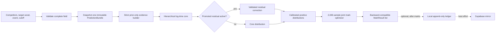

# STRATHMARK Architecture

STRATHMARK 2.0.0 turns a field of competitor histories and a target wood profile into
positive finish-time distributions and bounded integer handicap marks. The base package
works offline. Prediction does not depend on a database, LLM, or optional native ML
library.

The complete model contract is in [`PREDICTION_ENGINE_V2.md`](PREDICTION_ENGINE_V2.md).

## Field request flow



The calculator validates every input before model or persistence work. It resolves one
exclusive UTC cutoff and snapshots one bundle for the entire field, preventing a file
change from mixing model versions in one start sheet. The trusted ledger attempt occurs
only after every mark is final and cannot block returned marks.

## Module map

| Module | Responsibility |
| --- | --- |
| `features.py` | closed evidence allowlist, stable identity, UTC cutoff, exclusion diagnostics, species-property joining |
| `prediction_v2.py` | robust hierarchical log-time core, competitor state, cross-event borrowing, conformal calibration, safe JSON artifact |
| `residual.py` | optional CatBoost residual runtime and promotion-compatible artifact checks |
| `validation.py` | rolling-origin evaluation, promotion gates, chronological residual construction |
| `predictor.py` | immutable providers, artifact precedence, V2-to-five-key compatibility projection, temporary legacy rollback |
| `calculator.py` | field validation, performance `std_dev`, ordering, optimizer call, optional trusted write |
| `mark_optimizer.py` | deterministic joint posterior mark search and rounded-gap fallback |
| `variance.py` | separate Monte Carlo fairness audit for an already assigned sheet |
| `ledger.py` | local append-only SQLite request, prediction, feature, and settlement records |
| `api.py` | stateless public routes and authenticated ledger/result routes |
| `db.py` | optional Supabase state, mirror, and legacy integration helpers |
| `loader.py`, `store.py` | workbook input and local result-history storage |
| `llm.py`, `llm_roles.py`, `fairness.py` | optional narrative analysis only; no numeric V2 authority |

## Evidence boundary

`features.py` is the only raw-history-to-model boundary. Active evidence is stable
competitor identity/history, event, strictly prior result date, measured time, diameter,
species and six physical properties, and gender including missing. The builder excludes
same-day, future, invalid-date, and undated rows and never parses notes for penalties,
DNFs, or timeouts.

Division, round/heat, venue, lane/stand, run order, exact material identity,
quality/moisture, weather, equipment, fatigue, penalty/DNF state, same-tournament
weighting, and field strength are explicit numeric no-ops. They cannot enter the model
without a versioned allowlist and new temporal evidence.

## Statistical core and uncertainty

The core models log time with robust Huber/ridge population effects and partially pooled
competitor state. Event, log-diameter ratio, species physical properties,
gender/missingness, recency, history depth, bounded trend, and cross-event history are
used only when supported by earlier rows. Predictions have positive support.

Chronological split-conformal residuals create the central 90% forecast interval. The
interval's lower/upper bounds, nominal coverage, calibration state, and pooling scope are
public. `MarkResult.std_dev` remains performance variability for race simulation; it is
not forecast uncertainty.

The optional residual learner is an additive correction to the core, not a second
opinion. It activates only after its manifest proves the frozen promotion gates. No
residual is active in the 2.0.0 packaged bundle.

## Compatibility projection

The package keeps the existing `get_all_predictions()` keys:

```text
manual   operator override; interval-free and not training evidence
llm      always None numerically
ml       promoted residual correction, when active
baseline V2 hierarchical core
panel    static broad event prior
```

`get_best_prediction()` chooses manual, promoted residual, core, then panel. Legacy
arguments remain callable but inactive context is ignored. The explicit
`STRATHMARK_PREDICTION_ENGINE=legacy` selector is a one-release baseline-only rollback;
it never invokes a numeric LLM.

## Mark assignment

`mark_optimizer.py` draws 2,048 deterministic common-random-number samples and runs at
most eight coordinate passes. It minimizes equal-win-probability error, then expected
finish spread, then departure from rounded median-gap marks, then the input-order tuple.
It preserves floor, ceiling, monotonicity, input-order ties, and at least one Mark 3.

Any optimizer failure returns the established rounded-gap sheet and records why. The
separate `variance.py` simulation accepts up to 250,000 races and audits results after
marks are assigned; it does not choose V2 marks.

## Persistence boundaries

There are three distinct persistence concerns:

1. `ResultStore` holds local historical results for applications.
2. `PredictionLedger` holds trusted, immutable prediction and settlement evidence.
3. Supabase/MNEMEX helpers support optional synchronization and analytics.

Public `/predict` and `/calculate` do not write the ledger. Authenticated
`/ledger/calculate` requires stable IDs and a request key. SQLite is authoritative for
the race-day write. The canonical request is hashed; names, notes, and the full raw
payload are not retained. Optional cloud mirroring uses a replayable local outbox plus
migrations 005-006's service-role RPC, versioned request hashes, and forced RLS. Delivery is off the calculation
response path; pending or failed delivery is visible in status and non-blocking.

## Artifact architecture

The V2 core is bounded-size, checksummed JSON with schema, feature, canonicalization,
training-cutoff, model, and calibration versions. Pickled core models are not loaded.
Artifact precedence is environment override, supported local path, packaged artifact,
then broad prior. Backdated requests reject newer artifacts.

The packaged model is `strathmark/models/prediction_v2_core.json`. `python
train_model.py` verifies the artifact, source checksum, manifest, and locked report
without rescoring the locked rows.

## Public and internal API

Package-root exports are the stable Python surface. New V2 dataclass fields were
appended with defaults, and result order remains slowest-to-fastest. Internal posterior
metadata exists to replay optimizer distributions but is not a mutable model API.

REST exposes stateless prediction/calculation/simulation and protected result/ledger
operations. `/health` reports prediction components separately from narrative Ollama
availability.

## Downstream boundary

STRATHMARK is the reusable engine; STRATHEX and tournament applications are consumers.
Consumers should pin `strathmark==2.0.*`, pass stable competitor IDs and an explicit
cutoff, inspect warnings/degraded state, and treat legacy context fields as inactive.
Tournament software is expected eventually to capture the deferred factors; capture
alone does not activate them until a future model version validates them.
