# STRATHMARK Architecture

## Status and authority

V3 is an implemented release candidate under exact-source verification. Its older
rehearsal is stale after current source changes. V2 remains the trusted production
authority until an explicit cutover. No production authority has changed, the consumer
endpoint has not switched, and V2 remains runnable and writable.

The two engines are deliberately separate:

| Boundary | V2 | V3 |
| --- | --- | --- |
| Namespace | `strathmark.*` | `strathmark.v3.*` |
| Numeric design | one prior-only core plus optional residual | blind formula + ML + LLM council ensemble |
| Evidence boundary | exclusive historical date | historical cutoff plus tournament/round epoch |
| Persistence | V2 ledger and shadow contract | V3 event authority and rebuildable projections |
| Consumer contract | public/ledger and six `/v1/shadow/*` routes | frozen ten-route `/v3/*` contract |
| Authority now | trusted production | implemented release candidate, rehearsal only |

V3 does not mutate V2 receipts or project itself through V2's five keys. Cutover is one
explicit tournament-boundary authority change, never a request-by-request fallback.

## V3 data flow

```mermaid
flowchart LR
    A["Verified history + tournament result events"] --> B["Cutoff + frozen round epoch"]
    B --> C["Canonical pseudonymous evidence packets"]
    C --> D["Transparent formula"]
    C --> E["Universal + specialist ML"]
    C --> F["Blind 3-member LLM council"]
    D --> G["Deterministic validation"]
    E --> G
    F --> G
    G --> H["Dual-state capability"]
    G --> I["Predictive + consequence credibility"]
    H --> J["Weighted linear distribution pool"]
    I --> J
    J --> K["Consequence disagreement gate"]
    K --> L["Fairness-frontier optimizer + Mark-3 rebase"]
    L --> M["Immutable field receipt"]
    M --> N["Green/amber/red approval projection"]
    N --> O["Atomic issue acknowledgment"]
    O --> P["Complete-roster atomic settlement"]
    P --> Q["Seven durable derivation reactions"]
    Q --> A
```

The circular edge does not mean a result can change its own race. All fields in a round
share one epoch. Settled results become input only after the legal boundary to the next
round. Capability, invalidation, scoring, coverage, weights, readiness, and credibility
must all close before the derivation barrier opens; none inserts a judge decision.

## Layers

### Contracts

`strathmark/v3/contracts/` owns closed dataclasses, identifiers, event and forecast
vocabularies, receipt schemas, canonical JSON, numeric bounds, and error types. Canonical
bytes and digests are part of the authority protocol, not serialization convenience.

### Domain

`strathmark/v3/domain/` contains deterministic evidence folding, capability state,
credibility, pooling, joint dependence, disagreement, state machines, and the optimizer.
It performs no environment reads, storage, provider I/O, or background work.

### Application

`strathmark/v3/application/` coordinates expected-version commands, rolling cards,
field assembly, approvals, issue, settlement, lifecycle, automated factory work,
operational status, recovery proof, and cutover preparation. Ports make every external
effect explicit.

### Infrastructure

`strathmark/v3/infrastructure/` implements the local SQLite event authority, projections,
durable jobs, outbox, content-addressed blobs, artifact integrity, backup/restore, Ollama,
cloud, V2 snapshot import, and rolling-head recovery. Optional provider or archive failure
cannot become local numeric authority.

### API and composition

`strathmark/v3/api/` exposes the injected FastAPI service. A pre-body boundary rejects
invalid transport, duplicate singleton headers, unauthenticated trusted requests,
oversized bodies, and capacity exhaustion before application work. Loopback is default;
non-loopback requires pinned mutual TLS. The OpenAPI document and SHA-256 are frozen
installed artifacts.

`strathmark/v3/composition.py` is the only V3 environment reader. It produces one
immutable configuration snapshot and performs no I/O. Production ML and release
authority require installation-owned non-exportable Windows CNG identities; tests use
explicit ephemeral adapters that cannot pass production verification.

## Event authority and concurrency

Every behavior-changing request has a stable command identity, canonical payload digest,
idempotency key, target aggregate, and sorted expected-version map. The SQLite writer
validates the legal transition, appends consecutive aggregate/global events, and advances
required projections in one short transaction.

- Exact retry returns the original bytes.
- Same key with changed payload conflicts.
- Stale versions and illegal transitions fail closed.
- Multi-field issue either commits all fields or none.
- Issued receipts cannot be mutated.
- Projection views may be deleted and rebuilt from the event log.
- Durable jobs use leases, heartbeats, bounded retries, and reconciliation after
  ambiguous external work.

Large packets, forecasts, model bundles, and support data live in content-addressed blob
storage. Events carry their verified digests. The optional mirror/archive consumes an
outbox and never owns race-day authority.

## Rolling preparation and live field assembly

As scheduling information arrives, V3 prepares per-competitor context cards and seals
their assessor forecasts before the final roster exists. The field assembler combines
current compatible cards, validates epoch/evidence/bundle/roster revisions, pools one
joint distribution, calculates disagreement and marks, and commits the receipt.

This separates slow speculative inference from the critical call-up path. The designated
Windows rehearsal measured field assembly below the two-second exclusive budget while
preserving exact-retry recovery and immutable issuance.

## Failure and readiness model

Readiness is dependency-specific. Field assembly, issue, receipt lookup, result
settlement, recovery, and support export have different dependency graphs; one aggregate
green light cannot hide a red critical path. Status records active bundle and epoch,
weights, queues, oldest job, assessor availability, model warmth, event tip,
projection/backup health, and SLA risk.

Recovery exercises process, machine, worker, Ollama, cloud, power, WAL, blob, disk, and
queue faults. If trusted numeric service cannot be restored, authority is stated as
traditional/manual. Silent partial state and automatic V2/V3 dual authority are forbidden.

## Official-system boundary

STRATHMARK owns numeric prediction and receipt evidence. The tournament manager owns
human authentication/RBAC, roster and schedule authority, official issue, judging,
results, publication, points, protests, and payouts. Actor/action/trace headers entering
V3 are audit metadata only.

For full behavior, use [`PREDICTION_ENGINE_V3.md`](PREDICTION_ENGINE_V3.md). For current
operations and cutover, use [`DEPLOYMENT.md`](DEPLOYMENT.md). V2 architecture remains in
[`PREDICTION_ENGINE_V2.md`](PREDICTION_ENGINE_V2.md).
