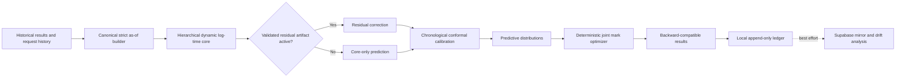

# Prediction Engine V2 - Plan

## Goal Capsule

Replace STRATHMARK's numeric prediction cascade with one reproducible,
prior-only prediction engine. The engine must use every verified factor that
the current data can support, return calibrated uncertainty, assign
model-equalized marks
from joint predictive distributions, and record trusted predictions without
making race-day calculation depend on a database or an LLM.

The authority order is:

1. The user-approved current-data boundary and the requirements in this plan.
2. AAA mark floor and ceiling invariants in `strathmark/config.py`.
3. Public compatibility requirements for STRATHEX and other pinned consumers.
4. Repository conventions and the implementation choices below.

Stop and surface a blocker if implementation evidence shows that a requirement
cannot coexist with an AAA rule or an existing public contract, or if the locked
temporal accuracy, calibration, or residual-promotion gates cannot be satisfied.
Do not add an unavailable factor, infer a missing context value, or weaken the
temporal validation gate to make a model appear more accurate.

Execution is a feature branch and pull request. The implementation tail owns
tests, review, documentation, wiki publication, CI, and removal of abandoned
experimental code.

## Product Contract

### Summary

Prediction Engine V2 uses a robust hierarchical dynamic model of log finish
time. It pools sparse competitors toward event and verified-group priors, uses
strictly earlier observations for every state estimate, and returns a positive
predictive distribution. A residual learner can augment the core only after
rolling-origin evaluation proves out-of-time lift. Manual values remain
operator overrides and LLMs remain available only for narrative features.

### Problem Frame

The production calculator usually returns the baseline under an `llm` label,
which hides the trained ML model. The existing feature engineering aggregates
future and target rows, its calibration and metrics are in-sample, and its
date schema silently disables important recency behavior. Confidence strings
are sample-count labels rather than calibrated coverage. The current simulator
audits a point-estimate mark sheet but does not choose marks from predictive
uncertainty. Several documented factors are not verifiable in the current
historical data and therefore cannot be valid model evidence.

### Actors

- A1. Handicapper: creates a start sheet and may enter a labeled manual time.
- A2. Tournament application: calls Python or REST interfaces and may provide a
  trusted ledger sink.
- A3. Model operator: trains, compares, registers, and activates artifacts
  outside the prediction hot path.
- A4. Maintainer: audits model behavior, calibration, drift, and compatibility.

### Requirements

#### Evidence and identity

- R1. V2 numeric predictions use the closed allowlist below and no other input.
  Unknown columns are ignored until a versioned allowlist change and temporal
  validation approve them.
- R2. Each request captures one exclusive UTC `prediction_as_of` cutoff, and
  V2 excludes same-day, future, invalid-date, and undated rows from evidence.
- R3. Division, round or heat, venue, lane or stand, run order, exact material
  identity, wood quality or moisture, weather, equipment, rest or fatigue,
  penalties, DNF status, and same-tournament weighting cannot affect V2 until
  they are captured with provenance and pass temporal validation.
- R4. Stable competitor IDs are required for population state, trusted logging,
  cloud mirroring, training evidence, and settlement. Display names are only a
  request-local prediction/display fallback and must never merge global history.

#### Prediction and uncertainty

- R5. The dependable core returns a predictive median on positive support from
  a robust hierarchical dynamic log-time model with partial pooling.
- R6. The core uses event, diameter, species and its allowlisted physical
  properties, immutable competitor gender, cross-event history, recency, trend,
  and history depth when strictly earlier evidence supports them.
- R7. Forecast intervals are calibrated from chronological out-of-time
  residuals and report their nominal coverage, calibration state, and scope.
- R8. Forecast uncertainty remains separate from race-performance variability;
  the public `std_dev` field keeps its existing simulation meaning.
- R9. An optional residual learner is inactive unless rolling-origin evidence
  improves the core on point accuracy without material coverage or cohort harm.
- R10. With a compatible core, a competitor without personal history receives a
  conditional population prior using supported request factors. Missing,
  corrupt, newer-than-request, or incompatible optional artifacts degrade to the
  core; unavailable core state degrades to a static broad event prior.

#### Selection and marks

- R11. Manual values are authoritative labeled overrides, not model evidence,
  and have no calibrated model interval.
- R12. No LLM may generate, select, or adjust a numeric prediction or mark.
- R13. One immutable engine snapshot bundle--core, optional residual,
  calibration, manifests, and every version--serves every competitor in a field.
  Every component's maximum evidence timestamp must be earlier than the request.
- R14. The joint mark optimizer compares candidates lexicographically: squared
  deviation from equal model-implied win probability, expected finish spread,
  departure from rounded median-gap marks, then input-order mark tuple. A faster
  median may not receive an earlier start (its mark is greater than or equal to
  a slower median's mark); equal medians retain input order. Marks are integers
  in `[3, effective_ceiling]` and at least one is Mark 3.
- R15. Identical inputs, cutoff, engine versions, and seed produce identical
  marks; optimizer failure uses the existing rounded-gap calculation and says
  that the fallback was used.

#### Persistence and operations

- R16. Trusted predictions with stable competitor IDs can be recorded append-only with request ID,
  prediction ID, stable competitor identity, engine and artifact versions,
  cutoffs, feature snapshot, median, intervals, source, assigned mark, ignored
  factors, and later settlement.
- R17. The local SQLite ledger is the race-day write target; cloud mirroring is
  best-effort and no ledger failure may block a prediction.
- R18. Settlement uses an explicit `prediction_id` and immutable versioned
  events. Exact retries deduplicate; corrections append an actor-attributed event
  that supersedes a prior event and never mutate evidence. Manual values remain
  separately reportable and do not become training examples.
- R19. Public unauthenticated REST calculation remains stateless and cannot
  write trusted training evidence.
- R20. Training, validation, registration, activation, and drift checks remain
  off the prediction hot path and fail visibly to the operator.

#### Compatibility and delivery

- R21. Existing constructors, positional dataclass fields, function names,
  result ordering, method keys, and `std_dev` semantics remain compatible; new
  fields are appended with defaults.
- R22. Legacy inactive parameters remain accepted as deprecated no-ops for one
  migration release, and a temporary explicit legacy-engine selector provides
  rollback without silently invoking the numeric LLM path.
- R23. Python and REST responses add typed interval, provenance, engine,
  optimizer, warning, prediction ID, and ledger-state fields.
- R24. Prediction Engine V2 ships as version 2.0.0 with current code docs,
  operator docs, architecture decisions, migration notes, and canonical wiki
  source synchronized to the GitHub wiki.
- R25. CI covers the pure NumPy/Pandas core on every supported platform and a
  focused optional-ML job covers artifact, residual, and temporal-validation
  behavior.

#### Closed active-feature and validity contract

- Request inputs: stable competitor ID when available, event code, target
  diameter, target species code/name, and immutable competitor gender (`M`, `F`,
  or explicit missing). Names identify request-local records but are not numeric
  features.
- Historical result inputs: stable competitor ID, event code, positive finite
  measured seconds, result date, diameter, and species code. Evidence must have
  `result_date < prediction_as_of`.
- Species properties: Janka hardness, specific gravity, crush strength, shear,
  modulus of rupture, and modulus of elasticity, joined one-to-one by species
  code. Unknown species receives pooled values plus a missing indicator.
- Derived inputs: log time, clamped log-diameter ratio, support/missing flags,
  prior-only history count, effective recency weight, robust residual location,
  bounded trend, and cross-event residual state learned from earlier rows.
- Country, state/province, region, notes, and every R3 field are excluded. Current
  mutable metadata is never projected into historical validation folds.
- A time is eligible when it is finite and positive. V2 does not parse notes or
  infer a timeout, DNF, or penalty from a value. A future provenance-backed
  validity flag may exclude a non-performance sentinel; changing a penalty or
  DNF label alone must never alter V2 evidence.

### Key Product Decisions

- The current-data-only boundary governs R1-R4. It is user-directed: guessed
  proxies and fabricated backfills were rejected because their timing and
  meaning cannot be proven.
- The numeric LLM tier is retired and manual values remain separate, governing
  R11-R12. This is user-approved because numeric predictions must be trained,
  reproducible, and auditable.
- Fixed same-tournament weighting is inactive, governing R2-R3. This is
  user-directed because rounds and exact timestamps are not currently reliable.
- Hierarchical dynamic log-time prediction, validated residual learning,
  calibrated uncertainty, and posterior mark optimization govern R5-R15. This
  is user-approved because the approach handles sparse histories without
  hiding uncertainty or leaking future results.

### Flows

- F1. Calculate field: validate all inputs, capture a request cutoff and model
  snapshot, predict every non-overridden competitor, optimize marks, attempt
  trusted logging, and return the complete field without partial side effects.
- F2. Predict one competitor: use the supplied self-contained history and the
  loaded population state, then return V2 plus legacy diagnostic keys.
- F3. Train and promote: build prior-only folds, calibrate on later data, compare
  the optional residual learner, register the artifact, inspect the report, and
  activate it explicitly.
- F4. Settle: write a valid measured result, associate its explicit prediction
  ID idempotently, and make the residual available to drift and later training.
- F5. Degrade: reject an incompatible optional artifact, mark the response as
  degraded, use the core or event prior, and never call an LLM for a number.

### Acceptance Examples

- AE1. Given two otherwise identical requests with different quality, division,
  tournament, heat, or field-strength values, V2 returns bit-for-bit identical
  medians and intervals. Covers R3 and R22.
- AE2. Given a prediction cutoff of 2026-08-11, a result dated 2026-08-11, a
  later result, an invalid date, and an undated result are all excluded and the
  response reports four exclusions. Covers R2.
- AE3. With a compatible core, a competitor with no valid earlier history
  receives a wide conditional population prior; one result narrows it modestly;
  established dated history narrows it smoothly. With no compatible core, the
  response instead identifies the static broad event-prior fallback.
  Covers R5-R7 and R10.
- AE4. A broken CatBoost artifact produces the same core prediction as no
  residual artifact and a degraded-artifact warning. Covers R9-R10.
- AE5. Repeating a field calculation with the same seed yields the same integer
  marks, and every mark obeys the floor, ceiling, and monotonicity constraints.
  Covers R14-R15.
- AE6. A ledger outage returns valid marks with `ledger_recorded=false`; an
  authenticated retry with the same request key does not duplicate predictions.
  Covers R16-R19.
- AE7. Existing code constructing `PredictionResult(value, confidence, method,
  explanation)` and reading the five `get_all_predictions()` keys still works.
  Covers R21-R23.
- AE8. A backdated request never loads a newer artifact. With no compatible
  historical snapshot it returns the labeled static broad prior, not a
  future-trained prediction. Covers R2, R10, and R13.
- AE9. A repeated ledger key with an identical canonical payload returns the
  original IDs; the same caller/key with a changed payload returns a conflict.
  A correction creates a new settlement revision. Covers R16-R19.

### Success Criteria

- No temporal feature or calibration leakage remains in V2 tests or the
  rolling-origin evaluator.
- The V2 core must reduce locked-test MAE by at least 1% versus the strict
  prior-only incumbent and may not worsen RMSE by more than 0.5%. If it misses
  this gate, V2 is not activated and no superiority claim is made.
- Empirical 90% interval coverage is reported globally and by event and history
  depth, with explicit fallback labels where minimum sample counts are unmet.
- All existing tests and new V2 tests pass on supported Python versions.
- Repeated mark optimization is deterministic and preserves every AAA bound.
- The canonical documentation and the published GitHub wiki describe the same
  active mechanism and identify superseded decisions.
- Model-implied equalization is described as such; real-world fairness is not
  claimed until settled fields support an adequately sized outcome study.

### Scope Boundaries

In scope:

- Current-data feature preparation, statistical core, calibration, optional
  residual gate, mark optimizer, prediction ledger, public integration,
  migrations, release tooling, tests, documentation, and wiki publication.

Deferred until tournament-management software captures them:

- Division, round or heat, venue, lane or stand, run order, exact material
  identity, wood quality or moisture, weather, equipment, rest or fatigue,
  penalties, and DNF status as active features.

Out of scope:

- Building the tournament-management product, fabricating historical context,
  online auto-activation, automatic reactions to drift, and deep neural models.

## Planning Contract

### Key Technical Decisions

- KTD1. Create one canonical as-of data builder with a hard active-feature
  allowlist and stable internal names. (session-settled: user-directed — chosen
  over inferred unavailable factors: only verifiable prior data is defensible)
  Governs R1-R4.
- KTD2. Implement the dependable core in NumPy and Pandas as a robust empirical-
  Bayes log-time model with event, diameter, species-property, and immutable
  gender effects, plus shrunk competitor-event and
  cross-event state, exponential recency, and explicit missing categories.
  (session-settled: user-approved — chosen over a PyMC or Stan runtime: it keeps
  race-day installs portable while retaining hierarchical behavior) Governs
  R5-R6 and R10.
- KTD3. Represent predictions with a median, calibrated central intervals, and
  a separate performance-variability estimate. Use positive-support log-time
  sampling internally. Governs R7-R8 and R14.
- KTD4. Calibrate with chronological split-conformal absolute log residuals.
  Pool by event and history-depth band, then event, then global, subject to a
  documented minimum sample count. Governs R2 and R7.
- KTD5. Make CatBoost a lazy optional residual learner. Promote it only when a
  common-fold rolling-origin comparison lowers both MAE and RMSE by at least 1%,
  changes global 90% coverage by no more than two percentage points away from
  90%, and worsens no eligible history-depth cohort MAE by more than 5%.
  Eligibility requires at least 30 examples. (session-settled:
  user-approved — chosen over an always-on ensemble: unproven complexity cannot
  enter production) Governs R9-R10 and R20.
- KTD6. Optimize integer marks with 2,048 deterministic common-random-number
  samples and at most eight fixed coordinate passes over the R14 objective.
  Coordinate order is input order; comparisons use a `1e-12` tolerance. Accept
  the search result only when it does not worsen the rounded-gap objective. Keep
  rounded-gap marks as the
  explicit bounded fallback. (session-settled: user-approved — chosen over
  point-estimate-only marks: posterior samples expose unequal uncertainty)
  Governs R14-R15.
- KTD7. Add an append-only SQLite ledger and additive Supabase migration. Python
  callers inject a ledger sink; REST writes require existing authentication.
  Cloud mirroring is best-effort. Governs R16-R20.
- KTD8. Snapshot the complete engine bundle once per field calculation and
  expose the core, residual, calibration, and manifest versions in every result.
  Governs R13 and R20.
- KTD9. Preserve the five legacy prediction keys as projections: `manual`,
  numeric `llm=None`, promoted V2 under `ml`, core V2 under `baseline`, and the
  static broad event prior under `panel`. Governs R11-R12 and R21-R23.
- KTD10. Release the behavior change as 2.0.0 while retaining deprecated input
  acceptance and an explicit deterministic legacy baseline selector for one
  migration release. No selector may invoke an LLM for a number.
  Governs R21-R24.

### Alternatives Considered

1. Repair the XGBoost/LightGBM cascade in place. This has the smallest diff but
   preserves a 2,171-line predictor, hard confidence rules, optional-native
   dependencies on the hot path, and an architecture in which sparse competitors
   are handled as exceptions rather than as the primary statistical problem.
2. Use a full PyMC or Stan hierarchical model at runtime. This expresses the
   posterior most directly but adds a heavy compiled toolchain and slower artifact
   lifecycle that conflicts with offline event laptops.
3. Use the native empirical-Bayes core plus an evidence-gated residual learner.
   This is selected because it supports partial pooling, reproducibility,
   calibrated distributions, lightweight fallback operation, and optional lift.

### High-Level Technical Design

The canonical builder owns validation, identity, cutoff filtering, active-field
selection, and exclusion reporting. Training, validation, calibration, and
inference consume this same contract. The core artifact contains fitted event,
diameter, species, metadata, cross-event, population-scale, and calibration
state plus schema and training-cutoff metadata.

The field calculator validates every competitor first. It then holds one
immutable engine snapshot, creates one predictive distribution per competitor,
and sends the joint distributions to the optimizer. Manual overrides replace
their point location but remain tagged and interval-free. The optimizer uses
historical performance variability for manual values and the full V2 predictive
distribution for model values.

#### Executable core algorithm contract

1. Fit `log(time_seconds)` with an event-specific intercept and log-diameter
   slope, the six standardized allowlisted species properties plus missing
   indicators, and event-by-gender categories. Clamp target diameter to the
   artifact's per-event 1st-99th percentile support before extrapolation.
2. Use deterministic ridge-regularized iteratively reweighted least squares:
   Huber threshold 1.345, ridge penalty 10 on non-intercept coefficients, at
   most 25 iterations, and coefficient tolerance `1e-8`. Standardization state
   is fitted on training rows only.
3. Compute competitor state from residuals against that population fit. Weight
   dated residuals with a 730-day half-life and Huber robustness. The same-event
   residual mean shrinks by `weight / (weight + 4)`. A trend requires three
   results spanning 180 days, shrinks by `weight / (weight + 6)`, is capped at
   plus or minus 0.12 log-seconds/year, and projects at most one year.
4. Learn each cross-event coefficient from training-only competitor residual
   summaries with at least ten paired competitors, ridge denominator 0.10, and
   clipping to `[-0.75, 0.75]`; otherwise use zero. Request history owns all
   competitor state. Artifacts contain population and cross-event priors only,
   so request observations cannot be double-counted.
5. Estimate event residual scale with median absolute deviation and a positive
   floor. Increase log-scale uncertainty for no/sparse history, unknown species
   or gender, and diameter outside support. The predictive median is `exp(mu)`.
   A manual override has no forecast interval; with insufficient history its
   performance variability uses a labeled event-prior scale.
6. Fit central 90% chronological split-conformal absolute-log-residual quantiles
   with finite-sample `higher` quantiles. Pool in order: event/history band
   (minimum 30), event (minimum 50), global (minimum 100), then the labeled
   analytic posterior fallback. History bands are 0, 1-3, and 4+ prior results.

The joint optimizer samples a shared event/model log-scale latent draw and
independent competitor performance draws. Exact material and condition
correlation remains unknowable and is not invented. For manual entries, the
shared model latent is absent. An external watchdog may return the canonical
rounded-gap fallback, but normal output never depends on elapsed wall time.

#### Artifact and replay contract

- Artifact JSON carries schema version, engine version, training source SHA-256,
  exclusive training cutoff, active allowlist, coefficients, support ranges,
  population scales, cross-event priors, calibration state, validation metrics,
  byte size, and payload SHA-256. Parsing is size-limited and never uses pickle.
- Load precedence is explicit injection, `STRATHMARK_V2_ARTIFACT`, an atomically
  activated local manifest, the packaged promoted artifact, then the packaged
  static broad prior. The separately protected activation manifest pins digest,
  identity, cutoff, actor, and activation time; a mismatch is rejected.
- An artifact is causal only when every component's maximum evidence timestamp
  is strictly earlier than `prediction_as_of`. Historical validation fits a new
  snapshot per fold. A backdated live request without a compatible snapshot uses
  the static broad prior and reports degradation rather than loading future state.

#### Locked validation and promotion contract

`benchmarks/prediction_v2_manifest.json` is fixed before model comparison. It
pins workbook SHA-256 `61344dda5a5aa84f99a9936f3710b3532f0faf3c373082314be1b1c6bf84c330`,
canonicalization version, events, exclusions, and four disjoint chronological
roles: fit before 2024-01-01; model selection in 2024; conformal calibration from
2025-01-01 through 2025-06-30; locked test from 2025-07-01 through 2026-02-06.
The strict incumbent uses only prior same-event valid results, the same diameter
normalization contract, and no future rows. The locked test is opened once after
all tuning and promotion rules are fixed. Primary metric is MAE; RMSE, median
absolute error, 90% coverage, interval width, and cohort metrics are secondary.
Global claims require at least 100 test rows; cohort claims require 30. Residual
promotion uses the KTD5 thresholds and a deterministic paired bootstrap with
2,000 seed-20260811 resamples; ties reject the residual.

#### Trusted ledger and API contract

- One SQLite transaction records a complete field request plus immutable
  prediction and per-prediction feature rows. Stable competitor ID is mandatory.
  The caller-scoped idempotency key is bound to a canonical request hash; exact
  retries return original IDs and mismatched reuse is a conflict.
- Settlement rows are immutable revisions with actor, timestamp, reason,
  canonical payload hash, and optional superseded-event ID. The current value is
  derived; old evidence is never updated or deleted.
- Public `/calculate` and `/predict` stay stateless. Protected
  `/ledger/calculate` and `/ledger/predictions/{prediction_id}/settle` use the
  existing fail-closed bearer dependency. The server, never a request flag,
  determines trust. Settlement must match competitor ID and event.
- Cloud mirror tables are additive, stable-ID-only, service-role-written, and
  have forced row-level security with anonymous/authenticated writes revoked.
  Mirror failures queue or report a sanitized status and never alter marks.
- Feature snapshots contain the active numeric/model inputs only--no names,
  notes, country, state, region, secrets, or unavailable context. Local operators
  own retention/export/deletion; documentation recommends encrypted device
  storage, access-controlled backups, and deletion after the governing record
  retention period.
- REST remains bounded to 64 competitors, 500 history rows per competitor,
  100-character strings, finite schema-constrained numbers, 2,048 optimizer
  samples, and eight passes. Deployment guidance requires body-size and rate
  limits; oversized work is rejected before prediction.

### Assumptions

- The supplied workbook and hydrated results cache contain stable result dates
  for the rows eligible for V2.
- `SB` and `UH` remain the only supported prediction events in this release.
- A pure NumPy/Pandas core is adequate for the current data volume and can be
  serialized as versioned JSON without unsafe pickle loading.
- The optional residual learner can remain inactive if the locked benchmark
  does not prove lift.
- The GitHub wiki repository is enabled and reachable with the current GitHub
  credentials; local canonical wiki updates do not depend on that publication.

### System-Wide Impact

- Public Python: additive dataclass fields and optional context/ledger arguments;
  deprecated parameters stop affecting V2 numeric output.
- REST: additive request cutoff, stable identity, trusted persistence, interval,
  provenance, health, and settlement fields; old payloads remain valid.
- Persistence: local tables are created in-place; Supabase receives a new
  idempotent migration and compatible helper updates.
- Training: current in-process XGBoost/LightGBM training is removed from the
  calculator hot path and retained only behind the explicit legacy selector.
- Simulation: the existing public Monte Carlo API keeps `std_dev` behavior;
  the optimizer uses its own positive-support posterior sample interface.
- Documentation: prior LLM-cascade and fixed tournament-weighting decisions are
  historical and receive supersession notices rather than being deleted.
- Operations: health reports core, residual, calibration, cutoff, and degraded
  state independently of narrative LLM availability.

### Risks and Mitigations

- Sparse cohorts can create unstable subgroup calibration. Use the KTD4 pooling
  hierarchy, minimum counts, and explicit uncalibrated analytic fallback.
- A flexible residual learner can overfit 1,300 rows. Keep it inactive unless
  common temporal folds pass KTD5, and record both accepted and rejected runs.
- Behavior changes can surprise pinned consumers. Use additive fields, retain
  legacy keys, ship a major version, and keep an explicit rollback selector.
- Ledger writes can pollute evaluation. Require trust, stable IDs, request
  idempotency, explicit settlement, and exclusion of manual values from metrics.
- Optimizer search can be slow for large fields. Bound samples and objective
  evaluations deterministically, reuse common samples, target p95 under one
  second for fields up to 64 on CI reference hardware, report fallback rate,
  and let an external watchdog discard partial work for the canonical fallback.
- External wiki publication can fail independently. Keep `docs/wiki/` canonical,
  verify its exact sync set, and report any GitHub wiki access failure separately.

### Research and Evidence

- `strathmark/calculator.py` and `strathmark/predictor.py` show that the hot path
  passes an LLM client and commonly returns the baseline under an `llm` label.
- `strathmark/predictor.py` computes row features from the full dataset and fits
  calibration on training predictions; `strathmark/utils.py` renames `date` to
  `result_date` while the model later reads `date`.
- `strathmark/migrations/20260504_002_ml_state_tables.sql` provides useful model
  state scaffolding but not append-only per-prediction features or complete V2
  provenance.
- `docs/solutions/data-integrity/timeout-results-pollute-baseline.md` and
  `docs/solutions/data-integrity/decay-weights-silently-default-to-one.md` require
  centralized validity and date normalization.
- CatBoost's ordered boosting research supports an optional categorical residual
  model, not bypassing temporal validation:
  https://proceedings.neurips.cc/paper_files/paper/2018/hash/14491b756b3a51daac41c24863285549-Abstract.html
- TrueSkill Through Time supports time-varying, partially pooled ability state:
  https://www.microsoft.com/en-us/research/publication/trueskill-through-time-revisiting-the-history-of-chess/
- Adaptive conformal inference motivates chronological coverage monitoring under
  distribution shift:
  https://proceedings.neurips.cc/paper/2021/hash/0d441de75945e5acbc865406fc9a2559-Abstract.html

### Settled-Decision Conflict Report

No current evidence invalidates a settled decision. The older cascade-order and
tournament-weighting architecture notes conflict with the new boundary but are
valid historical records. Mark them superseded and preserve their rationale.

## Implementation Units

### U1. Define the prior-only data and public type contract

- Goal: create the canonical data boundary and additive public types before any
  model behavior changes.
- Requirements: R1-R4, R8, R21-R23; F1-F2; AE1-AE2 and AE7.
- Files: `strathmark/features.py`, `strathmark/predictor.py`,
  `strathmark/api.py`, `strathmark/__init__.py`, `tests/test_features.py`,
  `tests/test_api.py`, `tests/test_predictor.py`.
- Approach: add strict canonical names, stable identity, exclusive cutoff,
  exclusion diagnostics, `PredictionContext`, `PredictionInterval`, and appended
  result metadata. Keep legacy constructors and request bodies valid.
- Test scenarios: same-day/future/undated exclusion; invalid/non-finite rows;
  inactive-factor invariance; duplicate-name overrides; explicit missing
  categories; old positional constructors and REST payloads.
- Verification: focused feature, predictor, and API suites pass without live DB
  access, and mutation of every inactive field cannot change V2 evidence.
- Dependencies: none.

### U2. Build and validate the hierarchical dynamic core

- Goal: produce a serializable, deterministic predictive distribution from
  verified current data.
- Requirements: R5-R10, R13, R20, R25; F3 and F5; AE3-AE4.
- Files: `strathmark/prediction_v2.py`, `strathmark/validation.py`,
  `tests/test_prediction_v2.py`, `tests/test_validation.py`, `train_model.py`.
- Approach: implement the executable core algorithm contract, including
  allowlisted event/diameter/species-property/gender effects, dynamic competitor-event
  state, learned cross-event borrowing, and chronological conformal calibration.
  Serialize safe JSON with schema, checksums, cutoffs, metrics, and versions.
- Test scenarios: zero/one/few/many histories; robust treatment of outliers;
  proof that cap/DNF/penalty inference is absent;
  diameter/species normalization; unseen species and extreme diameters; missing metadata; expanding folds; calibrated
  pooling; corrupted artifacts; deterministic serialization and inference.
- Verification: synthetic recovery tests and locked-data rolling-origin reports
  show no future access and publish point and interval metrics by cohort.
- Dependencies: U1.

### U3. Add the evidence-gated residual learner

- Goal: permit nonlinear lift without making it a dependency or assumption.
- Requirements: R9-R10, R20, R25; F3 and F5; AE4.
- Files: `strathmark/residual.py`, `strathmark/validation.py`, `train_model.py`,
  `pyproject.toml`, `.github/workflows/ci.yml`,
  `tests/test_residual.py`, `tests/test_validation.py`.
- Approach: lazy-load CatBoost from the `ml` extra, train only on core residuals
  built inside each temporal fold, and emit a promotion decision with point,
  coverage, and cohort comparisons. Core-only remains the default on rejection.
- Test scenarios: missing dependency; accepted and rejected promotion; schema and
  checksum mismatch; no leakage across folds; protected performance cohorts.
- Verification: the optional-ML CI job exercises a real artifact round trip and
  a failed promotion cannot alter production predictions.
- Dependencies: U2.

### U4. Replace numeric cascade behavior at every entry point

- Goal: make V2 the authoritative default while preserving public projections.
- Requirements: R10-R13, R19, R21-R23; F1-F2 and F5; AE1 and AE7.
- Files: `strathmark/predictor.py`, `strathmark/calculator.py`,
  `strathmark/api.py`, `strathmark/config.py`, `strathmark/__init__.py`,
  `tests/test_predictor.py`, `tests/test_calculator.py`, `tests/test_api.py`,
  `tests/test_integration.py`.
- Approach: snapshot the complete V2 engine bundle once per request, keep manual-first selection,
  project V2 into legacy keys, disable numeric LLM and inactive inputs, expose
  provenance, and retain an explicit legacy selector for rollback.
- Test scenarios: LLM function is never called; one model version per field;
  core/event-prior degradation; old function calls; public stateless REST;
  slowest-to-fastest stable output and equal-time tie stability.
- Verification: all legacy prediction and calculator tests pass after expected
  assertions are updated to the documented V2 contract.
- Dependencies: U1-U3.

### U5. Optimize marks from joint predictive distributions

- Goal: choose deterministic AAA-compliant marks against the full field rather
  than rounding medians alone.
- Requirements: R8, R14-R15, R21; F1 and F5; AE5.
- Files: `strathmark/mark_optimizer.py`, `strathmark/calculator.py`,
  `strathmark/variance.py`, `strathmark/config.py`,
  `tests/test_mark_optimizer.py`, `tests/test_calculator.py`,
  `tests/test_variance.py`.
- Approach: draw common positive-support posterior samples, run bounded
  deterministic coordinate search over the R14 objective, preserve the existing
  public simulator, and attach optimizer metrics and fallback reason.
- Test scenarios: single competitor; ties; heterogeneous uncertainty; floor and
  ceiling; monotonicity; reproducibility; watchdog failure; objective improves
  or safely retains legacy marks.
- Verification: property-style randomized fields never violate invariants and
  identical canonical input hashes and seeds return identical marks; normal
  fields up to 64 meet the documented reference performance target.
- Dependencies: U2 and U4.

### U6. Wire the trusted append-only prediction ledger

- Goal: preserve prediction evidence offline without making calculation depend
  on local or cloud persistence.
- Requirements: R4, R16-R20, R23; F1 and F4; AE6.
- Files: `strathmark/ledger.py`, `strathmark/store.py`, `strathmark/db.py`,
  `strathmark/api.py`, `strathmark/migrations/20260811_005_prediction_v2.sql`,
  `tests/test_ledger.py`, `tests/test_store_extended.py`,
  `tests/test_ml_state.py`, `tests/test_api.py`.
- Approach: implement the trusted ledger and API contract with field-transactional
  SQLite prediction/feature rows, payload-bound idempotency, immutable settlement
  revisions, protected REST routes, and stable-ID-only best-effort Supabase
  mirroring with forced row-level security.
- Test scenarios: temp-database creation and migration; duplicate request key;
  explicit settlement repeat/correction; same-key/different-payload conflict;
  concurrent duplicate requests; manual exclusion; cloud outage;
  unauthenticated no-write; old SQLite row preservation; mocked Supabase payload.
- Verification: every test uses `tmp_path` or mocked Supabase, and forced write
  failures never change the returned prediction or marks.
- Dependencies: U1, U4, and U5.

### U7. Refresh training, evaluation, and operational gates

- Goal: make model claims reproducible and promotion explicit.
- Requirements: R7, R9, R20, R24-R25; F3.
- Files: `train_model.py`, `strathmark/analytics.py`, `strathmark/drift.py`,
  `scripts/validate_v2.py`, `.github/workflows/ci.yml`,
  `tests/test_analytics.py`, `tests/test_drift.py`, `tests/test_validation.py`.
- Approach: replace leaked evaluation with rolling-origin reports, record cutoff
  and cohort metrics, compare champion/core/residual on common rows, add artifact
  validation and a focused optional-ML CI job, and keep activation human-driven.
- Test scenarios: insufficient dates fail honestly; cohort sample limits are
  labeled; drift consumes settled model predictions only; repeat reports match;
  a worse learner cannot pass promotion.
- Verification: the locked workbook report is generated from a documented cutoff
  and no zero-error placeholder or in-sample metric can satisfy a release gate.
- Dependencies: U2-U3 and U6.

### U8. Synchronize release documentation and wiki

- Goal: make every active document describe V2 and every displaced decision
  visibly historical.
- Requirements: R3, R11-R12, R20-R25.
- Files: `README.md`, `ONBOARDING.md`, `CONTRIBUTING.md`, `CHANGELOG.md`,
  `TODOS.md`, `docs/ARCHITECTURE.md`, `docs/DEPLOYMENT.md`,
  `docs/ml-persistence-policy.md`, `docs/ml-research-questions.md`,
  `docs/schema-reality-2026-05-04.md`, `strathmark/migrations/README.md`,
  a new V2 architecture decision under `docs/solutions/architecture-decisions/`,
  superseded solution notes, and all applicable pages under `docs/wiki/`.
- Approach: document active factors, inactive future context, algorithms,
  uncertainty semantics, optimizer objective, provenance, API migration,
  training/promotion, rollback, operational failure modes, and 2.0.0 release.
  Sync the exact canonical wiki Markdown set to `STRATHMARK.wiki.git` only after
  code and docs review pass.
- Test scenarios: links and code examples resolve; legacy cascade language is
  absent from active docs; every superseded note links to the V2 decision;
  wiki sidebar exposes V2 material; version strings agree.
- Verification: documentation search finds no active contradictory cascade,
  quality, tournament-weighting, or confidence claim, and GitHub wiki HEAD
  contains the canonical source content.
- Dependencies: U1-U7.

## Verification Contract

All test commands use isolated local paths. Never set `STRATHMARK_TEST_DB=1`
unless an explicitly isolated non-production Supabase project is provided.

Run these gates in order:

1. Focused unit suites while each unit is built, including
   `tests/test_features.py`, `tests/test_prediction_v2.py`,
   `tests/test_validation.py`, `tests/test_residual.py`,
   `tests/test_mark_optimizer.py`, and `tests/test_ledger.py`.
2. Existing compatibility suites for predictor, calculator, API, store,
   variance, analytics, ML state, drift, and integration behavior.
3. `pytest tests/ -q --tb=short` with pytest temp and cache directories placed
   in a writable isolated workspace path.
4. `ruff check .` and `ruff format --check .` with the same Ruff version CI
   installs.
5. `python -m build`, then install the built wheel with API and ML extras in an
   isolated environment and import the public API.
6. Run `scripts/validate_v2.py` against `woodchopping_clean.xlsx`; retain its
   chronological cutoff, cohort counts, point metrics, interval coverage,
   residual-promotion decision, and deterministic optimizer audit.
7. Run the repository structural code review and independent QA pass. Resolve
   all correctness, data-integrity, security, and compatibility findings.
8. Open the pull request and require every GitHub CI job to pass before handoff.

The optional residual learner is eligible for activation only if it meets KTD5.
A green test suite does not override a failed statistical promotion gate.

## Definition of Done

- Every R-ID is implemented or explicitly demonstrated as a compatibility no-op.
- Every implementation unit's focused tests and verification outcome pass.
- The current full suite remains green without production database access.
- The V2 validation report is temporal, reproducible, and honest about cohort
  sample sizes and any residual learner rejection.
- Prediction and calibration artifacts contain schema, checksum, version, and
  cutoff provenance and reject incompatible loads safely.
- Marks are deterministic and satisfy all R14 constraints under randomized tests.
- Trusted ledger writes are append-only, idempotent, explicit to callers, and
  nonblocking under forced local and cloud failures.
- Active documentation and the GitHub wiki agree on V2 behavior, version 2.0.0,
  inactive future factors, and rollback/degradation procedures.
- Superseded architecture notes remain searchable and link to the active V2
  decision.
- The pull request is review-clean and CI is green.
- Experimental code, temporary artifacts, stale generated models, caches, and
  approaches rejected by validation are removed from the diff.
