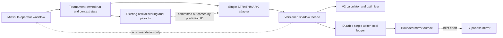
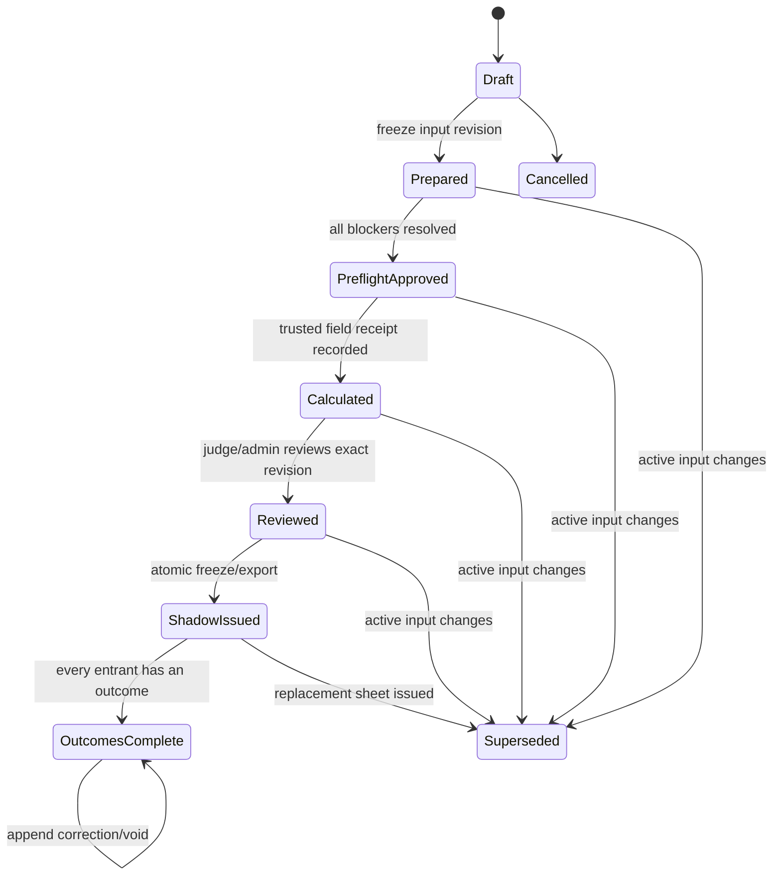
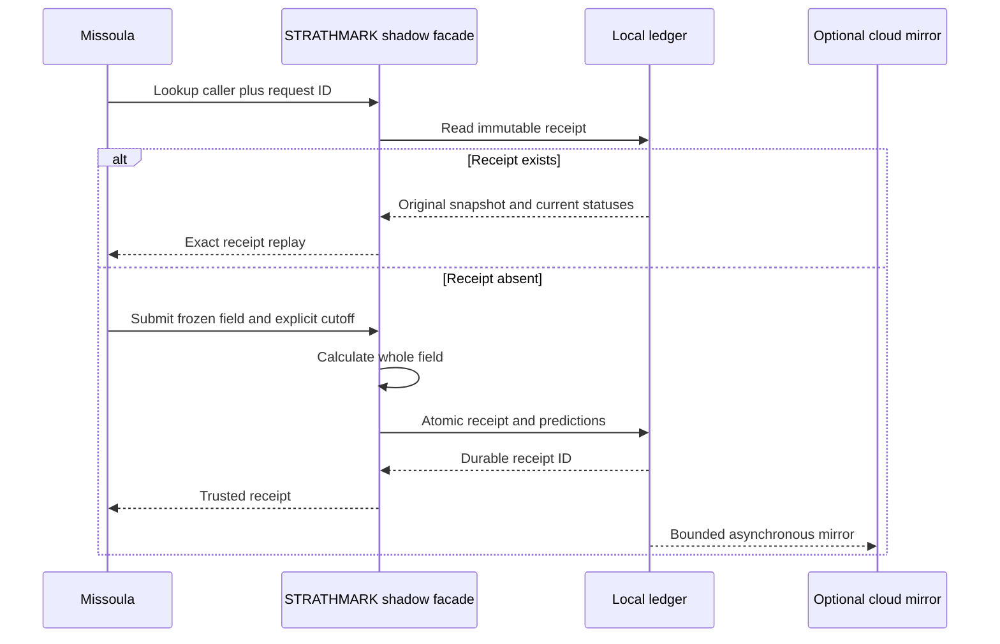
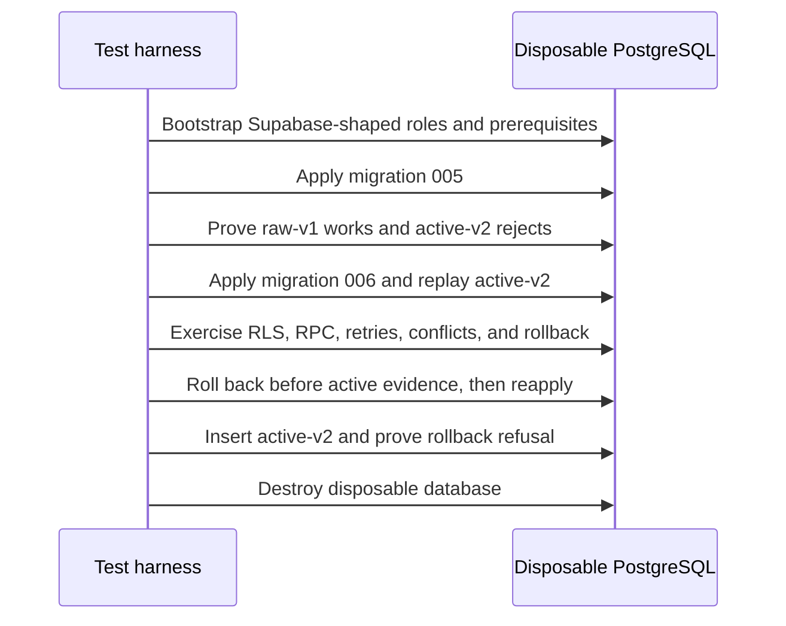

# Trusted Shadow Handicap Operations - Plan

## Goal Capsule

Build the next operational layer around the released Prediction Engine V2: prove
its cloud migrations against a disposable Supabase-shaped PostgreSQL database,
add a durable versioned shadow receipt/outcome/recovery contract to STRATHMARK,
and integrate that contract into Missoula Pro-Am Manager as a complete,
restartable, offline-capable **shadow** handicapping workflow.

The delivered workflow lets an authorized operator prepare a whole field,
calculate and recover the exact immutable recommendation, review and freeze it,
export it, observe shadow standings, record all outcomes and corrections, and
settle eligible positive times without changing championship positions, points,
payouts, or published authority. It also begins prospective, provenance-rich
capture of currently unavailable tournament factors while keeping every one of
those fields numerically inactive in V2.

This is a two-repository program with two independently reviewable pull requests:

1. **STRATHMARK** — executable migration proof and the trusted shadow service
   contract.
2. **Missoula Pro-Am Manager** — tournament-owned operational state, operator UI,
   offline recovery, and settlement integration.

Production databases, production deployment, official-handicap authority, model
retuning, and promotion of new factors remain out of scope.

## Product Contract

### Summary

Prediction Engine V2 is now authoritative for prior-only numeric predictions, but
the existing APIs and ledgers are not a complete tournament workflow. They do not
provide immutable whole-field receipt retrieval, namespaced tournament identity,
field-atomic outcome correction and voiding, or operator-facing recovery state.
Missoula's current mark assignment still describes the obsolete LLM cascade,
gates local calculation on cloud configuration, maps results by name, and writes
marks directly into official scoring fields.

This plan closes that operational gap without weakening the released V2 model or
the tournament manager's domain contract.

### Actors

- **Show director / judge-admin** — prepares, reviews, freezes, supersedes, and
  corrects a shadow mark sheet.
- **Scorer** — enters official raw outcomes through the existing scoring workflow;
  does not gain authority to alter a frozen shadow sheet.
- **Tournament manager** — owns entrants, schedule, operating context, official
  results, shadow presentation, and operator audit.
- **STRATHMARK service** — owns numeric calculation, immutable evidence receipts,
  settlement revisions, drift inputs, and local-first cloud delivery.
- **Cloud mirror** — optional best-effort copy; never the race-day authority and
  never a prerequisite for local review or issuance.
- **Developer/release operator** — runs only disposable database rehearsal in this
  phase and later follows a separately authorized production runbook.

### Requirements

#### Safety, authority, and repository boundaries

- **R1.** STRATHMARK remains the sole owner of numeric predictions, optimized
  marks, intervals, provenance, engine/model/calibration versions, evidence
  cutoff, ignored-factor declaration, ledger identity, and settlement revisions.
- **R2.** Missoula is the sole authority for tournament entrants, scheduling,
  operational outcomes, prospective context and their correction histories,
  operator approval, official-versus-shadow authority, publication, and payout.
  It consumes STRATHMARK only through one adapter boundary. STRATHMARK receives
  only immutable receipt projections, context fingerprints, and eligible numeric
  settlement or void revisions linked to stable Missoula revision IDs.
- **R3.** Shadow output must never mutate official `handicap_factor`, championship
  ranking, points, payouts, or published results. Existing official behavior is
  unchanged unless a later product decision explicitly promotes shadow authority.
- **R4.** All tests and rehearsals use isolated SQLite paths, temporary files, and
  disposable PostgreSQL databases. Ambient production Supabase variables are
  removed, and the known production project/database is explicitly rejected.
- **R5.** The existing dirty Missoula checkout is not edited, staged, discarded,
  committed, or used as a merge base for uncommitted files. Missoula work occurs
  in a new isolated worktree based on an agreed committed revision.

#### Immutable whole-field calculation and replay

- **R6.** A V2 mark sheet is an atomic whole-field artifact because its optimizer
  considers the entire field. Entrant order/identity, wood, event, exclusive UTC
  cutoff, eligible history, and optimizer inputs are frozen into one canonical
  input snapshot and fingerprint.
- **R7.** Every trusted request requires namespaced stable consumer, tournament,
  event-occurrence, field-run, competitor, and operator identities. Display names,
  local integer IDs, and list positions are never used as cross-system identity.
- **R8.** The trusted endpoint requires an explicit exclusive UTC
  `prediction_as_of` date. Missoula defaults it to the tournament-local event date
  represented as the frozen UTC evidence date, displays it, attributes its source,
  and creates a superseding run when it changes.
- **R9.** A caller-generated request ID identifies one immutable attempt. Exact
  retries return the original immutable receipt core even after process restart,
  package upgrade, or artifact upgrade. Changed input always receives a new
  request ID and names the prior run it supersedes.
- **R10.** Receipt retrieval occurs before recalculation. Lookup by namespaced
  caller/request identity returns an immutable core containing the original field
  snapshot, predictions, digests/versions, cutoff, warnings, evidence quality, and
  prediction IDs. A separate live operational projection returns current numeric
  settlements/voids, trust, mirror delivery, and readiness facts.
- **R11.** Calculation plus local ledger persistence is field-atomic. A numerical
  result whose trusted ledger write failed is labeled untrusted and cannot become
  a frozen trusted shadow sheet.
- **R12.** A roster, scratch, wood, schedule fingerprint, cutoff, event, or active
  history change makes the current run stale. Approval is bound to the exact run
  revision; relevant changes require recalculation and supersession.

#### Operational state and authorization

- **R13.** State is projected across independent axes rather than collapsed into
  one misleading enum:
  - lifecycle: draft, prepared, preflight-approved, calculated, reviewed,
    shadow-issued, outcomes-complete, superseded, cancelled;
  - trust: unrecorded, recorded, conflict, write-failed;
  - mirror: not-configured, pending, recorded, retryable-failed,
    permanent-failed;
  - freshness: current, stale;
  - outcomes: none, partial, complete, corrected.
  Persist only lifecycle decisions and their optimistic-concurrency revision.
  Derive trust from the ledger receipt, mirror state from outbox delivery,
  freshness from fingerprint comparison, and outcome completeness from Missoula's
  latest operational revisions.
- **R14.** Cloud pending/failure never blocks local preparation, review, or shadow
  issuance. Trust write failure and stale input do block trusted issuance.
- **R15.** Judge/admin roles may calculate, review, issue, supersede, correct, and
  request settlement. Scorers may enter results through existing scoring routes;
  post-commit settlement runs as an authenticated system action attributed to the
  initiating result actor. Every supersession/correction requires a reason.
  Missoula authenticates and authorizes the human. Its server-only adapter uses a
  scoped STRATHMARK service credential and sends a short-lived signed attestation
  binding consumer, actor, role snapshot, action, request/run revision, audience,
  nonce, and expiry; STRATHMARK never trusts caller or actor identity from an
  unsigned payload.
- **R16.** State-changing operations use optimistic concurrency against the saved
  run revision so two operators cannot both issue, supersede, or correct the same
  revision.
- **R17.** Shadow issuance freezes and exports the entire field atomically; operators
  cannot cherry-pick V2 rows or edit individual values while still labeling the
  sheet as V2. Manual comparison sheets remain separately sourced and
  training-ineligible.
- **R18.** A timeout after STRATHMARK commits is resolved by receipt lookup. A
  timeout after Missoula saves its local run is reconciled by request ID. Neither
  path blindly recalculates.

#### Outcomes, settlement, and monitoring

- **R19.** Missoula's operational outcome authority records valid finish,
  DNS/scratch, DNF, DQ, penalty,
  rerun/no-contest, and timing failure with actor, source, timestamp, reason, raw
  measured time when present, and official/adjusted values when applicable.
- **R20.** Only an unpenalized valid positive raw elapsed time is eligible for V2
  numeric settlement, training, calibration/drift evaluation, or residuals.
  Nonfinishes and penalized/invalid values remain auditable context.
- **R21.** Missoula field outcome submission is atomic and append-only. Corrections
  append revisions; they never mutate prior rows. In the same database transaction
  that finalizes or corrects official results, Missoula writes a deterministic
  settlement-outbox record for the eligible settlement or void projection.
- **R22.** STRATHMARK numeric settlement supports explicit void/retraction linked
  to the authoritative Missoula outcome-revision ID. The latest valid revision
  controls training/drift eligibility, allowing a bad finish to become DNF/DQ and
  a corrected DNF/timing failure to become a valid finish without leaving stale
  model evidence active.
- **R23.** Outcome completeness is separate from numeric settlement completeness:
  a field containing documented nonfinishes can be operationally complete even
  when fewer predictions are numerically settled.
- **R24.** V2-supported single-result event semantics are explicit. Events whose
  authoritative target is multi-run/best-run are rejected from trusted shadow
  mode until a separate target contract is approved; the implementation does not
  infer semantics from a generic result value.
- **R25.** Operator status shows local trust, stale/current state, mirror backlog,
  oldest/last attempt, settlement/correction backlog, evidence quality, and
  advisory drift/calibration. Drift displays `insufficient evidence` below its
  approved sample floor and never blocks race-day work.

#### Prospective context capture

- **R26.** Missoula prospectively captures division, round/heat, venue, lane/stand,
  issued run order, exact log/block/batch identity, material quality/moisture,
  weather, equipment actually used, rest/fatigue observations, penalty, and
  DNF/DQ status.
- **R27.** Every Missoula context observation has a schema version, stable
  event/heat/run/
  material identity, source classification, captured-at UTC timestamp, actor,
  explicit unknown state, and append-only correction/supersession history.
- **R28.** Context uses a separate observation fingerprint and remains outside the
  active V2 calculation hash, numeric features, and training eligibility. Missing
  is never coerced to false or zero. A `derived` value is permitted only when it is
  a deterministic reproducible transformation whose formula and cited source
  records are retained; probabilistic, imputed, or guessed values remain unknown.
- **R29.** Promotion of any prospective factor requires a future feature-schema
  version, causal/exclusive-cutoff leakage tests, multiple seasons of prospective
  data, rolling-origin evaluation, and a new frozen temporal release gate.

The initial capture matrix is part of the product contract. Every row supports an
explicit unknown value, and no unknown inactive factor blocks shadow issuance.

| Factor | Responsible actor/system | Natural capture step | Scope | Allowed provenance |
|---|---|---|---|---|
| Division | Tournament configuration | Event setup | Event/entrant | Imported or operator-entered |
| Round and heat | Scheduler | Heat generation/issue | Heat/run | System-recorded |
| Venue | Show director | Tournament setup | Tournament/day | Operator-entered |
| Lane or stand | Scheduler/judge | Issued heat assignment | Run | System-recorded or corrected |
| Run order | Scheduler | Issued schedule freeze | Field/heat/run | System-recorded |
| Log/block/batch identity | Field-prep crew | Material preparation/assignment | Material/run | Scanned or operator-entered |
| Wood quality and moisture | Field-prep crew | Measurement/assignment | Material | Measured or operator-entered |
| Weather | Designated official | Event start and material changes | Time window/field | Measured or operator-entered |
| Equipment actually used | Athlete/judge | Equipment check or result entry | Run | Operator-entered |
| Rest/fatigue | System, optional judge observation | Run timestamp/result entry | Entrant/run | Deterministically derived elapsed time or structured non-medical observation |
| Penalty, DNS, DNF, DQ | Judge/scorer | Result entry/correction | Run/outcome | Official operator decision |

#### Disposable database proof and durable topology

- **R30.** Database rehearsal uses a disposable, Supabase-shaped PostgreSQL
  instance with prerequisite tables and roles. A blank generic database is not
  accepted as proof, and no hosted production project is contacted.
- **R31.** The executable matrix applies and exercises migrations 005/006, forced
  RLS, grants, triggers, indexes, security-definer RPC behavior, exact retry,
  conflict, FK rollback, settlement/correction atomicity, and rerun idempotency.
  Every new security-definer function uses a dedicated non-login owner, an empty
  search path with fully qualified objects, no dynamic SQL, explicit input
  validation, revoked public/anon/authenticated execution, and only the minimum
  service-role grant; catalog and object-shadowing tests enforce this.
- **R32.** Rehearsal proves pre-activation rollback and post-activation rollback
  refusal. After active-v2 evidence exists, recovery is forward repair or database
  restore from the local durable ledger, not destructive down migration.
- **R33.** Supported trusted topology is one single-writer STRATHMARK service or
  offline installation with a durable local ledger path and optional mirror. An
  ephemeral or multi-writer SQLite deployment is explicitly unsupported. This
  phase implements and tests the contract but does not deploy production infra.
- **R34.** Cloud identity uses an explicit reviewed mapping from Missoula identities
  to canonical STRATHMARK/MNEMEX competitor IDs. Unresolved/conflicted mappings
  block mirror readiness but not local shadow calculation; name-based auto-match
  is prohibited.
- **R35.** A factor-capture matrix assigns every prospective factor to its
  responsible actor/system, natural workflow step, shared-versus-per-run scope,
  provenance source, and required-versus-explicit-unknown policy. Missing inactive
  context never blocks shadow issuance.
- **R36.** The data-handling contract excludes PII and medical/free-text fatigue
  notes from STRATHMARK, cloud mirror payloads, logs, errors, and operator exports.
  Missoula uses pseudonymous stable IDs for analytics, role-restricts operational
  observations, records export access, and retains only the provenance required
  for the approved multi-season evidence purpose. Production retention/deletion
  activation requires a later operator-approved policy.
- **R37.** All external requests and exports have versioned schemas and explicit
  size, cardinality, string, nesting, pagination, concurrency, timeout, and outbox
  capacity limits. Unknown properties and oversized inputs fail before calculation
  or persistence.
- **R38.** Before offline operation, a verified prior-history snapshot is refreshed
  into STRATHMARK's durable local result store. Preflight and receipts expose its
  source, cutoff, age, completeness, and digest; offline calculation and freshness
  checks use only that snapshot until the operator performs another explicit
  refresh.

### Key Product Decisions

- **KPD1 — V2 stays prior-only.** `session-settled: user-directed` The unavailable
  tournament factors are collected prospectively but have no numeric effect until
  a future locked promotion.
- **KPD2 — Complete shadow, not official authority.** `session-settled:
  user-directed` The operator can run the complete preparation-to-correction
  workflow, but championship scoring and payout remain untouched.
- **KPD3 — Local durable authority.** `session-settled: user-directed` STRATHMARK's
  local ledger is the trusted source; cloud delivery is best-effort. The plan
  rejects ephemeral/multi-writer deployment claims rather than weakening restart
  guarantees.
- **KPD4 — Separate repositories and pull requests.** `session-settled:
  user-directed` STRATHMARK supplies a stable service contract first; Missoula
  consumes it in an isolated worktree second.
- **KPD5 — Fail closed on unknown event targets.** Multi-run/best-run semantics are
  not guessed. Only events with the approved V2 single-result target enter trusted
  shadow mode.

### Flows

- **F1 — Database rehearsal:** create disposable Supabase-shaped PostgreSQL ->
  seed stable prerequisites -> apply 005 -> prove raw-v1 and active-v2 rejection ->
  apply 006 -> replay and prove RLS/RPC/atomicity -> prove safe rollback boundary ->
  destroy disposable database.
- **F2 — Prepare:** operator configures a shadow-capable event -> resolves stable
  identities and wood -> completes scheduling/field prep -> selects explicit cutoff
  -> freezes an ordered whole-field input snapshot -> preflight approves that exact
  revision.
- **F3 — Calculate/recover:** Missoula looks up caller/request receipt -> hydrates it
  when present -> otherwise submits the field -> STRATHMARK calculates and writes
  one atomic local receipt -> Missoula stores its receipt projection -> mirror runs
  independently.
- **F4 — Review/issue:** operator sees evidence quality, intervals, warnings,
  degraded/trust/mirror state -> compares without row editing -> reviews exact
  revision -> atomically freezes/exports a shadow sheet -> championship authority
  remains unchanged.
- **F5 — Stale/supersede:** entrant, scratch, wood, schedule, cutoff, or active
  history changes -> current run becomes stale -> prior sheet remains immutable ->
  operator prepares a new request linked by `supersedes` -> review/issue repeats.
- **F6 — Outcome/settlement:** scorer commits official outcomes -> Missoula appends
  field outcome revision -> eligible raw positive times settle by prediction ID ->
  nonfinishes remain context-only -> corrections append and void/replace eligibility
  -> dashboard reconciles backlog and drift.
- **F7 — Offline/restart:** cloud/network unavailable -> local calculation and
  receipt persist -> process restarts -> receipt is retrieved by request ID -> sheet
  is issued/exported -> bounded replay resumes when network returns.

### Acceptance Examples

- **AE1.** Applying migrations 005/006 to the disposable fixture proves actual
  service-role RPC access while anon/authenticated direct read/write and direct
  table mutation fail under forced RLS.
- **AE2.** The same caller/request/input after an artifact upgrade retrieves the
  original immutable receipt core byte-for-byte, plus a current live status
  projection, instead of recalculating or conflicting.
- **AE3.** Changing one entrant, wood dimension, schedule fingerprint, or cutoff
  marks the reviewed run stale and requires a linked superseding field run.
- **AE4.** A mirror outage leaves a trusted local sheet reviewable and issuable,
  shows a bounded pending backlog, survives restart, and later records exactly one
  cloud copy.
- **AE5.** If calculation succeeds but trusted local persistence fails, the UI
  labels the draft untrusted and prevents trusted issue.
- **AE6.** Two judges attempt to issue the same revision; one succeeds and the
  stale compare-and-swap attempt is rejected without duplicate audit state.
- **AE7.** A field with valid finishes, DNF, DQ, scratch, and timing failure reaches
  operational completeness; only the unpenalized positive raw finishes settle.
- **AE8.** A mistakenly settled finish is corrected to DQ; a void revision removes
  it from training/drift. A later valid rerun appends a new eligible settlement.
- **AE9.** Shadow issuance and parallel handicap standings do not change official
  result values, championship positions, points, payouts, or public output.
- **AE10.** A zero-second recommended or manual comparison mark requires explicit
  review and is never inferred from a database default.
- **AE11.** Every deferred factor appears in the audit export with source/unknown/
  actor/timestamp semantics while V2's calculation hash and numeric output remain
  unchanged under context-only edits.
- **AE12.** A name collision or cross-season registration without an approved
  identity mapping is visibly unresolved; no prediction or settlement is matched
  by name.
- **AE13.** A DST/local-midnight scenario freezes one explicit UTC cutoff and
  excludes same-day/future evidence identically before and after restart.
- **AE14.** A multi-run event with no approved target contract is rejected with a
  plain-language operator action instead of being silently treated as single-run.

### Success Criteria

- **SC1.** Disposable PostgreSQL behavior proof is executable locally and in CI,
  isolates all credentials/data, and covers the full 005/006 matrix.
- **SC2.** STRATHMARK returns and retrieves immutable field receipts with exact
  core replay across restart/artifact upgrade and field-atomic numeric settlement
  or void revisions.
- **SC3.** Missoula completes prepare -> preflight -> calculate/recover -> review ->
  shadow issue/export -> outcome -> correction without cloud availability.
- **SC4.** Shadow operation leaves all official championship/payout outputs
  unchanged in end-to-end tests.
- **SC5.** Every state transition and correction is identity-bound, attributed,
  concurrency-safe, and recoverable by request/receipt identity.
- **SC6.** Prospectively captured context is complete enough to audit, explicitly
  inactive, and proven numerically inert.
- **SC7.** SQLite and disposable Supabase-shaped PostgreSQL semantics suites,
  package/API tests,
  browser/operator workflow tests, lint/format, and both repositories' CI gates are
  green on separate feature branches and pull requests.

### Scope Boundaries

**In scope**

- STRATHMARK disposable migration/RLS/RPC rehearsal.
- Versioned immutable field receipt, lookup, live status, numeric settlement/void,
  and bounded replay contract.
- Missoula shadow-only mode, durable operational models, V2 adapter, operator UI,
  offline recovery and checksummed export, status, outcomes, corrections, and
  factor capture.
- Additive migrations, isolated tests, operator/developer docs, and wiki updates.

**Out of scope**

- Production database access, migration, restore, deployment, secrets, or smoke.
- Changing released V2 numeric mechanisms, artifact, calibration, optimizer, or
  locked-test evidence.
- Making shadow marks authoritative for scoring, publication, points, or payout.
- Consuming the new factors numerically or training on them.
- Supporting ambiguous multi-run targets.
- Rewriting unrelated Missoula scheduling or partner-assignment work.

## Planning Contract

### Key Technical Decisions

- **KTD1 — Versioned shadow facade over existing numeric/persistence layers.** Add a
  dedicated STRATHMARK orchestration/read-model boundary rather than widening or
  breaking `/ledger/calculate`. `calculator.py` retains numeric authority,
  `ledger.py` retains persistence, and transport remains a thin adapter. This
  isolates consumer evolution from the stable public calculation response.
- **KTD2 — Receipt-first idempotency.** Lookup by `(consumer namespace, caller,
  request ID)` precedes numeric work. The immutable receipt core contains the
  ordered field snapshot/fingerprint, artifact digest, active-evidence hash/
  algorithm, versions, optimizer contract, diagnostics, warnings, and prediction
  IDs. Trust, mirror, freshness, and settlement/void state are a separate live
  projection. The split is required for exact replay after an upgrade while still
  showing current operations; recomputation is not replay.
- **KTD3 — Multi-axis operational projection.** Lifecycle, trust, mirror, freshness,
  and outcomes are separate read-model axes over authoritative facts. Only
  lifecycle decisions and concurrency revisions are persisted as workflow state;
  the other axes are derived. One combined or independently mutable status model
  would create false combinations and let cloud failure masquerade as calculation
  failure.
- **KTD4 — Authoritative Missoula outcomes, numeric STRATHMARK revisions.** Missoula
  appends the complete operational field outcome and correction history in its
  result transaction. STRATHMARK accepts only eligible numeric settlement or void
  revisions linked to those stable outcome revisions; latest-valid eligibility
  prevents permanently active residuals after a finish becomes DQ/DNF.
- **KTD5 — Supabase-shaped PostgreSQL proof, not hosted-Supabase claim.** A local
  disposable PostgreSQL fixture models required roles, prerequisites, RLS, grants,
  triggers, and RPC execution. It proves database semantics, not Auth/REST gateway
  behavior or production deployment.
- **KTD6 — Explicit single-writer durability.** Trusted operation supports one
  durable STRATHMARK ledger writer. Optional mirror workers remain bounded and
  off-path. Multi-replica SQLite and ephemeral Railway files are rejected; a later
  production deployment must supply a durable volume/service or a new authority
  design.
- **KTD7 — Shadow is an independent authority mode.** Missoula replaces the single
  `is_handicap` implication with an additive explicit mode that distinguishes
  championship, shadow, and any future official-handicap authority. Existing
  tournaments migrate safely to their current official meaning; new shadow mode
  never enters the official scoring metric.
- **KTD8 — Durable external identity mapping.** Missoula registrations remain
  tournament-scoped, while a reviewed UUID mapping links them to a namespaced
  external competitor. Ambiguous/unmapped identities are explicit states. Aliases
  and supersessions preserve history; names never decide identity.
- **KTD9 — Separate active and observational fingerprints.** Active evidence uses
  the released V2 canonical hash. Prospective context has a versioned observation
  hash and authoritative append-only history only in Missoula. STRATHMARK retains
  only the schema version, fingerprint, and immutable receipt snapshot needed to
  explain the calculation. This preserves causal proof without creating two
  correction authorities.
- **KTD10 — Two repositories, dependency-ordered PRs.** STRATHMARK's contract PR
  lands and releases before the Missoula PR updates its pinned dependency. The
  Missoula implementation is developed in a separate worktree so unrelated local
  edits remain intact.
- **KTD11 — Delegated operator authorization.** Missoula is the human authorization
  authority; STRATHMARK authenticates a scoped service caller and verifies a
  short-lived signed actor/action attestation. Credential material is server-only,
  rotated/revocable, and redacted from logs and errors.

### Alternatives Considered

- **Keep using `/ledger/calculate` and reconstruct receipts in Missoula — rejected.**
  The response omits durable request identity, retrieval, artifact fingerprint,
  and complete status; it cannot guarantee exact restart replay.
- **Embed STRATHMARK in each Railway web replica — rejected.** Ephemeral/multi-writer
  SQLite cannot satisfy trusted durability and risks split-brain.
- **Use cloud Supabase as the primary race-day authority — rejected.** It violates
  the local-first contract and makes connectivity a race-day dependency.
- **Write shadow recommendations directly to current mark fields — rejected.** The
  scoring engine treats those fields as official, changing championship results.
- **Store only final JSON/CSV output — rejected.** It loses identity, versions,
  correction lineage, settlement eligibility, and exact provenance. A checksummed,
  non-importable operator export is useful for printing/archive, but durable
  receipt lookup remains the only restart/recovery mechanism in this phase.
- **One workflow status enum — rejected.** Independent trust/mirror/freshness/
  outcome changes cannot be represented without false transitions.
- **Auto-generate cross-season identities from names — rejected.** Collisions and
  name changes make the mapping unsafe.
- **Model unavailable factors immediately — rejected.** No prospective causal
  evidence or multi-season temporal gate exists.

### High-Level Technical Design

These diagrams define boundaries and invariants, not exact class or route names.

### Assumptions

- The released V2 artifact and public numeric behavior remain unchanged.
- Docker or an operator-provided loopback PostgreSQL DSN is available for the
  executable rehearsal; CI can run an equivalent PostgreSQL service.
- Missoula's current judge/admin/scorer authentication can be reused for role
  gates and actor attribution.
- Existing official handicap tournaments retain their current scoring meaning
  during the additive mode migration.
- V2's currently supported events have one approved event-result target; other
  target shapes fail closed.

### Resolved During Planning

- **Deployment topology:** contract and tests support a single durable STRATHMARK
  writer plus optional mirror. Production hosting is a later authorized decision.
- **Shadow authority:** a frozen recommendation/export and parallel standings only;
  it does not populate official marks.
- **Role defaults:** judge/admin owns review/issue/correction; scorer enters results;
  service settlement is actor-linked and idempotent.
- **Cutoff default:** explicit event-local calendar date stored as the UTC evidence
  date; any override is displayed, attributed, and supersedes the run.
- **Multi-run behavior:** unsupported until a target contract exists.
- **Identity:** durable UUID/external mapping is introduced rather than blessing
  name-derived IDs.
- **Operational data authority:** Missoula retains complete outcomes and context;
  STRATHMARK retains prediction receipts plus eligible numeric settlement/void
  revisions and fingerprints only.
- **Offline recovery:** durable receipt lookup and Missoula run state are the only
  recovery path. Export is checksummed, read-only, and not importable in this phase.
- **Sensitive context:** no medical/free-text fatigue or PII enters STRATHMARK,
  mirror payloads, logs, errors, or exports; production retention activation is
  separately approved.

### Deferred Product Questions

- Whether a later version may promote a reviewed shadow sheet to official handicap
  authority after sufficient rehearsals.
- Which production hosting option will provide the durable single-writer ledger.
- The future feature-schema and promotion criteria after multiple seasons of
  prospective context.
- Event-specific multi-run/best-run target definitions.

### System-Wide Impact

- **STRATHMARK API:** additive authenticated versioned shadow receipt, status,
  numeric settlement/void, and replay surfaces; current public and ledger routes
  remain compatible and stateless/trusted as documented.
- **STRATHMARK persistence:** additive immutable receipt and numeric settlement/
  void tables, observation fingerprints, derived live read model, and cloud mirror
  RPC; complete operational outcomes and context are not duplicated. Current
  ledger rows remain readable and eligible under existing rules.
- **Missoula schema:** additive authority mode, shadow run/revision/receipt,
  identity mapping, context observation, and durable settlement-outbox data. No
  destructive rewrite of completed results.
- **Missoula workflow:** preflight and scoring distinguish shadow readiness from
  official blockers; existing championship generation/scoring/payout sequence is
  preserved.
- **Failure propagation:** local trust/staleness block trusted issue; cloud and
  advisory drift do not. Outcome mirror failure leaves a durable retry. Timeout
  ambiguity resolves by receipt lookup.
- **Security:** a scoped service identity and short-lived signed actor/action
  attestation cross the repository boundary; role authorization, request limits,
  optimistic concurrency, reason-required corrections, forced RLS, hardened
  security-definer functions, credential redaction, and payload allowlists are
  verified.
- **Data lifecycle:** Missoula owns append-only observations and operational
  outcomes; STRATHMARK owns immutable receipt cores and append-only numeric
  settlement/void revisions. Training/drift uses only the latest eligible numeric
  revision.
- **Performance:** calculation remains one bundle snapshot per field with no hot-
  path training; receipt lookup avoids duplicate computation; mirror work remains
  bounded/off-path.
- **Documentation:** both repos' canonical docs, operator runbooks, deployment/
  persistence notes, API examples, stale cascade pages, and wiki sources must
  agree on the new boundary.

### Risks and Mitigations

- **RISK1 — Production credential accident.** Rehearsal could target the wrong
  database. Mitigation: dedicated rehearsal variable, loopback/disposable-name
  validation, explicit production denylist, ambient secret scrubbing, and test
  bootstrap before imports.
- **RISK2 — False Supabase confidence.** PostgreSQL tests do not exercise hosted
  Auth/REST. Mitigation: label evidence accurately and retain a later non-production
  hosted smoke gate before production migration.
- **RISK3 — Split-brain ledger.** Multiple ephemeral writers could issue conflicting
  receipts. Mitigation: enforce/document single-writer durable topology and reject
  unsafe readiness.
- **RISK4 — Identity corruption.** Name matching could settle the wrong athlete.
  Mitigation: reviewed namespaced UUID mapping, conflict states, no automatic name
  fallback, stable IDs in every receipt/outcome.
- **RISK5 — Shadow leaks into official scoring.** Current `is_handicap` and mark
  fields couple the two. Mitigation: additive authority mode, separate shadow
  tables/read model, regression tests across positions/points/payouts/public views.
- **RISK6 — Stale atomic optimizer output.** Row-level changes invalidate joint
  marks. Mitigation: immutable ordered field fingerprint, stale projection,
  supersession, and atomic issue/export.
- **RISK7 — Bad correction contaminates model evidence.** Current positive-time-only
  correction cannot retract. Mitigation: append-only void revisions and latest-
  revision eligibility before any automatic Missoula settlement.
- **RISK8 — Race-day cloud outage.** Mitigation: durable local authority, bounded
  outbox, exact restart lookup, verified local history snapshot, checksummed
  operator export, visible backlog, and nonblocking mirror.
- **RISK9 — Scope collision with dirty Missoula work.** Mitigation: isolated
  worktree, file-level reconciliation before PR, no staging/discard in original.
- **RISK10 — Context accidentally becomes a model feature.** Mitigation: separate
  schema/hash, ignored-factor assertions, metamorphic numeric invariance tests,
  and future promotion gate.
- **RISK11 — Forged operator attribution.** A service credential holder could claim
  another judge. Mitigation: scoped credentials, signed nonce/expiry/action-bound
  attestations, Missoula-side role enforcement, rotation/revocation, and spoof/
  replay tests.
- **RISK12 — Sensitive observation exposure.** Mitigation: collect no medical or
  free-text fatigue data, use pseudonymous analytics IDs, role-gate access/export,
  allowlist mirror/export fields, redact logs/errors, and defer production
  retention activation until the operator policy is approved.
- **RISK13 — Post-finalization settlement loss.** Mitigation: create the outcome
  revision and settlement-outbox row within the official result transaction, then
  deliver after commit with idempotent reconciliation.

### Research and Evidence

- STRATHMARK patterns: `strathmark/ledger.py`, `strathmark/calculator.py`,
  `strathmark/api.py`, `strathmark/drift.py`, `strathmark/store.py`, migrations
  `20260811_005_prediction_v2.sql` and `20260813_006_prediction_hash_algorithm.sql`,
  `docs/PREDICTION_ENGINE_V2.md`, and `docs/DEPLOYMENT.md`.
- Missoula authority and seams: `docs/DOMAIN_CONTRACT.md`,
  `docs/MARK_ASSIGNMENT_WORKFLOW.md`, `models/event.py`,
  `models/competitor_identity.py`, `services/mark_assignment.py`,
  `services/scoring_engine.py`, `services/scoring_workflow.py`,
  `services/preflight.py`, and `services/strathmark_sync.py`.
- PostgreSQL row-security semantics: [PostgreSQL Row Security
  Policies](https://www.postgresql.org/docs/current/ddl-rowsecurity.html).
- Supabase local migration workflow: [Supabase CLI Local
  Development](https://supabase.com/docs/guides/local-development/cli-workflows).
- Supabase database/RLS testing: [Supabase Local Testing
  Overview](https://supabase.com/docs/guides/local-development/testing/overview)
  and [Database Testing](https://supabase.com/docs/guides/database/testing).

### Settled-Decision Conflict Report

- No settled decision is invalidated by repository or external evidence.
- A generic blank PostgreSQL rehearsal was corrected to a Supabase-shaped fixture
  because the migrations require prerequisite roles and tables.
- Complete restart-safe operation is workable only under an explicit durable
  single-writer topology; the plan records that constraint rather than claiming
  ephemeral Railway parity.

## Implementation Units

### U1. Add executable disposable PostgreSQL migration proof

- **Repository:** STRATHMARK.
- **Traces:** R4, R30-R32; F1; AE1; SC1.
- **Files:** new isolated PostgreSQL test/bootstrap helpers under `tests/`, focused
  migration behavior tests, CI PostgreSQL service configuration, migration runbook
  and `strathmark/migrations/README.md`.
- **Approach:** test-first create a dedicated rehearsal boundary that accepts only
  loopback/disposable targets; bootstrap the required Supabase roles and minimal
  prerequisite schema; exercise actual migrations and catalog/runtime behavior;
  always tear down the disposable database.
- **Test scenarios:** wrong host/name/known-production rejection; 005 raw-v1 success
  and active-v2 rejection; 006 replay; anon/authenticated denial; service-role
  direct-mutation denial plus RPC success; immutable triggers; exact retry;
  changed-payload/hash conflict; FK and field-atomic rollback; idempotent reapply;
  rollback before active evidence; rollback refusal afterward.
- **Verification outcome:** a disposable Supabase-shaped PostgreSQL semantics gate
  proves the real SQL behavior while producing no external writes.
- **Depends on:** none.

### U2. Define the versioned shadow identity and immutable receipt contract

- **Repository:** STRATHMARK.
- **Traces:** R1-R12, R26-R29, R33-R38; F2-F3; AE2-AE5, AE11-AE14.
- **Files:** new shadow orchestration/read-model module, public typed contracts and
  exports, ledger schema/read paths, calculator/predictor provenance projection,
  focused contract/ledger/calculator tests.
- **Approach:** freeze namespaced identity and schema versions; persist an immutable
  receipt core with ordered field snapshot, active fingerprint, observation schema/
  fingerprint (not the observation history), artifact/source digests, evidence
  diagnostics, versions, optimizer metadata, warnings, ignored factors, and
  prediction IDs. Derive a separate live status projection. Perform receipt lookup
  before calculation and retain legacy route behavior.
- **Test scenarios:** absent versus existing receipt; exact core replay after
  restart and changed provider artifact; current status after replay; same request
  changed payload conflict; cross-caller isolation; names/display-order collision;
  explicit cutoff and DST boundary; unsupported target; context-only fingerprint
  changes leave active hash/output unchanged; atomic persistence failure returns
  untrusted result.
- **Verification outcome:** one immutable receipt core explains and recovers the
  exact recommendation while live status remains current without recalculation.
- **Depends on:** U1 for cloud-schema implications; local TDD may proceed once the
  contract is frozen.

### U3. Add numeric settlement voids and monitoring read model

- **Repository:** STRATHMARK.
- **Traces:** R13-R25, R36-R37; F6-F7; AE4-AE8; SC2, SC5.
- **Files:** shadow/ledger settlement and drift/status modules, additive local
  schema, focused ledger/drift/store tests.
- **Approach:** accept field-atomic eligible numeric settlement or void revisions
  linked to stable Missoula outcome-revision IDs; never duplicate nonfinish or
  operational context history. Make latest-valid eligibility authoritative for
  training/drift and derive trust/mirror/freshness monitoring without exposing
  payloads.
- **Test scenarios:** partial numeric field rollback; positive finish correction;
  finish void; later valid replacement; stale revision conflict; duplicate retry;
  latest-only training/drift; insufficient monitoring evidence; mirror pending and
  recovery; unknown operational payload fields rejected.
- **Verification outcome:** corrected tournament results cannot leave stale active
  numeric evidence, and operators can distinguish local trust from cloud delivery.
- **Depends on:** U2.

### U4. Expose authenticated shadow orchestration and recovery transport

- **Repository:** STRATHMARK.
- **Traces:** R7-R18, R25, R31, R33-R38; F3-F7; AE2-AE6; SC2.
- **Files:** API schemas/routes/auth projection, shadow facade, service health,
  package exports/examples, focused API/predictor/ledger tests.
- **Approach:** add a versioned authenticated field contract for receipt lookup,
  calculate-and-record, live status, numeric settlement/void, bounded replay, and
  drift. Keep current public routes stateless and current trusted route compatible.
  Authenticate the scoped service caller and verify a short-lived signed actor/
  action attestation. Enforce input, body, concurrency, timeout, and pagination
  limits before work begins.
- **Test scenarios:** missing/invalid/scoped auth; actor spoof; assertion replay,
  expiry, wrong audience and action; lookup-before-calculate timeout recovery;
  optimistic concurrency; stable-ID enforcement; degraded/untrusted readiness;
  boundary/oversized input rejection; bounded replay; public-route write absence;
  legacy response compatibility.
- **Verification outcome:** a consumer can complete every trusted action with
  stable identities, bounded inputs, actor attribution, and exact failure semantics.
- **Depends on:** U2-U3.

### U14. Provision and attest the durable offline evidence snapshot

- **Repository:** STRATHMARK.
- **Traces:** R6, R12, R33, R38; F2-F3, F7; AE2-AE5, AE13; SC2-SC3.
- **Files:** result-store refresh/import boundary, snapshot metadata and readiness,
  isolated source adapter/mocks, focused store/shadow/preflight tests and runbook.
- **Approach:** load verified dated prior histories into the durable local result
  store during a deliberate pre-event refresh. Record source, cutoff, age,
  completeness, row diagnostics, and digest; freeze the digest into the receipt
  and detect staleness without consulting cloud during race-day operation.
- **Test scenarios:** full/partial/empty refresh; invalid or future rows; atomic
  refresh failure retains prior snapshot; stale age; digest mismatch; restart;
  completely offline calculation and freshness; explicit operator refresh creates
  a new superseding input.
- **Verification outcome:** offline prediction uses known local evidence rather
  than silently degrading or reintroducing a cloud dependency.
- **Depends on:** U2.

### U6. Freeze and rehearse the local STRATHMARK consumer contract

- **Repository:** STRATHMARK.
- **Traces:** R1-R29, R33-R38; F2-F7; AE2-AE8, AE11-AE14; SC2, SC5-SC6.
- **Files:** local end-to-end rehearsal fixtures, machine-readable consumer schema,
  installed-package API smoke, focused contract examples.
- **Approach:** run prepare/calculate/retrieve/restart/review-ready/settlement/void
  as one isolated local scenario and freeze the machine-readable contract before
  cloud mirroring. This is the earliest point at which the Missoula schema and
  vertical slice may scaffold against the contract.
- **Test scenarios:** full offline run and restart; artifact upgrade core replay;
  current live status; settlement/void; context invariance; evidence-snapshot age;
  installed-wheel service; schema examples against live responses.
- **Verification outcome:** the local contract is stable enough for early operator
  validation without making cloud work a critical path.
- **Depends on:** U2-U4, U14.

### U5. Mirror the additive shadow contract and rerun database rehearsal

- **Repository:** STRATHMARK.
- **Traces:** R4, R21-R23, R26-R38; F1, F6-F7; AE1, AE4, AE7-AE8, AE11.
- **Files:** new forward-only migration and guarded down/repair guidance, sanitized
  mirror RPC/payload, migration tests, schema/deployment/persistence docs.
- **Approach:** mirror schema-versioned immutable receipt cores, numeric settlement/
  void revisions, identity namespace, observation fingerprints, and delivery
  metadata without duplicating Missoula's operational outcome/context history or
  rewriting existing rows. Apply the security-definer restrictions in R31, force
  RLS, and repeat U1 runtime proof.
- **Test scenarios:** upgrade from 005/006 data; legacy preservation; complete
  receipt and settlement/void mirror; payload allowlist; identity FK conflict and
  retry; transaction rollback; direct mutation and object-shadowing denial; down
  refusal after active shadow evidence; local outbox replay after migration.
- **Verification outcome:** cloud mirroring copies only minimum prediction evidence
  append-only without becoming an authority or weakening RLS.
- **Depends on:** U1-U4, U6.

### U13. Close, land, and verify the STRATHMARK contract pull request

- **Repository:** STRATHMARK.
- **Traces:** all STRATHMARK-owned requirements; SC1-SC2, SC5-SC6.
- **Files:** canonical README/changelog/deployment/persistence/API/wiki/operator
  docs, package metadata and installed-artifact verification, CI configuration.
- **Approach:** reconcile docs, simplify and structurally review the STRATHMARK
  diff, run all isolated gates, commit/push/open the first PR, babysit CI, resolve
  findings, and land it. Use the landed commit and its checksummed installed
  artifact as Missoula's immutable dependency; do not deploy or migrate production.
- **Test scenarios:** contradiction/link/schema audit; complete suites and database
  rehearsal; wheel/sdist smoke; API examples; clean CI; no production variables or
  writes.
- **Verification outcome:** the first PR is landed and supplies the verified
  dependency required to finish the consumer PR.
- **Depends on:** U1-U6, U14.

### U7. Create isolated Missoula worktree and additive operational schema

- **Repository:** Missoula Pro-Am Manager, separate feature branch/worktree.
- **Traces:** R2-R5, R7, R13-R18, R26-R29, R34-R38; F2, F5; AE3, AE6,
  AE9-AE14.
- **Files:** event/identity and new shadow run/receipt-revision/context/outbox models,
  additive Alembic migrations, model exports, isolated migration/model tests.
- **Approach:** start from committed main without touching the dirty checkout; add
  explicit authority mode, extend the existing identity spine with reviewed stable
  external mapping, immutable run/revision and receipt core projection, persisted
  lifecycle/concurrency decisions, derived status read model, authoritative context
  observations, and transactional settlement outbox. Preserve existing official
  tournaments and completed results.
- **Test scenarios:** migration safety on SQLite/PostgreSQL; existing handicap
  meaning preserved; shadow scoring-inert; identity ambiguity/conflict and UUID
  stability; optimistic concurrency; derived status consistency; append-only
  context/unknown; completed-result immutability.
- **Verification outcome:** Missoula persists the complete operational workflow
  without overloading official marks, duplicating STRATHMARK evidence, or using
  transient files.
- **Depends on:** U6 frozen schema for scaffolding; the dependency pin waits for
  U13's landed artifact.

### U8. Replace the stale shadow cascade with one V2 adapter and recovery service

- **Repository:** Missoula Pro-Am Manager.
- **Traces:** R1-R18, R24-R25, R33-R38; F3, F5, F7; AE2-AE6, AE12-AE14.
- **Files:** shadow adapter/service, shadow-only STRATHMARK sync replacement,
  configuration/health boundary, focused adapter/service tests, dependency pin.
- **Approach:** centralize shadow-mode calls while retaining the isolated existing
  official-assignment path. Remove cloud configuration as a local shadow
  prerequisite; use receipt-first lookup, explicit cutoff, signed actor attestation,
  namespaced stable IDs, field fingerprint, evidence-snapshot digest, and durable
  request link; reconcile timeout/restart and reject untrusted/stale readiness.
- **Test scenarios:** exact retry; timeout after remote commit/local save; restart;
  offline local service; cloud pending; identity ambiguity; artifact upgrade; stale
  active input/evidence snapshot; unsupported target; old cascade/LLM never invoked
  by shadow mode; existing official path remains compatible.
- **Verification outcome:** Missoula shadow mode consumes only the landed V2
  contract and can recover whether a request committed without changing official
  assignment behavior.
- **Depends on:** U7, U13.

### U9. Build complete operator prepare, review, issue, and export workflow

- **Repository:** Missoula Pro-Am Manager.
- **Traces:** R3, R6-R18, R25, R34-R38; F2-F5, F7; AE3-AE6, AE9-AE10,
  AE12-AE14; SC3-SC5.
- **Files:** event setup/preflight/mark routes and services, operator templates,
  status dashboard, checksummed non-importable export, browser/service tests.
- **Approach:** integrate after schedule/field preparation; freeze whole-field
  revision; show one primary `Ready to issue` or `Action required` summary, trust/
  freshness blockers with corrective actions first, mirror/drift advisories second,
  and lifecycle/outcome detail below. Require explicit review including zero;
  atomically issue/export; use compare-and-swap; never write official mark fields.
  Receipt lookup plus durable Missoula state is the only restart mechanism.
- **Test scenarios:** happy path; zero review; unresolved identity; missing wood;
  stale roster/schedule/wood/cutoff/history; degraded/untrusted block; mirror outage;
  concurrent issue; checksummed export; every state-to-action mapping; semantic
  headings/labels and status announcements; table captions/headers; keyboard-only
  flow, focus/error summaries, touch targets and narrow-screen field tables;
  championship outputs unchanged.
- **Verification outcome:** a nontechnical operator can run the full shadow sheet
  lifecycle offline without mistaking advisories for blockers or affecting official
  competition authority.
- **Depends on:** U7-U8.

### U10. Integrate outcomes, transactional settlement, correction, and shadow standings

- **Repository:** Missoula Pro-Am Manager.
- **Traces:** R3, R15-R25, R36-R37; F6; AE7-AE10, AE14; SC3-SC5.
- **Files:** scoring finalization/correction transaction hooks, durable settlement
  worker/outbox, shadow standings/status views, focused scoring/workflow tests.
- **Approach:** append the authoritative operational outcome revision and
  deterministic settlement-outbox row inside the same official finalization or
  correction transaction; deliver eligible numeric settlement/void after commit;
  reconcile already-finalized missing work idempotently. The correction UI starts
  from status/standings, shows immutable prior evidence beside read-only official
  context, requires a reason, previews eligibility/void effect, confirms, reports
  success or concurrency conflict, and links audit history. Shadow standings use a
  separate metric from championship results.
- **Test scenarios:** mixed/partial outcomes; valid settlement; duplicate
  finalization; crash before/after commit; reconciliation; finish-to-DQ void;
  DQ-to-valid finish; penalty/raw/official time; concurrent correction; worker
  restart/backlog; full correction interaction; official positions/points/payout/
  public results unchanged.
- **Verification outcome:** complete and corrected results become eligible V2
  evidence without a post-commit loss window, while shadow comparison remains
  useful and non-authoritative.
- **Depends on:** U8-U9.

### U11. Capture deferred tournament context with explicit provenance

- **Repository:** Missoula Pro-Am Manager.
- **Traces:** R26-R29, R35-R37; F2, F6; AE11; SC6.
- **Files:** tournament/event/heat/field-prep/result capture services and task-based
  forms, observation schemas/views/export, focused model/service/browser tests.
- **Approach:** implement R35's factor matrix. Auto-populate known values with
  visible provenance; batch field-shared observations; collect per-run facts only
  at their natural task; require explicit unknown at stage completion; expose
  append-only correction in the same context. Apply R36's data minimization and
  role/export/log boundaries. Derived values store formula and source records.
- **Test scenarios:** each actor/stage/factor present, explicit unknown and
  corrected; batch and per-run scope; no inferred defaults or sensitive free text;
  immutable issued order; stable material assignment; authorized redacted audit
  export; context changes do not alter V2 output/hash/training eligibility.
- **Verification outcome:** future seasons produce auditable, minimally sensitive
  prospective data without burdening shadow issuance or changing released V2.
- **Depends on:** U7, U9-U10.

### U12. Close the Missoula pull request and run cross-repository rehearsal

- **Repository:** Missoula Pro-Am Manager, consuming the landed STRATHMARK artifact.
- **Traces:** all requirements and success criteria.
- **Files:** Missoula domain/mark workflow/development/release/rollback/operator
  docs, CI, and cross-repository installed-artifact fixtures.
- **Approach:** remove obsolete cascade/cloud-required claims only from shadow-mode
  guidance while preserving the official path; document authority, durability,
  cutoff, identity, recovery, context inactivity, and production exclusions. Keep
  U7-U11 as separately reviewable commits/checkpoints, run the full isolated event
  rehearsal, simplify and review the Missoula diff, then commit/push/open the second
  PR and babysit its CI. No production deployment follows.
- **Test scenarios:** contradiction/link/schema audit; landed STRATHMARK artifact
  consumed by Missoula; browser complete shadow flow; SQLite/PostgreSQL gates; one
  isolated judge-admin dress rehearsal from canonical instructions without
  developer intervention; no production env access; original dirty checkout
  unchanged.
- **Verification outcome:** the second PR is independently understandable and
  CI-green, operational friction found in the dress rehearsal is resolved, and no
  production action has occurred.
- **Depends on:** U7-U11, U13.

## Verification Contract

- **V1. TDD:** every behavior-bearing unit records a focused RED failure before
  production-code edits, then GREEN and refactor evidence.
- **V2. Isolation:** all Python suites use temporary SQLite/base paths; rehearsal
  uses only validated disposable PostgreSQL; ambient production Supabase/Railway
  configuration is removed and known production identifiers are denied.
- **V3. STRATHMARK focused gates:** shadow, ledger, calculator, predictor, API,
  drift, store, migration, packaging, and documentation contract suites pass.
- **V4. Migration runtime gate:** PostgreSQL roles, forced RLS, grants, triggers,
  security-definer ownership/search-path/object-shadowing and grants, atomicity,
  idempotency, upgrade, and rollback boundary are tested by execution, not
  substring inspection.
- **V5. Missoula focused gates:** models/migrations, mark workflow, preflight,
  scoring, settlement, identity, context, status, and browser/operator suites pass
  on isolated fixtures.
- **V6. Cross-repo gate:** an installed STRATHMARK artifact drives a complete
  Missoula shadow rehearsal across calculate, restart lookup, issue/export,
  outcomes, void/correction, verified offline evidence, and mirror recovery.
- **V7. Authority regression:** official championship positions, points, payouts,
  public results, and completed-history invariants remain unchanged under shadow
  mode.
- **V8. Inactivity regression:** changing only prospective context does not change
  V2 marks, active hash, model selection, or training eligibility.
- **V9. Quality:** full suites pass in each repo; lint, format, type/schema checks,
  migration safety, diff whitespace, docs links, and installed-package smokes pass.
- **V10. Review:** independent simplification and structural review resolve all
  P0/P1 issues and reverify fixes; race-day browser QA covers operator-visible
  errors, recovery, accessibility basics, and one isolated judge-admin dress
  rehearsal without developer intervention.
- **V11. Git/CI:** STRATHMARK lands first on its feature branch with required CI
  green; Missoula is committed/pushed on a separate feature branch and opened as a
  CI-green PR against that landed artifact. The original dirty Missoula checkout
  remains byte-for-byte untouched. Missoula is not merged because `main`
  auto-deploys production.
- **V12. Production exclusion:** no production DB, hosted migration, Railway
  deploy, secrets, official-authority activation, model retraining, or locked-test
  reopening occurs.

## Definition of Done

- The executable disposable PostgreSQL proof covers R30-R32 and is green locally
  and in STRATHMARK CI.
- STRATHMARK can create, retrieve, explain, settle/void, and replay one immutable
  whole-field receipt core plus current live status across restart and artifact
  upgrade under R6-R25.
- Missoula provides a complete nontechnical shadow workflow from preparation
  through correction, works without cloud connectivity, and never changes official
  championship or payout authority.
- Stable namespaced identities, explicit cutoff, optimistic concurrency, actor
  attribution, stale detection, and atomic field semantics are enforced end to end.
- All deferred factors are captured prospectively with provenance and are proven
  numerically inactive.
- Both repos' canonical docs and operator guidance match live behavior; obsolete
  cascade and cloud-required instructions are superseded.
- The STRATHMARK contract PR is landed and verified before Missoula pins it. The
  Missoula feature branch has a clean, reviewed, CI-green PR ready for the later
  production-authorized release decision; it is not merged or deployed. The
  original dirty checkout and every production system remain untouched.
