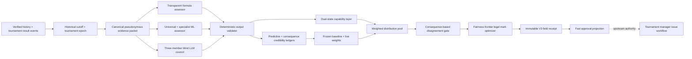
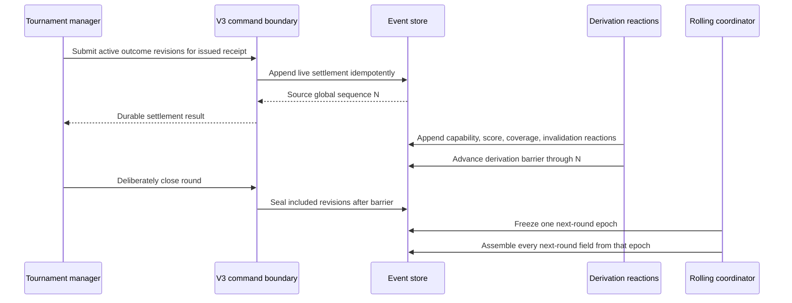
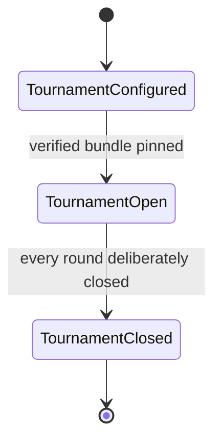
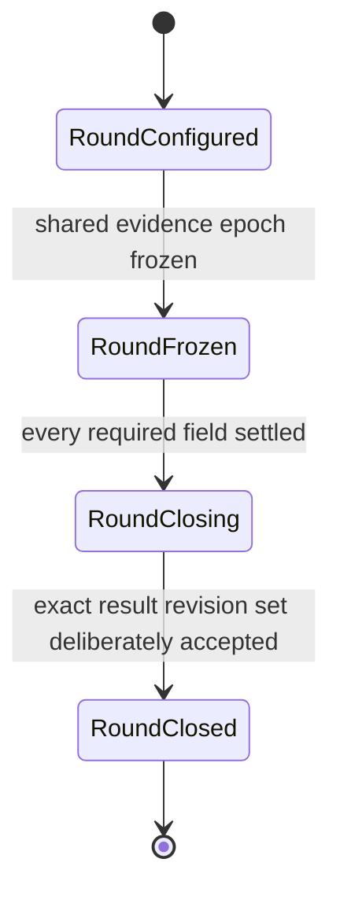
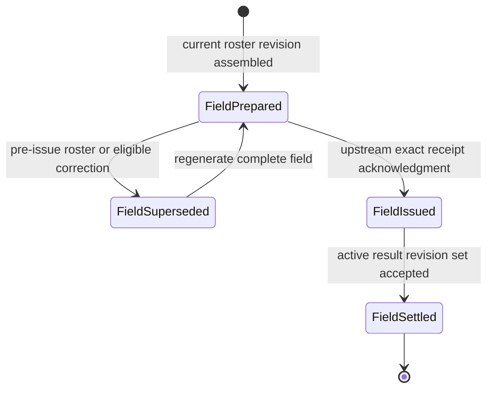
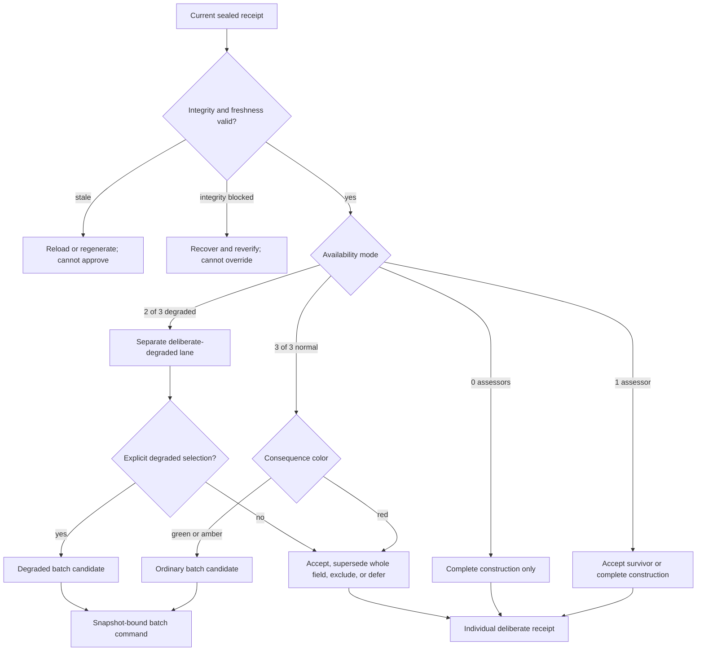
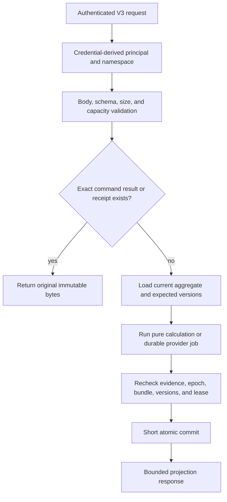
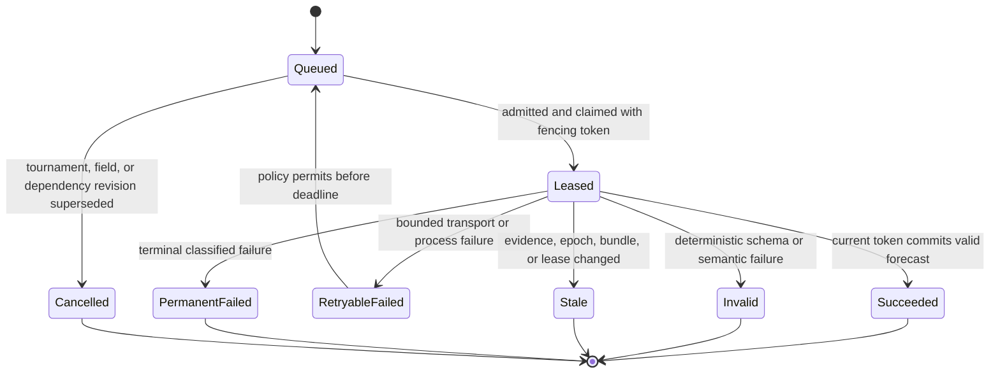
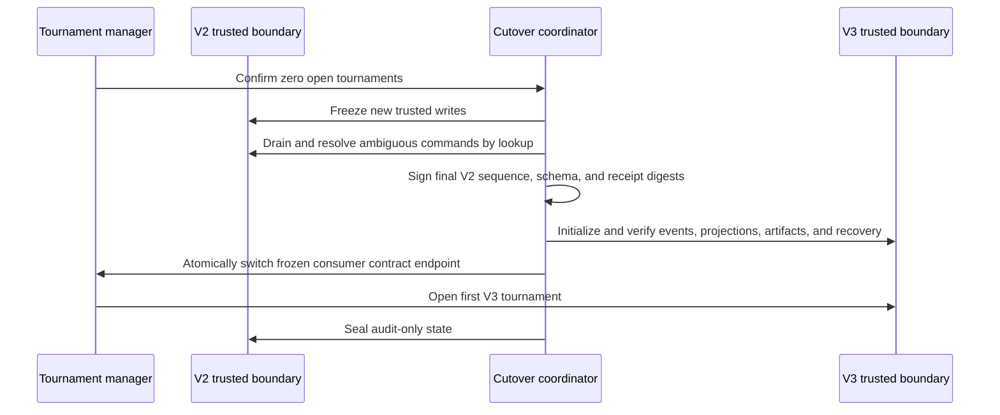

# Adaptive Ensemble Prediction Engine V3 - Plan

## Goal Capsule

Replace STRATHMARK V2's single prior-only numeric engine with a fully auditable,
automatically calibrating ensemble in which a transparent formula, an independent
hierarchical ML system, and a three-member LLM council each forecast raw cutting-time
distributions from the same sealed evidence. Compare those forecasts blindly, pool them
with accuracy-earned weights, preserve disagreement as uncertainty, and optimize a legal
field-relative mark sheet with the slowest expected competitor rebased to Mark 3.

The system must rehandicap every race, learn from every valid completion between rounds,
resist strategic underperformance without pretending to infer motive, and prepare the
next sheet within two minutes inside a show cadence that may allow only five minutes
between the final heat and the next round. It must remain locally authoritative and
recoverable on the designated Windows machine when the network or any assessor fails.

This is a whole-system successor, not a context-limited pilot and not an extension hidden
behind V2's compatibility keys. Formula parameters, model candidates, prompts, weights,
calibration, promotion, monitoring, and rollback form an automated model factory. An
open tournament freezes one complete bundle, while future bundles continue learning.

### Authority order

1. The settled decisions and requirements in this plan.
2. [`docs/wiki/Handicap-Mark-Math.md`](../wiki/Handicap-Mark-Math.md) for domain meaning.
3. Applicable governing rules for the competition being operated.
4. V3's frozen contract, artifacts, and immutable event/receipt evidence.
5. Existing V2 behavior only where this plan explicitly carries it forward.

V2 remains preserved as historical evidence of a justified earlier design. Its active
constraints remain true for V2 code until V3 cutover, but its numeric-LLM prohibition,
residual-only ML, date-only cutoff, same-tournament no-op, and single-authority forecast
do not constrain V3.

## Why This Pivot Exists

### What V2 fixed correctly

V2 retired an unsafe legacy cascade that mislabeled baseline output as LLM output, hid
trained ML, allowed temporal leakage, calibrated in-sample, and exposed uncalibrated
confidence labels. It established strict prior-only evidence, positive distributions,
hierarchical pooling, deterministic Mark-3 optimization, local append-only receipts,
and honest degradation. Those decisions were correct for the evidence and operating
contracts available on 2026-08-11.

### What changed in the product understanding

Subsequent domain work established that the target is not merely a stable prior-time
calculator. STRATHMARK must support a live, multi-round handicap process in which:

- formula, ML, and LLM forecasts are independently generated and compared;
- every heat, quarter-final, semi-final, divisional final, and grand final is a newly
  constructed race with a newly rebased field-relative sheet;
- every valid result can inform the next round without allowing early heats to influence
  later heats in the same round;
- the system detects surprising performance, updates capability, and makes coasting or
  foxing less advantageous without adjudicating intent;
- forecast credibility is learned from actual results both across history and during the
  current tournament;
- a judge can scan and batch-approve ordinary sheets while isolating consequential
  disagreement; and
- slow LLM work is completed before field confirmation instead of blocking race call-up.

### Why this is a replacement rather than a patch

The active V2 contract and executable tests intentionally forbid numeric LLM output,
make ML a correction to the core rather than an independent assessor, exclude all
same-day evidence through an exclusive UTC date, and permit only a short synchronous
trusted-calculation deadline. The current ledger records the selected forecast, not all
sealed component forecasts, weights, disagreement decisions, or model-factory events.

Implementing V3 behind V2's five keys would make the public story false and weaken the
very auditability the pivot is intended to create. V3 therefore receives a new contract,
new receipt version, new storage projections, and a new module namespace. V2 receipts
remain replayable and are never rewritten.

### Research evidence behind the initial LLM and runtime choices

The design is grounded in a local synthetic bakeoff on the intended Windows race-day
machine, not only in model-card claims:

- Ollama `qwen3.5:9b` Q4_K_M (digest prefix `6488c96fa5fa`) produced valid schemas in 9/9
  single-competitor cases, passed 8/9 coarse behavioral checks, showed exact identity and
  roster-order invariance in the full projection, and had a 5.52-second warm median.
- Ollama `ministral-3:8b` Q4_K_M (digest prefix `1922accd5827`) produced valid schemas in
  8/9 cases, passed 8/9 coarse behavioral checks, and had a 5.36-second warm median. Its
  duplicate warning and opaque-ID-dependent interval width prove that schema validity is
  not enough; deterministic invariance and semantic checks are mandatory.
- The former Qwen2.5 7B candidate produced valid schemas but passed only 3/9 behavioral
  checks because it over-abstained and reacted incorrectly to ordinary volatility and
  opaque IDs. It is retired from the initial council despite lower latency.
- An eight-entrant Qwen3.5 batch took 28.36 seconds and returned invalid interval ordering.
  A 32-entrant batch took 110.35 seconds for Qwen3.5 alone and repeated the interval
  failure. Running two verbose local batches after final-field confirmation cannot satisfy
  the two-minute requirement.
- The initial cloud finalists were selected for a future identical domain bakeoff, but no
  cloud winner was declared without configured credentials and sealed results.

These measurements are research evidence, not production qualification. They explain the
two diverse local families, strict deterministic wrapper, sequential GPU scheduling,
rolling per-competitor precomputation, and automatic champion selection required below.

Current-provider verification on 2026-08-22 confirms that the selected candidate names
are real deployable models, not stale shorthand: OpenAI documents `gpt-5.6-terra`,
Anthropic documents `claude-sonnet-5`, Google documents the stable structured-output model
`gemini-3.7-flash`, and Ollama publishes the recorded Qwen3.5 9B and Ministral 3 8B digest
families. This verifies availability only; it does not select a winner. The sealed domain
bakeoff still controls selection, and exact provider IDs/API revisions are pinned rather
than following mutable aliases.

- [OpenAI GPT-5.6 model guidance](https://developers.openai.com/api/docs/guides/latest-model)
- [Anthropic Claude Sonnet 5 announcement](https://www.anthropic.com/news/claude-sonnet-5)
- [Google Gemini 3.7 Flash model](https://ai.google.dev/gemini-api/docs/models/gemini-3.7-flash)
- [Ollama Qwen3.5 tags](https://ollama.com/library/qwen3.5/tags)
- [Ollama Ministral 3 tags](https://ollama.com/library/ministral-3/tags)

## Product Contract

Product Contract preservation: restructured and hardened with review-derived technical
guards; no settled product behavior or scope was changed.

### Summary

For each competitor and target context, V3 builds one canonical evidence packet at a
frozen historical cutoff and tournament epoch. Three blind outer assessors independently
produce positive raw-time distributions:

1. a spreadsheet-reproducible robust formula;
2. a universal-plus-specialists ML hierarchy; and
3. one LLM council aggregate formed from two local model families and one frontier cloud
   model.

The engine validates each output deterministically, scores settled forecasts, updates
context-sensitive credibility, and combines valid distributions through a weighted
linear pool. A dual-state capability mechanism preserves both current form and
demonstrated capability. A deterministic disagreement gate classifies the field as
green, amber, or red from potential sheet consequences. A fairness-frontier optimizer
then constructs legal integer marks, rebases the slowest expected competitor to Mark 3,
and records the entire derivation in an immutable receipt.

STRATHMARK does not implement tournament-manager RBAC. Its API authenticates the calling
service at one boundary; after entry, that caller has unrestricted V3 authority. A
consuming tournament manager owns human authentication, operator roles, approval
permissions, official results, publication, and payouts. STRATHMARK accepts caller-
supplied actor and reason metadata for audit but does not authorize that human actor.

### Non-negotiable domain invariants

- Marks are staggered start times, not rankings, penalties, bonuses, or points.
- A smaller mark starts earlier; a larger mark waits longer.
- Race completion clock is `mark + raw cutting time`.
- For continuous ideal times, `mark_i = 3 + T_slowest - T_i`.
- Every field is independently rebased. Marks copied from differently rebased fields are
  not comparable evidence of capability.
- Event, diameter, and species/material remain prediction context.
- Every race is rehandicapped, including later rounds and elite-only finals.
- The field-relative frontmarker receives Mark 3 even if every finalist is world class.
- Every heat in one round uses the same evidence epoch. Results enter only the next round.
- Every valid completion counts, including completions by eliminated competitors.
- DNF, DQ, DNS, void, penalty, and correction states are recorded explicitly. The engine
  never fabricates a raw time for a non-completion.
- Both overperformance and underperformance update future capability.
- Once a sheet is officially issued, its marks are immutable. The first legal completion
  under that sheet wins; V3 never adjusts the placing after the race.

### Product actors and system boundaries

- **STRATHMARK V3:** numeric evidence, assessor forecasts, capability state, credibility,
  pooling, disagreement, optimized marks, immutable receipts, settlement, automation,
  and local recovery.
- **Tournament manager:** rosters, scheduling, round closure, result finalization,
  upstream authentication/RBAC, approval UI, official issue, standings, publication,
  points, and payouts.
- **Model factory:** automatic candidate construction, temporal evaluation, calibration,
  promotion, monitoring, rollback, and bundle publication.
- **Local inference runtime:** two distinct offline LLM families, initially Qwen3.5 9B
  Q4_K_M and Ministral 3 8B Q4_K_M on Ollama.
- **Cloud inference provider:** one pinned frontier model chosen by the same sealed domain
  harness; the initial candidate set is GPT-5.6 Terra, Claude Sonnet 5, and Gemini 3.7
  Flash.
- **Optional mirror/archive:** best-effort delivery of approved numeric/provenance data;
  never required for race-day calculation, issuance, or recovery.

## High-Level Technical Design

### Component and prediction data flow



### Runtime topology

V3 is a modular monolith, not a network of microservices:

- deterministic evidence, formula, ML inference, capability, credibility, pooling,
  disagreement, and optimizer modules run locally;
- slow LLM inference runs as durable background jobs;
- Ollama and the cloud API are external inference processes, not independent STRATHMARK
  services;
- an append-only SQLite event ledger is the local authority;
- rebuildable projections serve low-latency reads and approval views;
- no Redis, message broker, Kubernetes, cloud database, or live MNEMEX connection is
  required on race day; and
- Python and versioned local REST interfaces share the same application service.

### Result-to-next-round protocol



### Aggregate lifecycle







### Approval decision flow



### Recovery-first request boundary



### Provider and job lifecycle



### V2-to-V3 authority handoff



## Detailed Requirements

### R1. Canonical evidence and identity

- **R1.1** One evidence governor is the only raw-history-to-V3 boundary.
- **R1.2** Every competitor uses a stable pseudonymous identity. Names, contact details,
  reputation, and other unnecessary PII are excluded from numeric packets.
- **R1.3** Eligible evidence contains verified raw completion time; event; diameter/size;
  species/material and versioned physical/context properties; result time and sequence;
  tournament, round, and field identity; issued mark; completion-clock time where known;
  placing/gap; official status; and correction/supersession provenance.
- **R1.4** Narrative claims about coaching, training, technique, equipment, intent,
  practice, or reputation are never numeric evidence.
- **R1.5** Unknown, unsupported, contradictory, invalid, or missing fields remain explicit.
  No assessor or wrapper may silently impute a fact that was not present.
- **R1.6** Formula, ML, and LLM receive semantically identical facts. Assessor-specific
  tables, tensors, or JSON are deterministic projections of the same packet.
- **R1.7** Every packet records schema, taxonomy, conversion, canonicalization, cutoff,
  epoch, and content digests.
- **R1.8** Display-only changes and opaque identifier renaming cannot change a numeric
  forecast. Metamorphic tests enforce identity and ordering invariance.
- **R1.9** A competitor's marginal raw-time forecast is invariant to opponent identity,
  roster membership, stand assignment, draw order, advancement path, and field-relative
  marks. Assessors receive one competitor/context packet, not the proposed field. The
  roster enters only after marginal forecasts are sealed, when the versioned joint-draw
  layer and optimizer construct the race.

### R2. Dual temporal boundary

- **R2.1** Historical training cutoff and live tournament evidence epoch are distinct.
- **R2.2** Training, calibration, replay, and long-term credibility use strictly causal
  evidence and never see a future result, correction, weight, or promoted artifact.
- **R2.3** A tournament result event receives a monotonic append-only observation sequence.
- **R2.4** A round freezes one evidence epoch before any official field in that round is
  assembled. Every field in the round uses that same epoch.
- **R2.5** Settled results may drive provisional reactions and prospective capability cards
  immediately, but become eligible for an official frozen evidence epoch only after
  deliberate round closure and only for subsequent rounds.
- **R2.6** Rolling jobs may compute prospective capability cards after each heat, but the
  official next-round bundle is sealed from the round-closure epoch.
- **R2.7** A correction before issue advances the relevant epoch, marks dependent prepared
  artifacts stale, and creates superseding computations. It never mutates a receipt.
- **R2.8** Historical date cutoffs remain available for reproducible backtests, while V3
  adds intraday sequence semantics rather than weakening `< cutoff` into a leaky rule.
- **R2.9** Round closure is its own upstream-authorized, idempotent event. It seals the
  exact set of result revisions eligible for the next round; receiving the last expected
  heat result never implicitly closes a round.
- **R2.10** A correction after round closure appends a new observation and score reversal.
  It may affect a later unissued round through a newly frozen epoch, but cannot rewrite a
  frozen prior-round epoch, prepared receipt, acknowledged issued sheet, or race placing.
- **R2.11** Database sequences—not wall-clock timestamps—determine evidence order. Events
  record UTC wall time for human audit and monotonic elapsed time for latency; clock
  rollback or drift creates an operational warning but never reorders evidence.
- **R2.12** Every official forecast identifies both the maximum historical evidence key
  and the exact closed tournament-event sequence included. Empty, partial, and corrected
  rounds replay without interpreting dates or schedule position.
- **R2.13** Before any field in a round is issued, an eligible correction invalidates every
  prepared field in that round and the round refreezes as one epoch. After the first field
  in a round is issued, that epoch is sealed for all remaining fields; the correction is
  incorporated only into the next not-yet-issued round. Invalidation is dependency- and
  round-aware, never a blanket rewrite of every unissued artifact.

### R3. Blind assessor protocol

- **R3.1** Each assessor commits its output before any component forecast, ensemble weight,
  mark sheet, race result, or other assessor commentary is disclosed.
- **R3.2** The outer interface returns a positive raw-time distribution, median, central
  intervals, evidence/support summary, abstention state, warnings, artifact versions, and
  evidence digest.
- **R3.3** Formula never receives ML or LLM output; ML never receives formula or LLM
  output; the LLM council never receives formula or ML output.
- **R3.4** Component forecasts are immutable after commit. Invalid forecasts create a new
  attempted revision; they are never edited into validity.
- **R3.5** Deterministic code—not an LLM—controls evidence eligibility, schema validation,
  finite/positive bounds, quantile order, warning codes, abstention, timeouts, and review
  classification.
- **R3.6** A constrained output-correction retry is permitted only within the sealed job's
  deadline. The original invalid output and retry are both retained. Quantiles are never
  silently sorted or repaired by the wrapper.

### R4. Transparent formula assessor

- **R4.1** The formula is independently executable in a spreadsheet from the canonical
  evidence packet and its published parameter manifest.
- **R4.2** Exact target-context completions receive the strongest context weight.
- **R4.3** Related event, diameter, and species/material evidence is converted through
  explicit, versioned, directionally tested transformations with conversion uncertainty.
- **R4.4** Observation weight is the declared product of context relevance, recency,
  evidence quality, and tournament relevance. Every factor and constant is printed.
- **R4.5** A robust weighted center limits a single extreme result without deleting it.
  Faster and slower residuals are treated symmetrically by the arithmetic.
- **R4.6** Sparse competitors borrow from event/discipline/population priors through
  explicit pseudo-observation strength. Personal influence grows continuously with
  support.
- **R4.7** The formula emits a median and uncertainty distribution incorporating residual
  dispersion, sample scarcity, conversion distance, and prior dependence.
- **R4.8** Formula form remains human-readable even when the automated factory recalibrates
  its frozen constants. Every promoted manifest includes a worked example and cell-level
  arithmetic trace.
- **R4.9** A zero-history competitor receives a broad context prior and mandatory red
  review; the formula never presents population evidence as personal evidence.

### R5. Independent hierarchical ML assessor

- **R5.1** ML predicts the raw-time distribution directly. It is not a residual correction
  to the formula or another assessor.
- **R5.2** A universal distributional boosted-tree model learns shared structure across
  events, sizes, species/materials, history depths, current form, and tournament state.
- **R5.3** Context specialists learn supported nonlinear behavior without fragmenting
  sparse contexts into unusable isolated models.
- **R5.4** An evidence-aware calibrated gate combines universal and specialist output into
  one ML distribution. Gate training uses out-of-fold component predictions.
- **R5.5** Features include only causal canonical evidence: context, verified competitor
  history, recency, consistency, trend, context distance, history depth, and eligible
  tournament sequence. Names and narrative evidence are forbidden.
- **R5.6** Training and evaluation split chronologically by tournament/date and prevent the
  same future show or target row from leaking through aggregates, calibration, tuning, or
  specialist selection.
- **R5.7** The model emits calibrated quantiles or an equivalent positive-support
  distribution, not a point estimate with a heuristic confidence label.
- **R5.8** An open tournament uses one frozen ML hierarchy. New results change causal
  inputs between rounds but never retrain the artifact during the tournament.
- **R5.9** Missing features follow explicit learned missingness paths or labeled fallback;
  no hidden mean/default imputation is allowed.

### R6. Three-member LLM council

- **R6.1** The council is one outer assessor and can never outvote Formula plus ML merely
  because it contains three models.
- **R6.2** Normal composition is two genuinely different local/offline families and one
  pinned frontier cloud family.
- **R6.3** Initial local champions are Qwen3.5 9B Q4_K_M and Ministral 3 8B Q4_K_M. They
  remain candidates until the complete frozen harness confirms schema, behavior,
  invariance, calibration, capacity, and thermal performance.
- **R6.4** The cloud champion is automatically selected from configured candidates using
  the identical sealed domain harness and promotion gates. Provider aliases that can
  silently change behavior are rejected.
- **R6.5** Every member receives the same pseudonymous structured evidence and returns a
  strict distribution schema, evidence references, warnings, and abstention reason.
- **R6.6** Member prompts forbid invented facts, motive claims, names, unsupported causal
  stories, and knowledge outside the packet.
- **R6.7** Council member subweights are context-sensitive and accuracy-earned. They sum to
  the LLM assessor's outer weight.
- **R6.8** Council aggregation is a reliability-weighted mixture. Dissent remains in the
  distribution and may widen it; no individual member has veto authority.
- **R6.9** Three valid members is normal. Two valid members is a degraded council requiring
  explicit upstream approval. One or zero valid members makes the LLM outer assessor
  unavailable.
- **R6.10** Prompt, schema, runtime, model digest, quantization, sampling parameters, raw
  response digest, validator result, and latency are recorded.
- **R6.11** Deterministic event/receipt replay never calls an LLM again; it consumes the
  exact immutable sealed member output. Provider snapshots are pinned when available.
  When a provider exposes only a durable-but-updatable model ID, the bundle records that
  limitation, provider-returned model/version/fingerprint, API revision, and a preflight
  canary digest. A changed runtime/provider fingerprint creates a new candidate and cannot
  silently satisfy an already pinned open-tournament job.

### R7. Dual-state capability and anomaly response

- **R7.1** V3 represents current form separately from demonstrated capability.
- **R7.2** Current form updates symmetrically from every valid faster or slower completion.
- **R7.3** Demonstrated capability retains credible repeatable speed and decays more
  gradually; one slow performance cannot immediately erase proven ability.
- **R7.4** Repeated, consistent slower performance can move both states and establish a
  genuine decline. The mechanism is not a permanent fastest-time ratchet.
- **R7.5** A credible dramatic improvement moves capability rapidly because the competitor
  has demonstrated the faster performance.
- **R7.6** A versioned change-point/mixture calculation estimates whether observations fit
  stable form, a new regime, or an isolated anomaly. It never labels foxing, cheating,
  injury, intent, or motive.
- **R7.7** Extreme results remain evidence. They may receive limited single-observation
  influence, expand uncertainty, or increase new-regime probability, but are never
  silently deleted.
- **R7.8** The protective capability layer is applied identically and audibly to assessor
  distributions before final pooling. It must not conceal the original forecasts.
- **R7.9** The receipt exposes before/after current-form state, capability state,
  change-point probability, influence, and the consequence for the prepared sheet.
- **R7.10** Capability persistence is a shared deterministic post-assessor operator, not a
  fourth assessor and not an input containing another assessor's opinion. Assessors see
  the same raw canonical evidence but never capability-adjusted forecasts. The operator
  uses only capability state sealed before the target result, applies identically to each
  committed distribution, and is calibrated/evaluated as part of the whole pipeline.
  Original and adjusted forecasts are scored separately so accidental double counting or
  overprotection is visible and can fail promotion.
- **R7.11** A corrected, superseded, or voided result deterministically rebases every
  capability state that depended on it. V3 appends a `capability.state-rebased` event that
  links the original state lineage, replacement evidence sequence, prior and replacement
  state digests, and all invalidated unissued card/field receipts. Issued sheets remain
  immutable. Replaying corrected history must produce the same current capability digest
  as a clean ledger containing only the final valid result revisions.

### R8. Predictive and handicap-consequence credibility

- **R8.1** Formula, ML, LLM council, and individual LLM members are scored only from their
  sealed pre-result forecasts.
- **R8.2** The Predictive Evidence Ledger scores every valid completion using a proper
  distribution score, median absolute error, tail error, interval coverage, sharpness,
  and calibration.
- **R8.3** The Handicap Consequence Ledger replays each assessor through the same optimizer
  against actual raw times and records counterfactual spread, win-probability distortion,
  class/context bias, gap error, breakout exposure, and optimizer repair.
- **R8.4** Raw-time predictive accuracy is the primary weight driver. Handicap consequence
  is a safety guardrail that can constrain or penalize an otherwise accurate assessor.
- **R8.5** Every valid competitor completion scores each eligible assessor; winners do not
  receive special scoring weight.
- **R8.6** Scores are hierarchical by event, size band, species/material group, history
  depth, and broader fallback context. Sparse cells shrink toward parent/global evidence.
- **R8.7** Recent evidence may matter more, but one surprising heat cannot overwhelm a
  deep, consistent record. Sample maturity, consistency, and context match govern
  adaptation speed.
- **R8.8** Corrected or voided results append score reversals/supersessions. They do not
  mutate the original score event.
- **R8.9** Credibility maintains a coverage-opportunity ledger for every assessor that was
  eligible at forecast time, including successful forecasts, justified model abstentions,
  schema-invalid outputs, transport/runtime failures, and missed deadlines. An assessor
  cannot improve its learned weight by selectively withholding predictions on difficult
  cases; transport and validation failure are never scored as principled abstention.
- **R8.10** Bundle-declared minimum coverage, context-specific shrinkage, and explicit
  missing-opportunity penalties constrain learned weights. Promotion includes adversarial
  selective-abstainer candidates and fails any policy that rewards withholding difficult
  forecasts or reclassifying invalid output as abstention.

### R9. Automatic outer weights and live overlay

- **R9.1** Cold-start outer weights are exactly one-third Formula, one-third ML, and
  one-third LLM council.
- **R9.2** After settled evidence exists, a versioned deterministic recalibrator converts
  context-specific proper scores into bounded weights and shrinks sparse evidence toward
  equal weights.
- **R9.3** No assessor may permanently monopolize or vanish solely from a short run. Weight
  floors, caps, learning rate, decay, and maturity are stored in the active bundle.
- **R9.4** Pre-tournament baseline weights derive from finalized long-term ledgers.
- **R9.5** A temporary live overlay updates between rounds from sealed forecasts and valid
  settled completions in the current tournament.
- **R9.6** Live influence starts with baseline ballast and grows with sample count,
  consistency, and context match. It cannot overwhelm the baseline from only a few rows.
- **R9.7** Weights are frozen for an entire round. No heat can change the weights used by a
  later heat in the same round.
- **R9.8** The live overlay expires after the tournament. Finalized results subsequently
  enter permanent ledgers through the normal causal lifecycle.
- **R9.9** Live credibility is enabled by default but can be suspended or emergency-stopped
  through unrestricted STRATHMARK controls. Both actions and re-enable events require an
  explicit reason and produce before/after projections.
- **R9.10** Missing assessors never cause silent weight movement. Receipts show baseline
  weight, unavailable weight, and any explicit effective normalization used for a
  provisional degraded recommendation.
- **R9.11** For a permitted degraded pool, baseline weights remain unchanged for learning
  and audit while effective calculation weights are explicitly renormalized only across
  valid available assessors. The receipt prints the normalization denominator and missing
  mass. Availability never creates a credibility update or synthetic assessor score.

### R10. Weighted distribution pooling

- **R10.1** Valid outer distributions are combined through a weighted linear opinion pool,
  not by averaging medians or interval endpoints.
- **R10.2** Pooling preserves multimodality and wider uncertainty when assessors disagree.
- **R10.3** The pool uses deterministic common-random-number sampling or an analytically
  equivalent reproducible implementation.
- **R10.4** The receipt retains original component distributions, capability-adjusted
  distributions, weights, pooled samples/digest, median, quantiles, and seed.
- **R10.5** A product-of-experts calculation is prohibited because disagreement must not
  create unjustified overconfidence.
- **R10.6** A point estimate alone can never be promoted as a valid V3 assessor output.
- **R10.7** Canonical numeric boundaries use a bundle-declared time quantum, initially one
  millisecond. Recorded times, quantiles, and persisted samples use integer time units or
  canonical decimal strings; non-finite values are impossible. Sampling records the
  algorithm, dependency version, seed, draw count, quantization, and common-random-number
  map so replay is exact under the frozen bundle rather than dependent on ambient globals.
- **R10.8** Marginal competitor distributions do not by themselves define a joint race.
  A separate versioned field-dependence layer supplies shared/context and competitor-
  specific draws to the optimizer. Dependence is learned only from causal same-field
  residual evidence, hierarchically shrunk toward independence, and frozen in the bundle.
  Unsupported contexts use explicitly labeled independence rather than invented
  correlation.
- **R10.9** Formula, ML, council, pooled, and counterfactual sheets all use the identical
  joint-draw generator and common random numbers. Competitor ordering and opaque identity
  cannot alter draw assignment; dependence parameters, effective sample size, seed, and
  fallback appear in the receipt and consequence ledger.

### R11. Consequence-based disagreement gate

- **R11.1** Classification is deterministic and versioned. LLM-generated explanations
  cannot select green, amber, or red.
- **R11.2** Green means assessors are numerically compatible and imply the same legal and
  competitive sheet within frozen tolerances.
- **R11.3** Amber means disagreement is visible but does not materially change competitor
  ordering, legal marks, expected spread, or win probabilities. Amber remains eligible
  for upstream batch approval.
- **R11.4** Red means disagreement can materially change the race, including a competitor
  ordering reversal, a legal mark movement of at least two seconds, or a versioned
  material change in simulated spread/win probability. Red is excluded from upstream
  mass approval.
- **R11.5** Probability and spread thresholds are selected from historical replay,
  verified on disjoint data, frozen in the bundle, and printed in the receipt.
- **R11.6** The gate evaluates assessor counterfactual sheets and the final pooled sheet;
  raw seconds alone are insufficient.
- **R11.7** Formula, ML, council aggregate, and council dissent remain inspectable even
  when the field is green.

### R12. Fairness-frontier mark optimizer

- **R12.1** The continuous reference sheet is `3 + T_slowest - T_i` from the final expected
  raw-time basis.
- **R12.2** Every field is independently rebased to Mark 3 without changing relative gap
  geometry.
- **R12.3** Candidate legal integer sheets are evaluated against the full pooled joint
  distributions.
- **R12.4** Objectives include predictive gap fidelity, model-implied win-probability
  parity, expected finish spread, and legal/stability constraints.
- **R12.5** V3 chooses a deterministic knee/diminishing-returns point on the Pareto frontier
  rather than allowing one hidden scalar preference to dominate.
- **R12.6** The optimizer may move more than one second from naive rounding when the
  documented fairness gain justifies it. Magnitude alone does not trigger review.
- **R12.7** Invariants include integer marks, configured floor/ceiling, at least one Mark 3,
  monotonic faster-to-larger-mark ordering, stable ties, deterministic replay, and no
  post-issue change.
- **R12.8** Output includes the continuous ideal, rounded baseline, optimized sheet,
  per-competitor deltas, fairness gain, spread change, gap-fidelity cost, frontier digest,
  and fallback reason.
- **R12.9** Optimizer failure returns the canonical rounded-gap sheet, records the failure,
  and enters the appropriate degraded/review state.

### R13. Zero-history and expected-time overrides

- **R13.1** A zero-history competitor receives a broad target-context population prior,
  maximum honest uncertainty, and red review.
- **R13.2** STRATHMARK exposes unrestricted actions to accept that starting estimate or
  replace the expected raw time. Authorization is an upstream concern.
- **R13.3** An override changes expected raw time, never an isolated field-relative mark.
  The whole field is re-pooled, re-optimized, and re-rebased.
- **R13.4** The override is not fabricated result or training evidence.
- **R13.5** An accepted override becomes the starting estimate and continues updating from
  subsequent valid evidence; it is not fixed forever.
- **R13.6** Override scope has no default. The caller deliberately chooses upcoming race,
  remaining rounds of the same event configuration, or remaining rounds of the
  tournament. Durable history/book correction is a separate workflow.
- **R13.7** Each event retains assessor outputs, consensus, evidence digest/epoch, actor and
  reason metadata, selected scope, before/after time, before/after sheet, affected
  competitors, and supersession links.

### R14. Availability and degradation

- **R14.1** Three valid outer assessors is normal operation.
- **R14.2** Two valid outer assessors produces an explicitly degraded recommendation that
  requires deliberate upstream acceptance.
- **R14.3** One valid outer assessor requires manual acceptance/construction and can never
  masquerade as ensemble output.
- **R14.4** Zero valid assessors exposes an audited traditional/manual construction path.
- **R14.5** A two-of-three LLM council is separately degraded even when the LLM aggregate
  remains available to the outer ensemble.
- **R14.6** Timeouts, invalid schema, invalid quantile order, artifact mismatch, stale
  evidence, runtime failure, and cloud loss map to explicit reason codes.
- **R14.7** Late output can create a diagnostic event but can never alter an already sealed
  field or issued sheet.
- **R14.8** Cloud failure leaves the two local members available. Local model failure must
  not prevent formula and ML calculation.
- **R14.9** No failover silently invokes V2, a different cloud alias, a different local
  model, or an unversioned manual default.
- **R14.10** One- or zero-assessor operation never invents a default. The caller must
  deliberately accept the exact surviving forecast or submit a complete expected-time
  construction for the affected field with reason and scope. V3 validates positivity,
  context, completeness, floor/ceiling, whole-field ordering, and Mark-3 rebasing, then
  labels the result manual/degraded; it never labels that construction as ensemble output.
- **R14.11** Manual/degraded construction and acceptance are immutable decision evidence,
  not assessor accuracy or training evidence. Later valid race completions update the
  competitor's starting estimate/capability through the normal causal path, while the
  manual decision remains visible in every dependent receipt and settlement.

### R15. Rolling race-day computation

- **R15.1** All scheduled heats are prepared before their round from the shared frozen
  epoch.
- **R15.2** After each official heat result, deterministic state, Formula, and ML update
  immediately for affected competitors and target contexts.
- **R15.3** The cloud member runs in parallel with local work. Local LLMs run sequentially
  on the designated 8 GB RTX 4070 Laptop GPU to avoid memory contention.
- **R15.4** V3 precomputes component capability cards for every plausible qualifier and
  every already scheduled future context, not only the expected winner.
- **R15.5** A card key includes competitor, target context, historical cutoff, tournament
  epoch, bundle digest, and evidence digest. Exact jobs deduplicate.
- **R15.6** Global/context weight changes recombine sealed component forecasts without
  rerunning assessors whose evidence packet did not change.
- **R15.7** Work priority is: imminent confirmed field, plausible next-round qualifiers,
  other scheduled race entrants, then maintenance/backfill/model-factory jobs.
- **R15.8** After the final heat settles and the tournament manager deliberately closes the
  round, only newly affected cards finish; confirmed field assembly, gate evaluation,
  optimization, receipt commit, and approval projection complete within the two-minute
  result-to-ready service level.
- **R15.9** The target field-assembly transaction excluding unfinished assessor jobs is
  under two seconds on the designated Windows machine.
- **R15.10** The show never waits indefinitely. At the hard deadline V3 seals the available
  state and follows the explicit degraded matrix.
- **R15.11** The tournament manager supplies canonical tournament, round, and field/roster
  snapshots with monotonic upstream revisions. A pre-issue scratch, substitution, entrant,
  draw, or target-context change supersedes the field revision and regenerates the whole
  receipt. After acknowledgment the sheet is immutable; a non-starter is settled as DNS
  unless the tournament manager issues an entirely new legal field.
- **R15.12** Tournament open and close are explicit idempotent lifecycle events. Open pins
  the verified bundle and first-round boundary. Close cancels speculative work, expires the
  live overlay, seals final mandatory derivations, freezes support/export evidence, and is
  the earliest point at which archive eligibility may begin.

### R16. Exception-first approval projection

- **R16.1** STRATHMARK exposes a read projection optimized for an upstream judge to scan
  many imminent sheets rapidly.
- **R16.2** Approval state is a deterministic product of integrity, freshness, assessor
  availability, manual/degraded-path status, and consequence color. Any blocked integrity,
  stale evidence, or unavailable mandatory state outranks green/amber color and prevents
  ordinary batch approval. In normal 3/3 operation, green is batch-eligible, amber is
  flagged but batch-eligible, and red is excluded.
- **R16.3** Every flag identifies the competitor(s), causal rule, component forecasts,
  consequence, and exact changed marks without requiring narrative interpretation.
- **R16.4** Reviewing or overriding one competitor always displays the regenerated
  whole-field before/after sheet because optimization and rebasing are field-relative.
- **R16.5** Upstream batch approval can bind multiple exact receipt IDs in one action. V3
  records supplied actor metadata, timestamp, included revisions, and exclusions without
  implementing RBAC. The tournament manager remains the only issue authority and durably
  forwards each decision through its outbox; V3 records an idempotent immutable
  acknowledgment and never originates authorization.
- **R16.6** The approval projection is ready from sealed local data and never waits for a
  cloud request initiated by opening the screen.
- **R16.7** Degraded 2/3 outer-assessor or 2/3 council output never enters the ordinary
  green/amber batch silently. It may enter a separate, prominently labeled deliberate-
  degraded batch lane only when its complete receipt set and degradation reasons are
  selected explicitly. One-assessor, zero-assessor, zero-history, red, stale, and integrity-
  blocked sheets remain individually deliberate paths with no invented default.

The approval contract has explicit exits; “individual review” is not a terminal mystery
state:

| Approval lane | Permitted deliberate exits | Prohibited behavior |
| --- | --- | --- |
| Normal green/amber | Accept the exact receipt in an ordinary batch; exclude; defer | Silent acceptance or issue of a different revision |
| Degraded 2/3 | Accept the exact degraded receipt in the separate degraded batch; submit a superseding whole-field construction; exclude; defer | Ordinary-batch inclusion |
| Red disagreement | Accept unchanged individually; submit a superseding whole-field construction; exclude; defer | Automatic/default acceptance |
| Zero history | Accept the broad-prior receipt individually; override the starting estimate in a superseding whole-field receipt; exclude; defer | Presenting population evidence as personal evidence |
| One assessor | Accept the exact survivor individually; submit a complete expected-time construction; exclude; defer | Inventing a pooled or default forecast |
| Zero assessors | Submit a complete expected-time construction; exclude; defer | Any computed/default ensemble receipt |
| Stale | Reload the current approval snapshot or regenerate the field | Override, accept, or issue the stale revision |
| Integrity blocked | Recover and re-verify before a new snapshot is exposed | Override, accept, or issue around failed integrity |

The projection exposes `accepted`, `override-submitted`, `excluded`, `deferred`, and
`blocked` decision states as immutable command results. An override always creates a new
whole-field receipt and returns through the same freshness and integrity gates.

The read contract is deliberately two-level. A bounded scan row contains call order and
deadline, field/context identity, current receipt revision, approval lane, readiness and
consequence color, proposed marks, changed-mark summary, affected competitors, primary
reason codes, and batch eligibility. A separate bounded detail query contains the complete
before/after field, component distributions, counterfactual consequences, capability facts,
and receipt evidence. The queue envelope contains snapshot identity/global sequence,
lifecycle state, counts by lane/readiness, preparation progress, earliest deadline,
projection currency, retry guidance, and one explicit empty reason: no scheduled fields,
still preparing, no batch-eligible fields, all issued, or all blocked.

Pagination and mass selection bind to one immutable approval-snapshot identity. A batch
command names that snapshot plus every included and deliberately excluded receipt revision.
A conflict returns bounded per-field reasons and replacement receipt identities so the
consumer can retain unaffected selections, refresh only changed rows, and deliberately
submit a new atomic batch.

### R17. Append-only event ledger and projections

- **R17.1** SQLite is the authoritative race-day event store. WAL, durability, backup,
  corruption detection, and single-writer behavior receive explicit tests and runbooks.
- **R17.2** Results, corrections, epoch closure, component forecasts, council members,
  capability updates, score events, weight changes, pooling, disagreement, overrides,
  field optimization, issue, settlement, model candidates, promotion, monitoring, and
  rollback are immutable typed events.
- **R17.3** Corrections append reversals/supersessions. Update and delete of authoritative
  events are forbidden by schema and triggers.
- **R17.4** Current capability, weights, job state, field readiness, receipt lookup,
  approval queue, and model status are rebuildable projections, not alternate authority.
- **R17.5** Projection rebuild from genesis and from verified checkpoints produces the
  same canonical digest.
- **R17.6** Event appends and required local projection changes are atomic or safely
  recoverable. Ambiguous completion resolves through idempotent lookup, never blind retry.
- **R17.7** The ledger stores pseudonymous numeric evidence and provenance; names, contact
  data, free-text notes, and tournament-manager secrets remain outside.
- **R17.8** Optional mirrors use a bounded retryable outbox and cannot block local commit,
  calculation, approval projection, issue, or recovery.
- **R17.9** Tournament, round, field, job, and bundle are explicit versioned aggregates
  with closed lifecycle state machines. Every command supplies the target aggregate and
  expected version. One SQLite transaction validates the legal transition, appends the
  next consecutive aggregate version, and advances required projections. Exact retries
  recover their original result; stale versions and illegal transitions fail closed.
- **R17.10** Every event digest commits the canonical event, prior global event digest,
  and prior aggregate-stream digest. Startup, issue acknowledgment, checkpoint, backup,
  and rebuild verify both chains. Periodic checkpoint manifests are signed with a
  versioned integrity key stored outside SQLite and exported through the tournament-
  manager outbox/support bundle and optional mirror, providing an independent anchor
  without making race-day operation network-dependent. Key rotation is append-only and
  preserves verification of prior checkpoints; verification never claims resistance to
  total compromise of the host and its key material.
- **R17.11** SQLite stores bounded canonical events and operational indexes. Large raw LLM
  responses, deterministic sample arrays, factory reports, and support artifacts live in
  an adjacent immutable content-addressed blob store. A blob is fsynced and atomically
  renamed before the referencing event commits; the event records digest, byte length,
  media/schema type, and retention class. Missing or corrupt required blobs invalidate
  readiness and are never silently regenerated from a newer model.
- **R17.12** The database uses explicit versioned connection policy: WAL mode, foreign
  keys, busy deadlines, declared synchronous level, short `BEGIN IMMEDIATE` writes, and
  bounded checkpoints. Model inference, blob encoding, network calls, and large report
  construction never occur while the SQLite writer transaction is open.
- **R17.13** Backups use SQLite's online backup mechanism or an equivalently verified
  snapshot of the database/WAL state plus blob manifest; copying only the main `.db` file
  is prohibited. Restore verifies schema, hash-chain tip, signed checkpoint, every
  required blob, pinned bundle, projection digest, and issued-sheet lookup before ready.
- **R17.14** Open-tournament events, issued receipts, required blobs, and undelivered
  outbox items are never compacted. Closed-tournament segments may leave primary storage
  only after a signed archive package has two independently verified copies and a local
  searchable index remains. Without that proof, storage pressure degrades maintenance and
  raises an operator stop condition rather than deleting evidence.
- **R17.15** Outbox deliveries have explicit transient, permanent, quarantined, and
  acknowledged states; bounded exponential backoff; operator-visible terminal reasons;
  and deterministic replay. No queue cap discards an undelivered authoritative payload.
- **R17.16** Every mandatory derived reaction is idempotently keyed by source global
  sequence plus reaction type. A durable derivation cursor/barrier proves that capability,
  forecast scoring, coverage opportunities, weights, invalidations, and readiness
  projections are complete through source sequence `N`. A round may freeze its next epoch
  only after every mandatory reaction for every included result revision has crossed that
  barrier; process restart resumes missing reactions without duplication.
- **R17.17** Commands spanning multiple aggregates carry a canonical sorted map of
  `{aggregate_id: expected_version}`. Batch issue is itself a versioned aggregate command
  that validates every field, receipt revision, derivation barrier, and expected version in
  one short SQLite writer transaction before appending all acknowledgments. It is all-or-
  nothing: a stale or invalid member commits none of the batch.
- **R17.18** V3 has a dedicated `STRATHMARK_V3_DB_PATH` resolved only by composition before
  any repository is constructed. V2 and V3 never concurrently write one SQLite file. Any
  V2 evidence migration is an explicit repeatable read-only snapshot import whose source
  bytes/rows remain unchanged and whose imported cutoff/digest is recorded.
- **R17.19** Acknowledged issue events have zero tolerated local data loss. Before returning
  an issue acknowledgment, V3 fsyncs a compact signed critical-event recovery record to a
  separately configured local recovery volume. Other events use a bundle-declared bounded
  recovery-point objective. Restore reconciles database/backup tip, signed checkpoints,
  critical journal, and tournament-manager retry/outbox; any unexplained gap blocks new
  issue until exact receipts are recovered or deliberately re-entered and audited.

### R18. Immutable V3 receipts

- **R18.1** A field receipt is atomic and contains the ordered field, target context,
  evidence cutoff/epoch, canonical packet digests, all component outputs, member outputs,
  validations, capability adjustments, credibility scores/weights, pooled distribution,
  disagreement result, optimizer frontier, marks, warnings, latency, and bundle versions.
- **R18.2** Receipt identity is content-addressed plus caller namespace/request identity.
  Exact retry returns the exact stored core before any provider is loaded.
- **R18.3** Changed material input requires a new receipt linked as a superseding revision.
- **R18.4** An idempotent upstream issue acknowledgment freezes the referenced marks
  permanently. Later outcomes settle forecasts and credibility but do not rewrite the
  receipt, issued-sheet fact, or race placing.
- **R18.5** Receipt serialization is canonical, closed-schema, bounded-size, and digest
  verified. Large samples may be represented by deterministic digest plus regeneration
  inputs when byte-for-byte replay is proven.
- **R18.6** A human-readable explanation is derived from receipt facts and never replaces
  the numeric/audit core.
- **R18.7** Live settlement requires the exact acknowledged issued receipt, field revision,
  competitor membership, and one active upstream outcome revision per entrant. Duplicate,
  wrong-field, unissued, or non-member results cannot update capability or credibility as
  official live evidence.
- **R18.8** Verified historical import is a separate command/event family with source,
  cutoff, provenance, and digest. Imported evidence never impersonates settlement of a
  live issued race and cannot create an issued-sheet fact.
- **R18.9** Completion, DNF, DQ, DNS, void, and penalty statuses form a closed versioned
  vocabulary with explicit raw-time eligibility and supersession rules. Invalid/nonfinish
  states never manufacture a completion time; evidence admission normalizes them once for
  every downstream assessor and ledger.

### R19. Durable jobs and recovery

- **R19.1** Background jobs are persisted before execution and have stable idempotency
  keys, lease/heartbeat state, deadlines, attempt history, and terminal reason codes.
- **R19.2** Process restart, machine restart, Ollama restart, cloud timeout, or worker crash
  resumes/reconciles jobs without duplicate committed forecasts.
- **R19.3** Separate bounded capacity exists for hot-path field assembly, inference,
  recovery/lookup, and maintenance/model-factory work.
- **R19.4** A saturated inference queue cannot consume receipt-recovery capacity.
- **R19.5** Jobs verify evidence and bundle digests immediately before commit. Stale work is
  recorded and discarded from current projections rather than committed as current.
- **R19.6** Model loading is warmed before the first operational deadline. Thermal and cold
  start behavior are benchmarked separately.
- **R19.7** Local models are never both loaded concurrently if the validated memory budget
  cannot support them safely.
- **R19.8** Durable jobs use closed states (`queued`, `leased`, `succeeded`, `invalid`,
  `stale`, `cancelled`, `retryable-failed`, `permanent-failed`) and store attempt count,
  priority, not-before time, hard deadline, lease owner, lease expiry, and a monotonically
  increasing fencing token. Atomic claim returns one lease; only its current fencing token
  may commit a forecast. Expired workers may finish diagnostically but cannot publish.
- **R19.9** Retry policy is error-code-specific and bundle-versioned. Schema correction has
  its one bounded retry; deterministic validation errors are terminal; transport and
  process failures use bounded jittered retry within the deadline; exhausted work becomes
  an explicit unavailable assessor rather than looping forever.
- **R19.10** Queue admission is bounded by a capacity manifest. Imminent field work has
  reserved capacity, starvation prevention uses aging within lower priorities, and
  maintenance/factory work is suspended before it can consume issue, recovery, result,
  or projection-rebuild capacity.

### R20. Automated model factory

- **R20.1** The factory automatically constructs, trains/tunes where applicable, replays,
  calibrates, compares, promotes, monitors, and rolls back Formula manifests, ML
  hierarchies, LLM member candidates/prompts, credibility parameters, capability
  parameters, and optimizer/gate parameters.
- **R20.2** Candidate evaluation uses nested causal splits: training/tuning, calibration,
  and locked out-of-time audit data are disjoint.
- **R20.3** Candidate generation cannot read sealed audit outcomes while tuning.
- **R20.4** Promotion is an automatic deterministic event when every predeclared gate
  passes. Failure leaves the champion unchanged and records every failed gate.
- **R20.5** There is no context-limited product release. The active bundle covers the
  entire configured domain using hierarchical fallback and honest uncertainty.
- **R20.6** An open tournament pins one complete bundle manifest. A newly promoted bundle
  becomes eligible only for unopened tournaments.
- **R20.7** Post-promotion monitoring uses newly settled evidence and can automatically
  roll back to the last healthy bundle when frozen regression/drift thresholds trigger.
- **R20.8** Rollback is append-only and affects only future/unopened tournaments. It never
  changes an issued or historical receipt.
- **R20.9** Candidate inputs must be locally available or explicitly configured. The
  factory does not download arbitrary executable artifacts or send evidence to an
  unconfigured provider.
- **R20.10** Each bundle includes code revision, dependency lock, data snapshot digest,
  formula manifest, ML artifacts, LLM models/prompts/schemas, calibration, capability,
  credibility, gate, optimizer, and rollback parent.
- **R20.11** Bundles are immutable content-addressed directories. Publication writes to a
  staging directory, verifies every digest and compatibility gate, fsyncs content, and
  atomically installs the manifest before an append-only activation event switches the
  future-tournament pointer. An open tournament keeps its original bundle path and digest.
- **R20.12** Candidate code can read training/tuning/calibration roles but cannot read the
  sealed audit role. A separate evaluator process with a frozen harness opens audit data,
  emits a signed report, and has no candidate-writing capability. Promotion consumes only
  that report and predeclared gates; failed candidates cannot edit thresholds or retry
  against the same sealed role under a new cosmetic identity.
- **R20.13** No model, prompt, package, or bundle download occurs after tournament opening.
  Preflight proves all pinned local artifacts, cloud model IDs/API revisions, credentials,
  dependency versions, rollback parent, and offline fallbacks are present and warmed.
- **R20.14** Content addressing proves artifact identity but not authorization. Activation
  therefore requires a trusted-key signature over the final canonical manifest, separate
  evaluator report digest, code/data/dependency/artifact digests, compatibility contract,
  and rollback parent. The bundle-signing trust anchor is read-only and separate from the
  candidate builder. Append-only rotation preserves prior verification; revocation blocks
  new activation and tournament opening with a revoked signer without rewriting history.
- **R20.15** Locked audit data is one-use per candidate lineage, not one reusable answer
  sheet. Retry identities follow artifact/code/data ancestry rather than candidate names;
  the candidate generator receives no detailed row/slice outcomes that enable adaptive
  tuning. After an audit generation is consumed, further model selection requires a fresh
  prospective holdout generation under a precommitted manifest and gate.

### R21. API and compatibility boundary

- **R21.1** V3 receives new Python types and versioned REST schemas. It is not projected
  into V2's `manual/llm/ml/baseline/panel` dictionary as if those keys were independent.
- **R21.2** The V3 interface separates durable asynchronous card preparation from fast
  synchronous field assembly/recovery.
- **R21.3** All write commands use stable idempotency identities and closed schemas.
- **R21.4** Public unauthenticated calculation, if retained, is stateless and cannot create
  trusted evidence or model-factory outcomes.
- **R21.5** STRATHMARK does not implement per-user roles. Every trusted V3 operation
  requires a configured service credential at the API boundary; after authentication,
  that caller has full V3 control. The immutable service principal and idempotency namespace
  are derived from the validated credential, never supplied or overridden by request-body
  metadata. Upstream actor/action metadata is recorded for audit but is not authorized by
  V3 and cannot spoof the trusted service identity.
- **R21.6** The tournament manager later integrates through one adapter. Its official
  authorization and issue logic remain outside this repository. Its durable outbox sends
  an exact receipt-bound issue acknowledgment; V3 validates the current prepared receipt,
  records that fact idempotently, and returns the original result for an exact retry.
- **R21.7** V2 remains callable during migration for existing consumers but is never an
  automatic runtime fallback for V3.
- **R21.8** Cutover removes ambiguous dual-write/dual-authority behavior. A field receipt
  declares exactly one engine contract.
- **R21.9** Authority cutover occurs only at a tournament boundary with zero open
  tournaments. V2 trusted writes are frozen; all ambiguous in-flight requests are resolved
  by lookup; a signed manifest records final V2 sequence/schema/receipt digests and the
  verified initialized V3 state; then the consumer contract endpoint switches atomically.
  After the first V3 tournament opens, V2 is audit-only. Recovery uses V3 or the explicit
  traditional/manual path, never automatic V2 fallback.

### R22. Privacy, security, and data egress

- **R22.1** Local and cloud LLM packets use pseudonymous stable IDs and the minimum numeric
  evidence necessary for prediction.
- **R22.2** Names, contact details, medical information, free text, secrets, and unrelated
  tournament data never enter LLM prompts, receipts, or mirrors.
- **R22.3** Cloud egress is explicit, inspectable, bounded, and logged by digest/provider;
  loss of cloud consent/configuration follows degraded operation.
- **R22.4** Model artifacts and manifests are digest verified before activation.
- **R22.5** Deserialization uses safe bounded formats. Arbitrary pickle/code execution is
  prohibited for remotely sourced artifacts.
- **R22.6** Secrets remain outside events, receipts, logs, fixtures, and documentation.
- **R22.7** Test and rehearsal configuration rejects known production database endpoints
  and uses isolated writable database/temp paths before importing eager stores.
- **R22.8** The REST service binds to loopback by default. Non-loopback exposure is an
  explicit deployment choice and requires authenticated transport protection. Missing,
  invalid, or misconfigured service credentials fail closed without logging credential
  material; public stateless calculation remains isolated from every trusted write path.
- **R22.9** Internal stable competitor identity and LLM-egress identity are separate.
  Cloud/local packets use provider-scoped, dedicated-key HMAC opaque tokens that are stable
  only for the declared evaluation scope and rotate without changing internal evidence.
  The mapping and key never enter prompts, receipts, blobs, logs, support exports, or
  mirrors. Metamorphic tests prove token rotation cannot change a numeric forecast.
- **R22.10** Service-credential rotation has an explicit current/next overlap window and
  append-only activation/revocation events. A revoked credential fails immediately for new
  commands and cannot claim another principal's idempotency namespace; exact historical
  receipts remain recoverable through their stored principal. Audit records only a key-ID
  digest and principal, never credential material.
- **R22.11** A next credential is bound to the same immutable principal before activation,
  and normal API commands cannot revoke the final active credential. Total credential-loss
  recovery requires a listener-stopped offline bootstrap under local filesystem authority;
  it installs a replacement for the existing principal and appends a security-recovery
  event when trusted service operation resumes. This creates no STRATHMARK human roles.

### R23. Observability and operational controls

- **R23.1** Local status reports active tournament bundle, frozen epoch/weights, queue
  depth, oldest job, per-assessor availability, model warmth, last event digest, projection
  health, backup health, and readiness SLA risk.
- **R23.2** Metrics include per-stage latency, deadline misses, invalid outputs, abstentions,
  degraded sheets, disagreement colors, weight movement, calibration, score drift,
  projection lag, outbox lag, and recovery success.
- **R23.3** Suspend-live and emergency-stop controls are unrestricted within STRATHMARK but
  require deliberate scope, explicit reason, before/after weight/sheet preview, and an
  append-only event. Re-enable is equally explicit.
- **R23.4** A local operator can export a self-contained support bundle containing digests,
  schemas, logs, receipts, job states, and redacted configuration without PII/secrets.
- **R23.5** Health never claims readiness solely because the HTTP process is alive.
- **R23.6** Readiness is a dependency graph, not one boolean. It separately reports event
  integrity, projection currency, blob integrity, pinned bundle, Formula, ML, each LLM
  member, pool/degradation mode, writer latency, queue deadline risk, disk reserve,
  backup age, issue/recovery path, and cloud consent. Field readiness is computed from the
  exact required subset and never hidden behind an aggregate green status.
- **R23.7** Disk policy reserves space for critical result, issue, and recovery events.
  Warning thresholds suspend factory/backfill first, then speculative LLM work; crossing
  the critical reserve blocks new tournament preparation while preserving already-open
  tournament result, issue-acknowledgment, receipt lookup, and support-export writes.
- **R23.8** Capacity manifests declare and validate maximum open tournaments, round
  entrants, field entrants, plausible qualifiers, context cards, queued jobs, receipt
  bytes, blob bytes, and API page size. Inputs beyond a proven limit fail before work is
  admitted rather than converting an operational guarantee into an unbounded promise.

## Automatic Calibration Mathematics

The implementation may improve numerical technique, but it must preserve this declared
behavior and publish the exact formula in every bundle.

### Outer credibility

For assessor `a`, context node `c`, and eligible settled forecast `j`, compute CRPS from
the sealed predictive distribution and actual raw time. Normalize it by a robust
predeclared context scale so naturally longer events do not dominate. Recency and evidence
quality weights are fixed before the audit role is opened. Median bias, interval coverage,
and tail loss remain separate promotion/health guardrails rather than being hidden inside
an arbitrary composite score.

```text
loss[a,c] = sum_j evidence_weight[j] * normalized_CRPS[a,j]
            / sum_j evidence_weight[j]

shrunk_loss[a,c] =
    (n_eff[a,c] * loss[a,c] + prior_strength[c] * shrunk_loss[a,parent(c)])
    / (n_eff[a,c] + prior_strength[c])

raw_credibility[a,c] = exp(-(shrunk_loss[a,c] - min_loss[c]) / temperature[c])
```

Apply predeclared maturity-dependent floors and caps to `raw_credibility`, then normalize.
A handicap-consequence breach can lower an assessor cap or mark it unhealthy, but cannot
secretly rewrite its predictive loss. Every intermediate value is persisted. Context
hierarchy, robust scale, evidence weights, prior strength, temperature, floors, caps, and
health gates are locked in the candidate manifest before audit evaluation.

At zero evidence the prior is exactly `(1/3, 1/3, 1/3)`. Missing availability does not
change those learned baseline weights; a permitted degraded calculation prints and uses
the separately renormalized effective weights required by R9.11.

### Live tournament overlay

Live score evidence is computed only from forecasts sealed before each result. Its
effective sample size controls a bounded interpolation between baseline and live
credibility. The interpolation coefficient begins at zero, grows monotonically with
supported consistent evidence, and is capped. The entire round freezes the resulting
weights. The exact overlay expires at tournament close.

### Distribution and capability composition

Original assessor distributions remain immutable. A versioned capability-persistence
operator forms a reliability-weighted mixture between each assessor's committed
current-form distribution and one shared demonstrated-capability distribution:

```text
adjusted_distribution[a] =
    (1 - persistence_weight) * original_distribution[a]
    + persistence_weight * demonstrated_capability_distribution
```

`persistence_weight` is zero when capability evidence is unsupported, rises with repeated
credible demonstrated speed, protects that state against isolated slower observations,
and decays toward zero only through repeated supported slower performance and time. A new
credible faster result advances the capability distribution promptly rather than being
held back by the older slower state. The same sealed weight and capability distribution apply to every assessor, so this
operator cannot favor one method. Its parameter family is tuned causally and scored both
before and after adjustment. Valid adjusted distributions enter the outer linear pool;
no step collapses to a point estimate before optimization.

## Event Model

The minimum authoritative event vocabulary is:

| Event family | Purpose |
| --- | --- |
| `tournament.opened` / `tournament.closed` | Seal operational start/end, bundle, overlay, derivation, and archive boundaries |
| `field.roster-revised` | Ingest one upstream-owned monotonic field/context snapshot and supersede pre-issue preparation |
| `evidence.result-recorded` | Append one official valid/non-valid result classification |
| `evidence.result-superseded` | Correct or void a prior result without mutation |
| `evidence.live-race-settled` | Bind one active result revision set to the exact acknowledged issued receipt and entrants |
| `evidence.history-imported` | Admit verified historical evidence without impersonating a live issued race |
| `evidence.round-epoch-frozen` | Freeze the evidence sequence for one round |
| `evidence.round-closed` | Seal the exact result revisions eligible for subsequent rounds |
| `forecast.assessor-committed` | Seal Formula, ML, or council-member output |
| `forecast.assessor-invalid` | Preserve failed validation/timeout/abstention |
| `forecast.council-aggregated` | Seal member weights and the single LLM outer distribution |
| `capability.state-advanced` | Record form, demonstrated capability, and change-point update |
| `capability.state-rebased` | Supersede a capability lineage after corrected/voided evidence and invalidate dependent unissued work |
| `credibility.forecast-scored` | Score a sealed forecast against a settled result |
| `credibility.coverage-opportunity-recorded` | Record eligible success, abstention, invalidity, failure, or deadline miss without selective-survival bias |
| `credibility.weights-recalibrated` | Record baseline or live weight movement |
| `derivation.sequence-completed` | Advance the durable mandatory-reaction barrier through one source sequence |
| `field.disagreement-classified` | Record green/amber/red decision and consequences |
| `field.override-applied` | Record expected-time override and deliberate scope |
| `field.sheet-prepared` | Seal optimizer frontier and proposed marks |
| `field.sheet-issued` | Record the tournament manager's idempotent acknowledgment and freeze the exact official receipt reference |
| `job.state-transitioned` | Record lease, fencing token, attempt, deadline, and terminal reason |
| `tournament.bundle-pinned` | Bind one complete immutable bundle to an open tournament |
| `factory.candidate-evaluated` | Preserve candidate gates and reports |
| `factory.bundle-promoted` | Select a new bundle for future tournaments |
| `factory.bundle-rolled-back` | Return future tournaments to a prior healthy bundle |
| `factory.audit-generation-consumed` | Seal one-use audit lineage and prohibit adaptive reuse |
| `security.service-key-rotated` | Activate/revoke service credentials while preserving principal history |
| `operations.live-suspended` | Disable live influence while retaining calculation evidence |
| `operations.emergency-stopped` | Stop calculation/application of the live layer |
| `integrity.checkpoint-signed` | Anchor verified global/aggregate chain tips outside the database |
| `integrity.critical-recovery-recorded` | Anchor a zero-loss issued-sheet recovery record on the separate local recovery volume |
| `integrity.key-rotated` | Introduce a new checkpoint key while preserving prior verification |
| `migration.v3-authority-activated` | Seal the tournament-boundary V2 freeze and atomic consumer authority switch |
| `security.service-key-recovered` | Record completion of listener-stopped offline recovery for an existing principal |

Event schemas are closed, independently versioned, canonicalized, and idempotent. Every
event records its aggregate type, aggregate identity, consecutive aggregate version,
global observation sequence, originating command identity, and schema version. The
command layer—not a read projection—enforces the published Tournament, Round, Field,
Job, and Bundle transition tables. Projection rebuild applies those same transition
rules and fails on a gap, duplicate version, or illegal historical transition.

## Proposed Module Boundaries

Create V3 beside V2 rather than expanding the legacy `predictor.py`. Preserve a strict
dependency direction: domain code imports no storage, network, API, environment, or V2
module; application services depend on typed ports; infrastructure implements those
ports; transport calls the application layer only.

```text
strathmark/v3/
  contracts/
    commands.py         closed idempotent command and expected-version schemas
    events.py           closed canonical event envelopes and payload registry
    forecasts.py        positive distribution, validation, and assessor contracts
    receipts.py         receipt, issue acknowledgment, and read-projection schemas
  domain/
    evidence.py         canonical packet construction and metamorphic invariance
    epochs.py           historical cutoff, round closure, and tournament sequences
    state_machines.py   Tournament/Round/Field/Job/Bundle legal transitions
    capability.py       current-form, demonstrated-capability, change-point operator
    credibility.py      proper-score/consequence calculation and automatic weights
    pooling.py          weighted positive distribution composition
    disagreement.py     deterministic consequence gate
    optimizer.py        V3 fairness-frontier integer sheet builder
  assessors/
    base.py             blind assessor port and common result validation
    formula.py          spreadsheet-reproducible assessor
    ml.py               universal/specialist inference and calibrated gate
    llm_council.py      three-member blind orchestration and aggregation
    output_validation.py deterministic schema, support, and abstention rules
  application/
    commands.py         transactional command handlers and idempotent recovery
    queries.py          bounded projection/receipt/status queries
    coordinator.py      rolling cards, field assembly, issue/recovery priorities
    factory.py          candidate evaluation, promotion, monitoring, rollback
  infrastructure/
    sqlite/
      connection.py     policy, short writer transactions, and reader construction
      migrations.py     forward schema changes and compatibility guards
      event_store.py    append-only events, streams, hash chains, idempotency
      projections.py    rebuildable read models and derivation cursors
      jobs.py           durable leases, fencing, retries, and admission repositories
      outbox.py         finite delivery lifecycle and exact replay repositories
    blobs.py            immutable content-addressed payload store and verification
    artifacts.py        bundle staging, activation, pinning, and rollback lookup
    backup.py           online backup, archive, restore, and integrity checkpoints
    ollama.py           pinned local runtime adapter and memory scheduling
    cloud.py            provider adapters, egress projection, deadlines, consent
  api/
    schemas.py          strict versioned REST request/response/error schemas
    router.py           authenticated transport mapped only to application ports
  composition.py        lazy startup wiring and validated immutable configuration
```

Reuse or extract proven V2 primitives only after contract tests demonstrate that their
semantics match V3. Shared canonical JSON, SQLite deadline, identity, immutable-receipt,
and optimizer primitives may move to neutral modules; V3 domain code never imports V2
compatibility precedence. Environment variables are read only in `composition.py`, then
converted to an immutable validated configuration snapshot. Clocks, randomness, storage,
inference, and filesystem behavior are injected ports; import-time global stores and
worker threads are forbidden in V3.

### Distribution and artifact topology

- The normal Python wheel/sdist remains the code artifact and continues cross-platform
  CI on Python 3.10-3.13. A dedicated Windows V3 runtime job additionally installs the
  exact hashed runtime lock and runs the installed-wheel contract outside the checkout.
- Optional extras separate deterministic V3 core, ML training/runtime, local Ollama
  adapter, and each cloud provider. Importing `strathmark` or deterministic V2/V3 core
  never imports native ML, cloud SDK, or Ollama dependencies.
- Formula/ML/prompt/calibration bundles are separate immutable content-addressed runtime
  artifacts, not mutable files hidden in the wheel. Release bundles are attached to the
  GitHub release or produced locally by the model factory with identical manifests.
- Ollama weights are not repackaged. Preflight resolves exact model digests already
  installed locally, configures one loaded model and one parallel request on the 8-GB
  race-day GPU, bounds the Ollama queue, and verifies warm/unload behavior. The cloud
  manifest pins provider, exact model ID, API revision, request schema, and reasoning/
  sampling parameters; aliases that can drift are prohibited for an open tournament.
- No runtime installation or model download is allowed during an open tournament. The
  release verifier proves wheel, lock, migrations, schemas, bundles, local model digests,
  rollback parent, and offline recovery together before the tournament can open.

## Planning Contract

### Key Technical Decisions

- KTD1. **Isolated V3 composition and persistence.** `strathmark.v3` remains an explicit,
  standard-library-safe namespace until cutover. `composition.py` alone resolves immutable
  runtime configuration and `STRATHMARK_V3_DB_PATH`; V2 is a read-only import source, never
  a concurrent writer. Governs R17.11-R17.19, R21.7-R21.9, and R22.7.
- KTD2. **One canonical contract kernel.** Frozen dataclasses, enums, protocols, bounded
  canonical JSON, millisecond quantization, deterministic identifiers, digesting, and
  sorted expected-version maps live under `strathmark/v3/contracts/`. Domain code never
  imports Pydantic, FastAPI, storage, V2, environment, or provider modules. Governs
  R1.1-R1.9, R3.1-R3.6, R10.7, R17.9-R17.10, and R21.1-R21.3.
- KTD3. **Ports-and-adapters modular monolith.** Domain functions are pure; application
  handlers depend on typed ports; narrow SQLite/blob/provider repositories implement those
  ports; composition owns side effects. This is one local deployment, not microservices.
  Governs R15.1, R17.1-R17.19, R19.1-R19.10, and R21.1-R21.9.
- KTD4. **Event authority with rebuildable views.** Versioned aggregates, global and
  aggregate sequences, expected-version commands, canonical hash chains, and append-only
  supersession own truth; projections, readiness, and approval queues are disposable
  derivations. Governs R17.1-R17.17 and R18.1-R18.9.
- KTD5. **Idempotent derived reactions and epoch barrier.** Result-driven capability,
  scoring, coverage, invalidation, and readiness reactions are keyed by source sequence and
  reaction type. No next-round epoch freezes until all required reactions have crossed the
  durable barrier. Governs R2.1-R2.13, R7.11, R8.8-R8.10, and R17.16.
- KTD6. **Durable work before inference.** Jobs are persisted, capacity-admitted, leased,
  fenced, deadline-bounded, and recoverable before any local/cloud model call. Request-
  scoped or synchronized persisted health replaces mutable module-global status. Governs
  R6.1-R6.11, R15.1-R15.12, R19.1-R19.10, and R23.1-R23.8.
- KTD7. **Blind independent assessors and accuracy-earned authority.** Formula, ML, and the
  LLM council consume the same sealed facts, commit independently, start at equal thirds,
  and earn bounded weight from causal proper scores plus coverage/consequence guardrails.
  (session-settled: user-directed — chosen over a formula-dominant cascade or residual ML:
  all three methods must be generated and compared before results earn authority.) Governs
  R3.1-R3.6, R4.1-R6.11, R8.1-R10.9, and R12.1-R12.9.
- KTD8. **Capability is a shared auditable post-assessor operator.** Current form and
  demonstrated capability update from both faster and slower valid evidence; corrections
  append a deterministic rebase; the same sealed operator applies to all component
  distributions without becoming a fourth assessor. (session-settled: user-approved —
  chosen over both a permanent fastest-time ratchet and immediate forgetting: protect
  demonstrated speed while allowing sustained decline.) Governs R7.1-R7.11.
- KTD9. **Field-relative marks and immutable winners.** V3 builds each race from raw-time
  distributions, applies joint dependence and the fairness frontier, and rebases that
  field's frontmarker to Mark 3. The issued sheet determines the actual race; no model
  changes placings afterward. (session-settled: user-directed — chosen over copying marks
  through rounds or awarding an adjusted handicap winner: marks express each field's start
  geometry and the first legal completion wins.) Governs R10.1-R12.9 and R18.4.
- KTD10. **Approval state outranks color.** Integrity, freshness, availability, and manual
  requirements are evaluated before consequence color. Ordinary green/amber work may batch;
  degraded work uses a separate deliberate lane; blocked/red/manual work stays isolated.
  (session-settled: user-directed — chosen over a default decision: the judge must
  deliberately accept exceptional sheets.) Governs R13.1-R16.7.
- KTD11. **Authenticated God mode without identity spoofing.** Credential verification
  produces the immutable service principal and idempotency namespace; STRATHMARK adds no
  human roles or action permissions. Rotation, revocation, and offline last-key recovery
  preserve principal continuity. (session-settled: user-directed — chosen over duplicating
  tournament-manager RBAC: once inside STRATHMARK the trusted service has full control.)
  Governs R21.3-R21.6 and R22.8-R22.11.
- KTD12. **Upstream issue authority, atomic acknowledgments.** The tournament manager owns
  human approval and official issue. STRATHMARK atomically validates and acknowledges exact
  current receipt sets using a multi-aggregate expected-version map, then freezes them.
  Governs R16.1-R16.7, R17.17, and R18.1-R18.9.
- KTD13. **Authorized immutable model lifecycle.** Candidate generation cannot read locked
  audit rows; one-use lineage-bound audit generations produce signed reports; a separate
  trusted key signs the complete bundle manifest; activation affects unopened tournaments
  only. Governs R20.1-R20.15 and R22.4-R22.6.
- KTD14. **Tournament-boundary whole-domain cutover.** V3 ships only after the full domain,
  installed artifact, replay, failure matrix, Windows capacity, and consumer contract pass.
  The signed zero-open-tournament authority handoff makes V2 audit-only and never an
  automatic fallback. (session-settled: user-directed — chosen over a context-limited pilot
  or dual runtime: roll the entire verified system forward together.) Governs R20.5-R20.8,
  R21.7-R21.9, and R23.6-R23.8.

### Research-grounded implementation constraints

- Preserve the recovery-first lookup pattern from `strathmark/shadow.py`, while prohibiting
  unpersisted V3 drafts from entering approval or issue projections.
- Reuse the tested behaviors in `strathmark/ledger.py` and `strathmark/sqlite_utils.py`—short
  `BEGIN IMMEDIATE` transactions, exact retry, rollback, and immutable triggers—without
  reusing the large ledger class or its in-memory worker/queue ownership.
- Keep FastAPI/Pydantic in the API adapter and optional extra. Core contracts use only the
  Python standard library; ML, local LLM, and cloud clients remain lazy optional adapters.
- Preserve V2 top-level exports, V1 consumer-contract resources, golden outputs, and
  validation scripts until KTD14 cutover. V3 uses separate imports, database, OpenAPI
  resources, checksum, and installed-wheel smoke.
- Tests must prove the intended non-fallback path executed by asserting packet, epoch,
  assessor, artifact, and receipt identities. Fixture cardinality/provenance failures are
  fatal; invalid result statuses are normalized once at evidence admission.

### Pinned bootstrap algorithms and platform controls

These choices close implementation ambiguity for the first V3 candidate. They are frozen
manifest values, not universal truths: the model factory may replace a numeric constant or
algorithm only through the same causal evaluation, non-inferiority, manipulation, signing,
and future-tournament activation gates as any other candidate. Audit results may not be used
to edit a failing candidate in place.

#### Formula bootstrap

- Transform every admitted completion to target-context log seconds using the versioned
  conversion and retain the conversion variance. For observation `j`, use
  `w_j = context_j * recency_j * quality_j * tournament_j / (1 + conversion_variance_j)`.
- Bootstrap context factors are 1.00 for exact event/size/species, 0.60 for a declared
  same-discipline event conversion, and 0.25 for a declared cross-discipline conversion.
  Diameter similarity multiplies that factor by
  `exp(-2 * abs(log(observed_diameter / target_diameter)))`. Unsupported conversions have
  weight zero rather than an invented value.
- Recency is `2 ** (-age_days / 730)`. Evidence quality is 1.00 for an issued official
  completion and 0.85 for a verified historical import. Tournament relevance is 1.00 for
  the active tournament, 0.90 for another authoritative result, and 0.75 for a verified
  legacy import. The receipt prints every factor.
- Add three context-prior pseudo-observations at the causally frozen population log-time
  median. Compute the center with deterministic weighted Huber IRLS, tuning constant 1.5,
  at most 20 iterations, and convergence tolerance `1e-10`. Initialize and scale with the
  weighted median and `1.4826 * weighted MAD`; apply the Huber function symmetrically to
  signed residuals.
- Emit a lognormal predictive distribution. Its log-scale variance is the robust residual
  variance plus weighted conversion variance, prior variance, and scarcity inflation
  `1 + 1 / max(n_eff, 0.25)`, where
  `n_eff = sum(w)^2 / sum(w^2)`. Enforce only the bundle's positive numeric bounds; never
  clip an admitted observation out of the evidence trace. Zero personal history therefore
  reproduces the broad context prior exactly and enters mandatory review.
- The spreadsheet golden contains the complete transformed rows, weights, every IRLS
  iteration, prior contribution, center, scale, quantiles, and canonical bytes. Python and
  spreadsheet output must match at the declared one-millisecond quantum.

#### Capability bootstrap

- Maintain current form with Bayesian online change-point detection over target-context log
  seconds. Each run-length hypothesis uses a Normal-Inverse-Gamma/Student-t predictive
  state, a constant hazard of `1/20` valid observations, and a deterministic run-length cap
  of 64. Population context supplies the prior (`kappa=1`, `alpha=3`, calibrated beta);
  observation variance includes evidence and conversion uncertainty.
- Bound only the state-update influence, not the evidence: clamp the signed standardized
  innovation to `[-4, 4]` symmetrically while preserving the original result and its
  likelihood. Current form is the full posterior predictive mixture across retained
  run-length hypotheses; `P(run_length=0)` is the printed change-point probability.
- A faster capability candidate is opened immediately when the posterior probability of a
  new median at least `max(1 second, 2%)` faster than prior current form is at least 0.90,
  or when an admitted observation is at least three prior predictive standard deviations
  faster. It begins as a wide one-observation regime rather than being ignored. Repeated
  compatible evidence narrows it. Demonstrated capability is the lowest-time credible
  regime posterior retained alongside its evidence lineage.
- The shared persistence weight is
  `min(0.65, n_fast / (n_fast + 3)) * 2 ** (-age_days / 730) *
  2 ** (-n_supported_slower / 4)`. `n_fast` and `n_supported_slower` are effective
  quality/context-weighted counts. Slower support advances only when the observation has at
  least 0.80 posterior probability of belonging to the active slower regime. A faster
  compatible completion resets slower support. This makes one dramatic improvement affect
  current form and capability promptly while preventing one slow heat from erasing proven
  speed.
- Corrections replay the exact observation lineage from the last verified checkpoint; no
  inverse arithmetic is allowed. The clean-ledger equivalence digest is the authority.

#### ML bootstrap

- Use CatBoost regression on log seconds for both the universal model and context
  specialists, with the `MultiQuantile` objective at
  `[0.05, 0.10, 0.25, 0.50, 0.75, 0.90, 0.95]`. CatBoost is the only boosted-tree runtime in
  the first V3 bundle; XGBoost and LightGBM are not hidden alternates.
- Train one universal model. A specialist is eligible only with at least 500 admitted rows,
  30 competitors, and 10 tournaments in its exact event-family/size/species group; otherwise
  specialist availability is false and the universal model carries the distribution.
- Train the universal/specialist gate from grouped out-of-fold pinball-loss advantage using
  bounded logistic regression. Its specialist weight is clipped to `[0.10, 0.90]` when a
  specialist is eligible and is exactly zero otherwise. Store coefficients as canonical
  JSON, not a Python object.
- Fit a monotone isotonic probability-integral-transform calibration map on the separate
  calibration role. Build the positive distribution by monotone quantile interpolation with
  explicit exponential tails. Quantile crossing, extrapolation, and unseen-category paths
  are deterministic and tested.
- Persist CatBoost models in its documented JSON format plus canonical JSON gate,
  calibrator, feature schema, category vocabulary, dependency lock, and digests. Pickle,
  joblib, arbitrary Python callbacks, and executable training snapshots are prohibited in a
  trusted bundle.

#### Optimizer bootstrap

- Draw 4,096 common-random-number joint samples from the receipt digest. Always include the
  canonical rounded-gap sheet. For fields of six or fewer entrants, exhaust every legal
  sheet within three seconds per mark of the canonical baseline. For larger fields, use a
  deterministic legal one-second-move beam search of width 512 for at most
  `min(8 * entrants, 128)` expansion rounds; stable upstream order breaks generation ties.
- Evaluate four minimized objectives: squared continuous-gap error, maximum absolute
  deviation from equal simulated win probability, expected finish spread, and mean absolute
  movement from the canonical rounded sheet. Mark floor, ceiling, Mark 3, monotonic order,
  and stable ties are hard feasibility constraints, not penalties.
- Retain candidates using exact Pareto dominance with numeric tolerance `1e-9`. Normalize
  each objective from its frontier ideal/nadir; a degenerate objective contributes zero.
  Select the multi-objective knee by the convex-hull-of-individual-minima (CHIM) rule: choose
  the nondominated point with greatest orthogonal improvement toward the normalized utopia
  from the hyperplane through the per-objective anchor solutions. Resolve rank-deficient
  geometry by deterministic SVD. Ties prefer lower maximum normalized regret, then lower
  total regret, lower total mark movement, and finally lexicographic marks in upstream
  competitor order.
- If the frontier is empty, non-finite, rank-invalid after the specified fallback, or cannot
  improve any objective without worsening every other objective relative to the canonical
  sheet, return the canonical rounded-gap sheet and the degraded optimizer reason.

#### Enforced Windows trust boundaries

- Candidate construction, audit evaluation, and signing run under three separate Windows
  service identities. NTFS ACLs make sealed audit generations unreadable to the builder,
  candidate outputs read-only to the evaluator, evaluator reports read-only to the signer,
  and private signing keys inaccessible to both builder and evaluator. Job Objects and
  outbound firewall rules deny provider/network access to builder and evaluator. A plain
  second Python process under the application identity is not an acceptable boundary.
- Bundle, checkpoint, cutover, and critical-recovery signatures use ECDSA P-256 with
  SHA-256. Production private keys are non-exportable Windows CNG keys owned by the relevant
  service identity, preferring the Platform Crypto Provider when available and otherwise
  the Software Key Storage Provider with ACL protection. Ordinary V3 processes receive
  public keys and key IDs only. CI/dev ephemeral keys are explicitly marked and rejected by
  production readiness.
- Service and provider credentials live in an OS-protected secret store bound to the
  service identity, never in manifests, logs, support bundles, or committed environment
  files. Current/next service-key overlap is capped at 15 minutes; the old key expires
  automatically unless an explicit rollback revokes the next key first.
- Loopback listeners may use the service credential alone. Every non-loopback listener
  requires mutual TLS, a pinned client CA, hostname validation, and principal binding to
  both the client certificate and service credential; startup fails closed otherwise.
- Each cloud adapter has a frozen allowlist of HTTPS origins, validates certificate and
  hostname normally, rejects redirects and cross-origin credential forwarding, and ignores
  ambient proxies unless the exact proxy is in the signed deployment manifest. Ollama is
  restricted to declared loopback/private origins and never receives cloud credentials.
- V2 import verifies the supported schema, immutable triggers, and every available chain
  lineage before admission. Imported evidence remains ineligible until its accepted source
  tip is bound to the signed final V2 cutover manifest.

#### Durability and issue commit protocol

- The promised race-day fault model covers process crash, forced termination, OS restart,
  sudden power loss, primary-filesystem corruption, and complete loss of the primary data
  volume. It does not claim survival of simultaneous loss of both local physical devices or
  the venue. Production issue authority therefore requires the primary store and recovery
  journal on different physical devices, with filesystem/device identities recorded and
  verified at startup. A second partition on one disk does not qualify.
- Before acknowledging issue, fsync a canonical signed intent containing command,
  approval-snapshot, expected-version map, and receipt identities to the recovery device;
  commit the SQLite issue events/projections referencing that intent; fsync a signed journal
  commit marker containing the committed global sequence; then return the acknowledgment.
  Recovery reconciles every prefix by command and receipt identity: intent-only aborts or
  resumes safely, database-committed/marker-missing writes the marker, and marker-complete
  returns the original acknowledgment. No prefix can create a second issue.
- The designated machine currently has only one visible physical volume, so it may run
  development and fault-injected rehearsal but cannot pass production issue readiness until
  a second local physical device is configured. Without it, calculation and deliberate
  manual export may remain available, but trusted issue acknowledgment fails closed.
- Closed-tournament removal from primary storage requires two verified archive copies on
  distinct physical devices, at least one of them off-host; site-loss survival begins only
  after that off-host copy verifies. Destination device/host/site identities are signed into
  the archive manifest. Destructive rehearsals prove every failure class actually promised.
- Routine signer retirement leaves a healthy pinned open tournament unchanged. A compromise
  revocation preserves history and issued sheets but blocks new preparation and issue for
  every affected open tournament until an audited emergency bundle is explicitly re-pinned
  or the traditional/manual path is deliberately selected.

## Engineering Review Resolutions

### What already exists and must be reused deliberately

| Existing foundation | Reuse in V3 | Required boundary test |
| --- | --- | --- |
| `features.py` causal filtering and `store.py` verified evidence snapshots | Extract canonical parsing, exclusion diagnostics, digest, and field-wide frozen-snapshot semantics | V2 exclusive-date behavior remains unchanged; V3 adds a separate intraday sequence and never weakens V2 |
| `store.py` activation hash chain | Generalize its verified predecessor-chain pattern for V3 global/aggregate event chains | Tamper, gap, reorder, restart, and cross-version fixtures verify both old and new chains |
| `ledger.py` `BEGIN IMMEDIATE`, idempotent request recovery, immutable triggers, settlement supersession, and mirror outbox | Extract small neutral primitives; do not extend the 2,950-line V2 ledger into a V3 god object | Original V2 receipt bytes and retry behavior remain exact while V3 migrations operate in separate tables/namespaces |
| `shadow.py` receipt-first recovery and current/stale projection separation | Carry forward exact-receipt lookup before provider loading and immutable-core/live-status separation | Provider/artifact changes never alter an exact V3 retry; issue acknowledgment binds the exact prepared receipt |
| `auth.py`/`api.py` pre-body service authentication and bounded request handling | Simplify to service authentication without role authorization; retain fail-closed configuration and constant-time credential comparison | Authenticated callers have all V3 actions; missing/wrong credentials fail before body, DB, or provider work |
| `prediction_v2.py` positive distributions, artifact validation, chronological calibration, and deterministic serialization | Reuse mathematical/storage primitives only where V3 contract tests prove identical semantics | No V2 single-authority, residual-only, date-only, or no-numeric-LLM policy leaks into V3 |
| `mark_optimizer.py` Mark-3 fallback, deterministic tie ordering, common samples, legal invariants, and capacity benchmark | Extract the legal invariant kernel and retain the rounded-gap fallback; implement the V3 objective separately | V2 golden stays exact; V3 never produces a less legal sheet and has its own golden/frontier benchmark |
| `api.py` separate critical/recovery/maintenance executors and honest ambiguous-timeout language | Preserve reserved recovery capacity and explicit lookup-after-timeout semantics | Saturated inference/model work cannot starve results, issue acknowledgment, or receipt lookup |
| `pyproject.toml`, installed-wheel smoke, Windows/Linux matrix, optional dependency jobs, and GitHub release flow | Extend rather than replace the distribution pipeline | Core/V2 remains importable without V3 heavy extras; installed V3 wheel and exact Windows runtime lock pass outside-checkout smoke |

### Explicitly not in scope

- Tournament-manager authentication, human roles, permissions, schedule editing, official
  standings, publication, points, prize money, or payout logic.
- Post-race adjusted placing, a “best handicap” award, or any result other than the first
  legal completion under the issued sheet.
- Declaring competitor intent, guilt, foxing, coaching, equipment, health, or reputation
  from narrative evidence. V3 models numerical anomaly and capability only.
- League-specific penalty tables, draw procedures, conversion scales, or committee rules
  unless a consuming competition explicitly supplies them through a versioned adapter.
- Rewriting V2 receipts, V2 audit evidence, or the historical rationale that made V2 the
  correct prior design.
- Making MNEMEX, Supabase, a cloud LLM, a mirror, GitHub, or any remote service part of the
  race-day trust path.
- Context-limited official rollout, automatic V2 fallback, hidden dual writes, or two
  simultaneously authoritative engines for one field.
- Production deployment or tournament-manager mutation without a separately explicit
  release/deployment authorization after V3 acceptance evidence exists.

### Code-quality and dependency rules

- V3 uses frozen dataclasses or strict Pydantic schemas at boundaries and typed domain
  values internally. Untyped nested dictionaries are confined to canonical serialization.
- Domain functions are pure whenever possible. Wall clock, monotonic clock, RNG, storage,
  artifact lookup, LLM/ML inference, and filesystem operations are injected interfaces.
- Environment variables, secrets, and filesystem defaults are resolved once in the
  composition root. Tests construct explicit configuration; module import never creates a
  database, worker, model session, network client, or background thread.
- Every expected failure has a stable machine-readable code, safe public message,
  retryability class, and audit projection. Broad `except Exception` is permitted only at
  an outer crash boundary that records the typed terminal state and preserves traceback in
  a redacted local diagnostic artifact.
- Canonicalization, hashing, time units, identity validation, SQLite deadlines, and atomic
  filesystem writes have exactly one implementation each. V2 wrappers may delegate after
  byte-compatibility tests; copy/pasted variants are prohibited.
- SQLite migrations are monotonic, transactional where SQLite permits, checksum-verified,
  and tested from every supported prior schema. Destructive down-migration is not a race-
  day rollback mechanism; rollback selects prior code/bundles while preserving new events.
- API schemas are closed and versioned. Unknown fields fail; pagination and response byte
  caps apply to every collection; raw blobs and unbounded samples are never returned in a
  normal approval/status response.
- No network call, model inference, compression, report generation, or unbounded loop
  executes inside a DB write transaction or synchronous field-assembly critical section.
- Structured logs use allowlisted fields and correlation IDs. Event payloads, prompt
  contents, competitor identifiers, raw model output, credentials, and free text are not
  logged.

### Production failure modes and required behavior

| Failure | Detection | Required behavior | Recovery evidence |
| --- | --- | --- | --- |
| Power loss during event/blob commit | orphan blob, missing commit marker, chain verification | Ignore unreferenced complete blobs; never expose a partial event; fail readiness on referenced missing blob | Restart fixture at every durability boundary, then exact retry/rebuild |
| SQLite locked or writer saturated | busy deadline and writer-latency metric | Return explicit retry/unknown outcome; preserve lookup/result/issue reserved capacity | Lock-holder test plus exact idempotent recovery |
| Database, WAL, or event row corruption | SQLite integrity check, global/aggregate chain, checkpoint mismatch | Stop trusted writes and issuance; keep verified support export/read-only recovery where safe | Tamper/delete/reorder/truncate fixtures and verified restore |
| Disk approaches reserve | filesystem capacity thresholds | Stop factory/backfill, then speculative inference; preserve open-tournament critical writes; block opening new tournaments | Filled-disk rehearsal without losing issued receipt lookup |
| Projection missing/corrupt/behind | projection sequence/digest differs from event tip | Rebuild from verified checkpoint or genesis; never treat projection as authority | Delete/corrupt every projection and compare canonical digest |
| Result correction leaves derived state behind | derivation cursor and dependency lineage disagree with corrected revision | Append capability/score/coverage supersessions, invalidate unissued dependents, and block next epoch until rebased | Crash/restart at every reaction; corrected replay must equal clean-history replay |
| A required derived reaction is missing | epoch target sequence exceeds mandatory derivation barrier | Resume source-sequence-keyed reactions idempotently; do not freeze or prepare from partial state | Omit/duplicate/reorder each reaction and restart through the barrier |
| Worker crashes or lease expires | heartbeat/lease expiry and fencing token | Requeue retryable job; stale worker cannot commit; preserve all attempts | Kill process before/after provider response and before/after commit |
| LLM invalid, times out, or returns late | deterministic validator and hard deadline | Record invalid/late attempt; bounded correction retry only; apply council/outer availability matrix | Full 3/3 through 0/3 member/outer matrix |
| Assessor selectively abstains on hard cases | coverage-opportunity rate and conditional difficulty slices | Penalize/shrink credibility and fail candidate promotion; never relabel transport/schema failure as abstention | Adversarial abstainer against always-predicting baselines |
| Ollama overloaded or model cannot fit | preflight VRAM/RAM check, queue response, runtime metrics | One loaded model, one parallel request, bounded local queue; unload/retry or declare unavailable without blocking field assembly | Warm/cold/thermal/OOM/503 rehearsal on designated Windows host |
| Cloud unavailable, rate-limited, or consent revoked | provider error code, consent/config state | Stop egress, keep local work, produce explicit degraded council/outer state | Offline, timeout, 429, 5xx, malformed payload, and credential-expiry matrix |
| Bundle/artifact missing or changed | manifest/digest/API revision verification | Refuse tournament open or candidate activation; an open tournament keeps its verified pinned bundle | Delete/tamper/alias-drift/atomic-activation crash fixtures |
| Bundle is content-valid but unauthorized or signer revoked | manifest signature, trust-anchor status, signer/revocation event | Refuse activation/open; preserve prior signed history and pinned healthy open tournaments | Untrusted signer, swapped report, rotated/revoked key, rollback-parent substitution |
| Correction races preparation or issue | aggregate expected version and issue acknowledgment | One legal transition commits; stale command conflicts; acknowledged sheet never changes | Concurrent correction/prepare/issue model-based test |
| One member of a batch issue is stale | batch aggregate plus sorted expected-version map | Reject the entire batch without partial acknowledgments; exact retry returns the original result | Multi-field concurrency, injected failure at every append, and ambiguous timeout |
| Tournament-manager issue timeout | acknowledgment idempotency identity and receipt lookup | Exact retry returns original acknowledgment; changed receipt set conflicts | Drop response before/after commit and restart both sides |
| Round closes with missing, duplicate, or corrected results | explicit round state machine and revision set | Require deliberate close; freeze exact included revisions; later correction uses new sequence and cannot rewrite issued work | Empty/partial/duplicate/corrected round fixtures |
| Correction arrives after first next-round field issues | round epoch seal and issue sequence | Keep the complete round on its already sealed epoch; schedule correction for the next not-yet-issued round | Correction immediately before/after first and last field acknowledgment |
| Scratch/substitution races preparation | upstream roster revision and field expected version | Supersede/regenerate whole pre-issue field; after issue preserve sheet and settle non-start or require a new legal field | Scratch, substitute, draw/context edit before/after issue |
| Result does not belong to issued field | receipt/field/entrant/outcome-revision binding | Reject live settlement; optionally admit only through separate verified historical import | Wrong field, duplicate entrant, unissued race, imported record, mixed revision set |
| Clock jumps backward/forward | wall/monotonic comparison | Warn operationally; preserve DB sequence order and deadline monotonicity | Injected clock-skew and DST tests |
| Outbox target permanently rejects payload | terminal classification and bounded retries | Quarantine visibly; do not discard or block local authority; allow exact operator replay after configuration repair | Permanent/transient/recovered destination matrix |
| Candidate leaks audit data or tunes after failure | process/file capability boundary and signed role manifest | Invalidate candidate and audit generation; champion unchanged | Adversarial path, environment, cache, and report-tamper tests |
| Candidate adaptively reuses audit feedback | lineage ledger and consumed audit-generation event | Reject renamed/repacked descendants; require a fresh prospective holdout generation | Cosmetic rename, dependency-only mutation, retry storm, and side-channel report probes |
| Request body spoofs a trusted caller | credential-derived principal/namespace differs from supplied metadata | Reject identity claim or retain it only as untrusted actor metadata; never cross principal idempotency | Principal mismatch, rotation overlap, immediate revocation, historical lookup |
| Last credential is revoked or config is lost | final-key guard and bootstrap readiness | Reject online last-key revocation; recover offline with listener stopped and append a principal-continuity event | Final-key attempt, same-principal rotation, total-loss bootstrap, hostile config replacement |
| Degraded sheet appears ordinary-green | approval-state precedence detects availability/manual/integrity block | Remove from ordinary batch and require explicit degraded lane or individual deliberate path | Color × availability × integrity × freshness × manual-state cross-product |
| Restore omits an acknowledged issue | critical journal/checkpoint/outbox tips disagree | Keep new issue fail-closed; reconstruct exact receipt/acknowledgment or deliberately re-enter with audit | Backup before/after issue, lost WAL, damaged recovery volume, manager retry reconciliation |
| V2 write races V3 cutover | cutover state machine sees open/in-flight/ambiguous V2 work | Refuse switch until zero open tournaments and every ambiguous command resolves; atomically activate one contract | In-flight timeout at every freeze/manifest/switch boundary and post-switch V2 retry |

## Verification Contract

### Test isolation is mandatory

- Set unique writable `STRATHMARK_V3_DB_PATH` and `STRATHMARK_DB_PATH` values plus pytest
  `--basetemp` before importing any API/store module.
- Set the repository's explicit test-database guard.
- Reject known production Supabase/database identifiers.
- Use disposable SQLite/PostgreSQL fixtures and mocked cloud endpoints.
- Never use a production or operator ledger for tests, replay, training, or rehearsal.

Pytest is the authoritative framework. Before collection, `tests/v3/conftest.py` must
create unique writable `STRATHMARK_V3_DB_PATH` and `STRATHMARK_DB_PATH` values, set
`STRATHMARK_TEST_DB=1`, create isolated blob/bundle/archive directories, reject known
production identifiers for both database paths, and require an isolated pytest
`--basetemp`. An import-isolation test fails if collection opens a production/default DB,
starts a worker, loads a model, or makes a network request.

New V3 code requires 100% statement and branch coverage for deterministic domain,
application, persistence, migration, and API modules. Provider adapters may exclude only
SDK-internal unreachable lines documented one by one; every adapter behavior is still
covered through contract fakes and opt-in live smoke. The whole package cannot regress
from its pre-V3 coverage baseline. Hypothesis stateful/property tests are part of the dev
toolchain rather than hand-written random loops.

### Coverage map

```text
CODE PATHS                                              OPERATOR / SYSTEM FLOWS
[PLANNED] contracts + canonicalization                  [PLANNED] Tournament open [→E2E]
  ├─ strict valid schema                                  ├─ authenticate service
  ├─ unknown/missing/wrong-type field                     ├─ verify capacity + storage reserve
  ├─ canonical number/time/ID encoding                    ├─ verify and pin complete bundle
  └─ digest/token/order invariance                        └─ freeze first round epoch

[PLANNED] command/event transaction [→E2E]              [PLANNED] Heat result to next round [→E2E]
  ├─ authenticate before body/DB                          ├─ append valid/non-valid result
  ├─ exact idempotent recovery                            ├─ preserve same-round frozen evidence
  ├─ changed-payload conflict                             ├─ update affected prospective cards
  ├─ expected-version success/conflict                    ├─ deliberately close round
  ├─ legal/illegal state transition                       └─ freeze next-round epoch + weights
  ├─ event + projection atomic commit
  └─ ambiguous timeout before/after commit

[PLANNED] Formula assessor                              [PLANNED] Prepare and review field [→E2E]
  ├─ exact context / converted context                    ├─ assemble only sealed current cards
  ├─ robust center / sparse prior                         ├─ explicit 3/3, 2/3, 1/3, 0/3 state
  ├─ zero history / missing fields                        ├─ pool + capability + disagreement
  └─ spreadsheet cell-for-cell golden                     ├─ optimize/rebase slowest to Mark 3
                                                           ├─ receipt commit under 2 seconds
[PLANNED] ML assessor                                     └─ green/amber batch, red isolated
  ├─ universal / supported specialist
  ├─ calibrated gate / specialist unavailable           [PLANNED] Issue exact sheet [→E2E]
  ├─ causal missingness / zero history                     ├─ upstream authorizes exact receipt set
  ├─ safe artifact load/tamper                             ├─ lost response before/after commit
  └─ distribution calibration                              ├─ exact retry recovers acknowledgment
                                                           └─ late result/job/correction cannot alter
[PLANNED] LLM member + council [→EVAL]
  ├─ strict schema / malformed / duplicate / extra ID    [PLANNED] Correct or settle outcome [→E2E]
  ├─ positive ordered quantiles / semantic invalid         ├─ valid completion scores all sealed forecasts
  ├─ prompt injection treated as data                      ├─ DNF/DQ/DNS/void creates no fake raw time
  ├─ identity/name/order/time-shift invariance             ├─ correction reverses prior score append-only
  ├─ timeout/late/bounded retry                             └─ placing and issued receipt remain immutable
  ├─ 3/3 → 2/3 → unavailable council
  └─ privacy payload + provider error matrix              [PLANNED] Restart and disaster recovery [→E2E]
                                                           ├─ restart with queued/leased/stale jobs
[PLANNED] capability + credibility                         ├─ rebuild projections from checkpoint/genesis
  ├─ faster and slower symmetric form update               ├─ online backup + blob manifest restore
  ├─ isolated slow heat retains capability                 ├─ corrupt/missing event/blob/bundle detection
  ├─ sustained decline eventually moves capability         └─ issued receipt lookup while inference saturated
  ├─ rapid improvement advances capability
  ├─ correction rebase equals clean-history replay
  ├─ CRPS/context shrinkage/cold equal thirds             [PLANNED] Automated model lifecycle [→E2E][→EVAL]
  ├─ live overlay freeze/expiry                             ├─ build candidate without audit access
  ├─ score reversal + mandatory derivation barrier          ├─ one-use lineage-bound audit generation
  └─ coverage-opportunity/selective-abstainer penalty       ├─ separate evaluator opens sealed role
                                                           ├─ exact deterministic gate promotes or rejects
[PLANNED] pool + disagreement + optimizer                  ├─ open tournament stays pinned
  ├─ linear mixture / multimodality                         └─ health breach rolls future tournaments back
  ├─ explicit degraded renormalization
  ├─ green/amber/red counterfactual consequences          [PLANNED] Capacity cadence [→E2E][→EVAL]
  ├─ continuous ideal / rounded / frontier knee            ├─ one heat every ten minutes
  ├─ floor/ceiling/order/tie invariants                     ├─ five-minute last-heat-to-final interval
  └─ optimizer failure → canonical rounded gaps             ├─ final ready in two minutes
                                                           └─ no critical-path starvation under overload

[PLANNED] storage/jobs/artifacts
  ├─ global + aggregate hash chains
  ├─ source-sequence reactions + epoch barrier
  ├─ atomic multi-aggregate batch issue
  ├─ blob atomic write/orphan/missing/corrupt
  ├─ lease heartbeat/expiry/fencing
  ├─ outbox transient/permanent/quarantine
  ├─ signed authorized bundle stage/install/activate
  └─ disk reserve/archive/two-copy proof
```

Initial V3 implementation coverage is necessarily `0/new paths` because the namespace
does not exist yet. Completion means every leaf above has behavior, edge, error, and
recovery evidence—not merely line execution.

### Concrete test artifacts

- `tests/v3/unit/` — pure contracts, evidence, formula, capability, credibility, pooling,
  disagreement, optimizer, numeric canonicalization, and state-machine branch tests.
- `tests/v3/property/` — Hypothesis invariants, aggregate model state machines, temporal
  leakage, correction/clean-history equivalence, derivation convergence, multi-aggregate
  atomicity, permutation/identity/time-shift metamorphics, and manipulation simulations.
- `tests/v3/integration/` — disposable SQLite/blob/bundle stores, migrations, jobs,
  projections, reaction barriers, outbox, batch issue acknowledgment, credential-derived
  principal/idempotency, signed bundle activation, API authentication, and restart.
- `tests/v3/evals/` — frozen LLM semantic/privacy harness and ML/formula/full-pipeline
  rolling-origin evaluation definitions, adversarial selective abstention, and audit-lineage
  isolation. Prompt/model changes cannot merge on schema-only tests; they require baseline
  comparison and predeclared quality gates.
- `tests/v3/system/` — subprocess crash points, power-loss simulation, online backup/
  restore, installed wheel, real local Ollama opt-in, designated-Windows capacity, and
  tournament-manager adapter contract rehearsal.
- `benchmarks/v3/` — immutable manifests/reports for optimizer, event writer, projection
  rebuild, field assembly, rolling coordinator, local council, disk growth, and end-to-end
  two-minute readiness.

### Unit and property tests

- Formula worked examples match spreadsheet fixtures cell for cell.
- Positive finite distributions and ordered quantiles hold for every assessor and pool.
- Pseudonymous identifier changes, display ordering, and names cannot alter forecasts.
- Uniformly adding five seconds to eligible raw times produces the expected translated
  forecast behavior within declared transformation rules.
- Both faster and slower results update current form; demonstrated capability persists
  and eventually decays under repeated supported decline.
- No component can observe another component's output before commit.
- No target/future/same-round row can leak through features, calibration, credibility,
  specialist gating, or model selection.
- All heats in one round produce the same result under draw-order permutation.
- Corrections create supersessions and reverse dependent scores without mutation.
- Aggregate commands accept only the declared next version and legal lifecycle edge;
  exact retries recover, stale concurrent commands conflict, and replay rejects event
  gaps, duplicate aggregate versions, or historically illegal transitions.
- Event and aggregate hash-chain verification detects payload replacement, deletion,
  insertion, and reordering; signed externally copied checkpoints verify independent
  historical anchors, key rotation, backup restoration, and deliberate tamper fixtures.
- Equal cold-start weights are exact and sparse context weights shrink correctly.
- Missing components preserve original/effective weight facts and degraded classification.
- Weighted pooling retains multimodality and cannot become more confident merely because
  components disagree.
- Disagreement classifications are deterministic from counterfactual consequences.
- Optimizer properties preserve Mark 3, limits, monotonicity, stable ties, and replay.
- Issued sheets and historical receipts reject update/delete.
- Issue acknowledgment survives timeout/retry and restart without duplicate issuance;
  a changed receipt set under the same idempotency identity conflicts, and late assessor
  output can never supersede an acknowledged issued sheet.
- Projection rebuild and checkpoint recovery reproduce canonical state digests.
- Corrected-result replay produces the same capability/credibility/current projection
  digests as a clean ledger containing only final valid revisions, while preserving the
  original append-only lineage and never invalidating issued sheets.
- A correction before first issue refreezes every field in that round; the same correction
  after first issue changes no field in that round and becomes eligible only for the next
  not-yet-issued round.
- Live settlement accepts only complete active outcome revisions bound to the exact issued
  receipt/field/entrants. Historical import proves its separate provenance and creates no
  live-settlement or issuance state.
- Every upstream roster/context revision invalidates the entire dependent pre-issue field;
  no scratch, substitution, or draw edit can leave a mixed-revision receipt.
- No round epoch freezes until every required reaction through its source sequence has
  crossed the derivation barrier; crash/restart/duplicate delivery converges exactly once.
- Job crash/restart/timeout cases do not duplicate forecasts or lose terminal state.
- Missing, invalid, revoked, and principal/body-mismatched service credentials fail closed
  on every trusted V3 operation. A credential-derived principal can exercise the complete
  V3 command set without STRATHMARK role checks but cannot enter another principal's
  idempotency namespace.
- A multi-field issue request commits every exact current receipt acknowledgment or none;
  stale expected versions, integrity/readiness failures, and crashes never leave a partial
  batch.
- Approval-state cross-product tests prove degraded, stale, integrity-blocked, red, and
  deliberate-manual sheets cannot inherit ordinary green/amber batch eligibility.
- Signed bundle tests prove digest equality alone cannot authorize activation and one-use
  audit-lineage tests reject adaptive retries under cosmetic candidate identities.
- Restore after every issue durability boundary either recovers the exact acknowledgment
  from the critical journal/manager retry or blocks issuance; it never reports healthy
  while silently losing an issued sheet.
- Cutover tests prove V2 and V3 never accept trusted writes concurrently and a post-switch
  V2 retry cannot regain authority or become an automatic fallback.
- Online commands cannot revoke the final credential; offline recovery preserves the
  immutable principal and emits a verifiable append-only recovery event.

### Statistical validation

- Frozen rolling-origin replay across the complete historical dataset.
- Splits grouped by tournament/date with nested tuning, calibration, and audit partitions.
- Score Formula, ML universal, every ML specialist, ML aggregate, each LLM member, LLM
  aggregate, original distributions, capability-adjusted distributions, and final pool.
- Report MAE, RMSE, proper distribution score, median bias, 50/80/90/95% coverage,
  sharpness, tail loss, subgroup residuals, and sample/effective-sample size.
- Replay legal sheets and report expected/actual spread, ordering error, win-probability
  parity, breakouts, frontmarker stability, optimizer repair, and mark movement.
- Slice every supported event, size band, species/material family, history-depth class,
  sex/gender field where lawful and supported, round stage, and missingness pattern.
- Report uncertainty and abstain/red behavior when a slice is too sparse; never hide it.
- Report eligible-opportunity coverage and score adversarial assessors that abstain only on
  high-error cases; the calibrated policy must not reward selective nonparticipation.
- Test rapid improvement, sustained decline, isolated extreme results, alternating form,
  strategic-coasting simulations, and repeated manipulation strategies.

### LLM council harness

- Strict schema validity and bounded response size.
- Exact evidence-ID coverage with no extras or duplicates.
- Quantile semantics and positive ordered intervals.
- Identity, name, roster-order, and irrelevant-field invariance.
- Evidence sufficiency and zero-history abstention behavior.
- Exact time-shift and context-change responsiveness.
- Rapid-improvement, decline, outlier, and conflicting-history behavior.
- Prompt-injection strings embedded in evidence treated only as data.
- Warm/cold latency, GPU/CPU memory, thermal throttling, timeout, restart, and offline tests.
- Cloud privacy payload inspection and provider error matrix.

The initial local bakeoff already established two design facts that become regression
requirements: schema-valid output can still be behaviorally wrong, and a 32-entrant
single-model batch can consume roughly the whole two-minute budget. The production design
therefore validates semantics outside the model and uses rolling per-competitor/context
precomputation rather than running both local models after field confirmation.

### Race-day capacity and recovery rehearsal

- Rehearse the designated Windows machine: Intel Core Ultra 9 185H, approximately 32 GB
  RAM, RTX 4070 Laptop GPU with 8 GB VRAM, and the supported Ollama runtime.
- Scheduled heat prepared before call-up.
- One heat every ten minutes, including stand assignments/marks, block setting, race, and
  winner determination.
- Worst case of five minutes between last heat and final.
- Formula/ML immediate update, cloud parallel, local models sequential, and all plausible
  qualifiers prepared.
- Final field ready within two minutes after the last qualifying result is settled.
- Cold restart, warm restart, power interruption, corrupt projection, locked SQLite,
  full disk, Ollama unavailable, one local model invalid, cloud offline, and all assessor
  availability combinations.
- Receipt lookup and issued-sheet recovery remain available when inference is saturated.
- No late completion changes the issued sheet.

### Acceptance gates for V3 cutover

V3 rolls forward as one complete successor rather than waiting to beat V2 or every
component on an artificial universal leaderboard. It must nevertheless prove its own
contract before cutover:

- zero known temporal leakage in automated and adversarial review;
- deterministic replay for every frozen fixture and receipt;
- calibrated uncertainty with predeclared aggregate and major-slice tolerances;
- matched-row median absolute error no worse than V2 or the canonical rounded-gap baseline
  by more than 2% overall or 5% in any predeclared major slice with at least 30 outcomes;
- no handicap-consequence regression larger than 0.25 seconds of expected finish spread or
  two percentage points of simulated win-probability distortion against both comparators;
- no unexplained severe context bias or other handicap-consequence regression;
- all formula/ML/LLM/weight/capability/gate/optimizer facts present in receipts;
- complete availability/degraded-mode matrix verified;
- two-minute result-to-ready SLA and sub-two-second field assembly met at the declared
  capacity on the designated machine;
- restart/recovery, projection rebuild, backup/restore, and issued-sheet immutability
  verified;
- full supported-domain historical replay completed and archived;
- prospective shadow operation completed without critical race-day failure;
- a representative tournament-manager adapter renders a production-sized approval queue;
  a judge can complete ordinary mass approval, isolate every flagged lane, recover a stale
  conflict without rescanning unchanged rows, and issue the exact batch inside the declared
  race cadence using no screen-time provider call;
- tournament-manager adapter contract frozen before official use; and
- documentation, README, onboarding, wiki, API schema, migration, and rollback material
  synchronized to the exact release commit.

Exact statistical tolerances are generated from the frozen validation design, stored in
the factory manifest, and approved as code before audit data is opened. They cannot be
relaxed after seeing a failing candidate.

Manipulation resistance is a falsifiable gate, not a narrative claim. The frozen simulator
compares a truthful-effort policy with isolated coasting, repeated coasting, alternating
effort, and legally relevant non-completion across heats, quarterfinals, semifinals,
divisionals, and the grand final. Utility is expected tournament win probability, including
the risk of failing to advance; secondary measures are next-race head-start gain and
expected adjusted-finish gain. For isolated or alternating strategic underperformance, the
95% upper confidence bound on improvement over truthful utility must be at most one
percentage point and future head-start gain at most 0.5 seconds. Repeated slowdown is tested
through the current tournament and must remain within a three-percentage-point utility bound
before the supported-decline policy intentionally adapts. DNS/DNF without a valid raw time
creates no numeric mark benefit. The same candidate must still pass separate rapid-
improvement and genuine-decline response tolerances; manipulation resistance cannot be
obtained by freezing every competitor forever.

## Performance and Capacity Contract

The designated Windows machine is the release authority for race-day capacity. CI
protects portable deterministic behavior but cannot certify GPU/thermal timing. Every
budget is measured with the frozen production-sized capacity manifest, warm and cold
conditions separated, and p50/p95/p99 plus worst observed value retained.

The bootstrap capacity envelope on that machine is one open tournament, at most 12 entrants
per field, 48 plausible qualifier/context cards in the active round, four newly affected hot
cards from one result, 256 evidence rows in a synchronous correction lineage, 128 invalidated
cards, and 512 mandatory derived reactions. The two-minute SLA is certified only inside this
envelope. Tournament open rejects a larger schedule unless a newer signed capacity manifest
proves it on the same hardware. An older/wider correction may be admitted and preserved, but
the next-round barrier remains visibly fail-closed until an offline rebuild completes or the
judge deliberately uses the traditional/manual path; V3 never freezes a partially derived
epoch to protect the clock.

| Path | Required ceiling at declared capacity | Notes |
| --- | --- | --- |
| Authenticated result/command append | p99 <= 100 ms when DB is healthy | Includes event, required projection, chain digests; excludes external mirror |
| Exact receipt/issue lookup | p99 <= 250 ms | Reserved recovery lane, even with inference queue saturated |
| Issue acknowledgment | p99 <= 250 ms | Exact receipt validation plus atomic event/projection commit |
| Approval projection read | p95 <= 100 ms, p99 <= 500 ms | Paginated/bounded; no model or blob read on normal list |
| Formula + capability card update | p95 <= 250 ms per affected competitor/context | Batch/vectorized where beneficial; no DB transaction held during calculation |
| ML inference card update | p95 <= 500 ms per affected competitor/context | Frozen loaded artifact; training excluded |
| Confirmed-field deterministic assembly | p99 < 2 seconds | Validate sealed cards, effective weights, pool, gate, optimizer, receipt/blob/event commit |
| Last qualifying result to ready final | <= 2 minutes | Includes remaining prioritized local/cloud jobs under realistic worst-case qualifier set |
| Critical restart readiness | <= 5 seconds | Receipt lookup/result/issue available; LLM warm-up continues separately |
| Projection rebuild from verified checkpoint | <= 30 seconds at declared event capacity | Genesis rebuild measured separately and must finish inside operator runbook target |
| Online backup | No critical-path pause > 250 ms | Includes blobs/checkpoint manifest verification asynchronously |

Performance rules:

- SQLite has one writer. V3 therefore uses one prioritized serialized writer boundary,
  short transactions, prepared statements, bounded indexes, and batch appends where one
  aggregate command legitimately emits multiple events. Adding thread pools does not
  create write concurrency.
- The approval list reads projections only. Full receipts, raw LLM responses, samples,
  frontier reports, and blobs are fetched explicitly and bounded by byte/deadline limits.
- Formula/ML/capability state is computed before opening the write transaction. The commit
  rechecks aggregate version, epoch, evidence, and bundle digests; stale calculations are
  recorded diagnostically or retried from a new command, never force-committed.
- Ollama runs with one loaded model and one parallel request on the declared 8-GB GPU
  unless a later capacity manifest proves otherwise. Local families run sequentially;
  cloud work overlaps them. The scheduler controls admission rather than relying on
  Ollama's much larger default queue.
- Startup prioritizes integrity verification, pinned-bundle lookup, receipt recovery, and
  result/issue commands. Projection maintenance, model factory, archive, and full LLM
  warming cannot delay those paths.
- Capacity gates include memory high-water mark, paging, VRAM allocation, thermal clocks,
  disk growth, WAL growth/checkpoint time, blob throughput, queue age, and deadline miss
  rate. Any OOM, swap-thrash, unbounded WAL/blob growth, or critical deadline miss fails
  the candidate regardless of average latency.

## Implementation Dependency Graph and Parallelization

```text
Phase 0 contracts + fixtures + pivot record
        |
        +--> event/state/blob foundation --> jobs/outbox/backup
        |                |                         |
        |                +--> epochs/results -----+
        |
        +--> evidence packet
                 |\
                 | +--> Formula ---------\
                 | +--> ML ---------------+--> capability/credibility/pool/gate
                 | +--> LLM council -------/                 |
                 |                                           +--> V3 optimizer
                 |                                                   |
                 +--> rolling coordinator/jobs ---------------------+
                                                                     |
                                                        receipt/API/adapter contract
                                                                     |
                                                       factory + shadow + cutover gates
```

Fresh implementation agents may work concurrently only on ownership-isolated leaves
after their shared contract has landed. Each slice begins with failing tests, includes a
reviewer pass before integration, and cannot modify another slice's owned files without
coordination. Storage/event contracts, canonical evidence, distribution types, and bundle
manifest are integration gates; parallel work must not invent competing schemas.

Safe parallel lanes after Phase 1 contracts are frozen:

1. Formula/spreadsheet fixtures.
2. ML training/inference and temporal validation.
3. LLM adapters/semantic eval harness.
4. Pure capability/credibility/pooling/disagreement mathematics.
5. SQLite jobs/blob/outbox/backup infrastructure.
6. API schemas/client contract after application command/query ports are frozen.

Field assembly, receipts, model promotion, and cutover remain integration-owner tasks
because they join all authoritative boundaries.

## Deferred-work reconciliation

- The active `TODOS.md` mirror-outbox lifecycle is absorbed by R17.14-R17.15: terminal
  classification, finite operational policy, archive proof, and no discard of undelivered
  evidence are required in this build rather than left as an unbounded queue footnote.
- Tournament-management fields remain numeric no-ops unless the V3 evidence governor has
  provenance-backed values and the locked causal evaluation promotes their use. Creating
  an epoch does not magically make venue, equipment, weather, fatigue, or penalties valid
  numeric features.
- Existing production PostgreSQL migrations remain separately authorized operational
  work. V3 local development, tests, replay, and CI never apply them to production.
- V2's sealed audit role remains closed. V3 creates new dated manifests and disjoint data
  roles; it never tunes against or repurposes the published V2 audit rows.

## Implementation Units

### U1. Establish the isolated V3 package and deterministic contract kernel

- **Goal:** Create an inert V3 namespace, isolated test harness, immutable configuration,
  canonical serialization, numeric units, identifiers, and shared error vocabulary.
- **Requirements:** R1.1-R1.9, R10.7, R17.18, R21.1-R21.3, R22.7; KTD1-KTD2.
- **Dependencies:** none.
- **Files:** `strathmark/v3/__init__.py`, `strathmark/v3/composition.py`,
  `strathmark/v3/contracts/canonical.py`, `strathmark/v3/contracts/identifiers.py`,
  `strathmark/v3/contracts/errors.py`, `tests/v3/conftest.py`,
  `tests/v3/unit/test_canonical.py`, `tests/v3/integration/test_import_isolation.py`,
  `pyproject.toml`.
- **Approach:** Resolve environment only in composition and inject an immutable snapshot.
  Keep `strathmark.v3` import-safe and keep all V2 top-level exports unchanged. Add
  Hypothesis to development dependencies before property tests are collected.
- **Execution note:** Start with failing import-side-effect and cross-platform canonical-byte
  tests before creating any V3 persistence object.
- **Patterns to follow:** `strathmark/sqlite_utils.py`, canonicalization behavior in
  `strathmark/ledger.py` and `strathmark/prediction_v2.py`, and test-environment guards in
  `tests/conftest.py`; consolidate behavior without importing those V2 modules.
- **Test scenarios:**
  - Import `strathmark`, `strathmark.v3`, and V2 public APIs while filesystem creation,
    threads, network, providers, and native ML imports are blocked; no side effect occurs.
  - Canonical bytes and digests match frozen Windows/Linux fixtures for Unicode, key order,
    millisecond time, `-0.0`, integer boundaries, and sorted expected-version maps.
  - Boolean-as-integer, NaN, Infinity, excessive depth/size, unknown types, and malformed IDs
    fail with stable typed errors.
  - `STRATHMARK_TEST_DB=1` rejects production identifiers before any connection/client loads.
- **Verification:** V3 contracts import on the base dependency set, canonical property tests
  have 100% statement/branch coverage, and the complete V2 regression subset is unchanged.

### U2. Define evidence, distribution, command, event, and receipt contracts

- **Goal:** Freeze the storage/provider-independent types through which every V3 component
  communicates.
- **Requirements:** R1.1-R3.6, R6.10-R6.11, R10.7-R10.9, R17.2, R17.9-R17.10,
  R18.1-R18.9; KTD2, KTD4, KTD7.
- **Dependencies:** U1.
- **Files:** `strathmark/v3/contracts/evidence.py`, `strathmark/v3/contracts/forecasts.py`,
  `strathmark/v3/contracts/commands.py`, `strathmark/v3/contracts/events.py`,
  `strathmark/v3/contracts/receipts.py`, `strathmark/v3/contracts/statuses.py`,
  `tests/v3/unit/test_evidence_contracts.py`, `tests/v3/unit/test_forecast_contracts.py`,
  `tests/v3/unit/test_event_contracts.py`, `tests/v3/unit/test_receipt_contracts.py`.
- **Approach:** Use frozen dataclasses/enums/protocols with closed schema-version registries.
  Define one positive predictive-distribution value consumed by all assessors, pooling, and
  optimization. Centralize completion/DNF/DQ/DNS/void/penalty admission and raw-time rules.
- **Patterns to follow:** positive-support and injected-seed concepts in
  `strathmark/prediction_v2.py`; do not import its distribution class or compatibility keys.
- **Test scenarios:**
  - Valid/invalid quantiles, positive support, deterministic samples, dependence inputs, and
    canonical round-trip preserve exact digests.
  - Unknown/missing/extra fields, schema versions, event kinds, status codes, and numeric
    coercions fail closed.
  - DNF/DQ/DNS/void/penalty combinations never manufacture an eligible raw completion.
  - Receipt/event maximum sizes and blob-reference boundaries are enforced before storage.
- **Verification:** All downstream ports can type against V3 contracts without importing
  API, persistence, V2, optional ML, or provider packages.

### U3. Build SQLite connection policy, migrations, and V2 read-only import

- **Goal:** Create the dedicated V3 database foundation and explicit repeatable migration
  ingress without dual-engine write authority.
- **Requirements:** R17.1-R17.3, R17.9-R17.13, R17.18, R22.7; KTD1, KTD3-KTD4.
- **Dependencies:** U1-U2.
- **Files:** `strathmark/v3/infrastructure/sqlite/connection.py`,
  `strathmark/v3/infrastructure/sqlite/migrations.py`,
  `strathmark/v3/infrastructure/v2_import.py`, `strathmark/v3/migrations/`,
  `tests/v3/integration/test_sqlite_migrations.py`,
  `tests/v3/integration/test_v2_readonly_import.py`.
- **Approach:** Apply explicit WAL/foreign-key/synchronous/busy/checkpoint policy through an
  injected connection factory. Version and checksum every forward migration. Import a
  stable V2 snapshot into V3 events with source cutoff/digest only after supported schema,
  immutable triggers, and available chain lineage verify; never open the V2 source for
  write and never share its path as V3 authority. Keep imported evidence ineligible until
  its source tip is bound to the signed final V2 cutover manifest.
- **Execution note:** Characterize existing V2 source schemas before writing the importer;
  every test uses a disposable source copy and a distinct V3 destination.
- **Patterns to follow:** short connection lifecycle and `BEGIN IMMEDIATE` behavior from
  `strathmark/ledger.py`, plus closing handles from `strathmark/sqlite_utils.py`.
- **Test scenarios:**
  - Empty database, every supported prior V3 schema, repeat migration, checksum mismatch,
    partial migration crash, and unsupported future schema.
  - Empty/V2-populated source, repeated import, changed source after import, malformed row,
    source lock, and source mutation attempt.
  - Tampered schema/trigger/chain/source tip and import before cutover-manifest binding remain
    rejected or explicitly ineligible for training and trusted prediction.
  - V2 source bytes/rows and current public behavior are identical before/after import.
  - Every success/error/cancellation path closes connections with no `ResourceWarning`.
- **Verification:** A fresh V3 store and migrated V3 store reach the same canonical schema;
  V2 remains byte-stable and independently runnable.

### U4. Implement the append-only event store and aggregate state machines

- **Goal:** Establish one authoritative command/event boundary with legal lifecycle,
  concurrency, idempotency, and integrity proofs.
- **Requirements:** R17.2-R17.10, R17.16-R17.17; KTD2-KTD5.
- **Dependencies:** U1-U3.
- **Files:** `strathmark/v3/domain/state_machines.py`,
  `strathmark/v3/infrastructure/sqlite/event_store.py`,
  `strathmark/v3/application/commands.py`, `tests/v3/unit/test_state_machines.py`,
  `tests/v3/property/test_aggregate_state_machines.py`,
  `tests/v3/integration/test_event_store.py`.
- **Approach:** Validate canonical command identity, credential namespace, expected aggregate
  versions, legal transition, global/stream sequence, and both prior hashes in one short
  transaction. Persist exact command result lookup. Multi-aggregate commands use a sorted
  version map and batch aggregate rather than nested independent writes.
- **Test scenarios:**
  - Every legal/illegal Tournament, Round, Field, Job, Bundle, and IssueBatch transition.
  - Exact retry returns original bytes; changed payload/namespace conflicts; stale version
    and sequence gaps fail closed.
  - Concurrent duplicate commands commit once; injected failure at every append rolls back
    every event/projection/result row.
  - Row mutation, deletion, reorder, truncation, global-chain break, and stream-chain break
    are detected at startup/rebuild/issue.
- **Verification:** Model-based state-machine tests and event-store integration tests prove
  deterministic replay and all-or-nothing multi-aggregate commit.

### U5. Add tournament/round/field ingress, result admission, epochs, and derivation barriers

- **Goal:** Make upstream scheduling and outcomes causally safe before any assessor or
  rolling coordinator depends on them.
- **Requirements:** R1.1-R2.13, R7.11, R8.8-R8.10, R15.11-R15.12, R17.16,
  R18.7-R18.9; KTD4-KTD5, KTD12.
- **Dependencies:** U2-U4.
- **Files:** `strathmark/v3/domain/evidence.py`, `strathmark/v3/domain/epochs.py`,
  `strathmark/v3/application/lifecycle.py`,
  `strathmark/v3/infrastructure/sqlite/projections.py`,
  `tests/v3/unit/test_evidence_admission.py`, `tests/v3/unit/test_epochs.py`,
  `tests/v3/property/test_temporal_causality.py`,
  `tests/v3/integration/test_derivation_barrier.py`.
- **Approach:** Ingest monotonic upstream tournament/round/field revisions and centralize
  result classification. Persist source-sequence-keyed mandatory reactions and a durable
  completion barrier. Keep historical import distinct from issued-race settlement. Apply
  R2.13 as a round-level issue seal, not per-field convenience logic.
- **Test scenarios:**
  - Open/close tournament, freeze/close round, empty/partial/duplicate result sets, and
    monotonic roster/context revisions.
  - Scratch/substitution/draw/context change regenerates every dependent pre-issue field;
    post-issue non-start becomes DNS unless a new legal field is issued.
  - Crash/restart/duplicate delivery at every mandatory reaction converges exactly once and
    blocks epoch freeze while any required source sequence is incomplete.
  - Correction before first round issue refreezes all fields; correction after first issue
    changes none in that round and becomes eligible only to the next round.
- **Verification:** Temporal property tests prove no future leakage, heat-order bias,
  mixed-revision field, mixed-epoch round, or unissued source of trusted live learning.

### U6. Add blobs, integrity anchors, backups, critical recovery, archives, and outbox

- **Goal:** Preserve large evidence and recover local authority without lengthening the
  SQLite writer path or silently losing an issued sheet.
- **Requirements:** R17.10-R17.15, R17.19, R22.6, R23.7; KTD3-KTD4.
- **Dependencies:** U3-U4.
- **Files:** `strathmark/v3/infrastructure/blobs.py`,
  `strathmark/v3/infrastructure/backup.py`,
  `strathmark/v3/infrastructure/sqlite/outbox.py`,
  `strathmark/v3/infrastructure/integrity.py`,
  `tests/v3/integration/test_blob_store.py`, `tests/v3/integration/test_outbox.py`,
  `tests/v3/system/test_backup_restore.py`,
  `tests/v3/system/test_critical_issue_recovery.py`.
- **Approach:** Atomically publish content-addressed blobs before event references; sign
  checkpoint/critical manifests with versioned external keys; use SQLite online backup;
  reconcile the separate local critical journal and tournament-manager outbox during
  restore; require two verified archive copies before closed-segment removal.
- **Test scenarios:**
  - Crash at every blob write/fsync/rename/event-reference boundary; orphan is harmless and
    referenced missing/corrupt content blocks readiness.
  - Transient, permanent, quarantined, repaired, duplicate, and acknowledged outbox states
    survive restart without dropping authoritative payloads.
  - Backup before/after result and issue, lost WAL, corrupt checkpoint, damaged journal,
    missing blob, stale bundle, and manager retry reconcile or fail closed exactly as R17.19.
  - Disk reserve suspends maintenance/speculation before preserving issue/recovery writes;
    archive cannot proceed without signed two-copy proof.
- **Verification:** Restore reproduces canonical event/projection/receipt digests and every
  acknowledged issue, or truthfully refuses new trusted operation.

### U7. Implement durable jobs, capacity admission, leases, and provider-independent scheduling

- **Goal:** Make all prospective and inference work restart-safe, priority-aware, and unable
  to publish after its evidence, lease, or deadline becomes stale.
- **Requirements:** R15.1-R15.10, R19.1-R19.10, R23.1-R23.8; KTD3, KTD6.
- **Dependencies:** U3-U5.
- **Files:** `strathmark/v3/infrastructure/sqlite/jobs.py`,
  `strathmark/v3/application/coordinator.py`, `strathmark/v3/application/capacity.py`,
  `tests/v3/unit/test_capacity_policy.py`, `tests/v3/property/test_job_state_machine.py`,
  `tests/v3/integration/test_durable_jobs.py`, `benchmarks/v3/job_capacity_manifest.json`.
- **Approach:** Persist before dispatch; atomically lease with monotonic fencing tokens;
  separate hot-field, inference, lookup/recovery, and maintenance capacity; age lower
  priorities without stealing reserved imminent-field capacity; keep health synchronized or
  request-scoped rather than module-global.
- **Test scenarios:**
  - Claim/heartbeat/expiry/reclaim/cancel/succeed/invalid/stale/permanent/retryable paths and
    late worker commit under old fencing token.
  - Process/machine restart before/after provider response and before/after forecast commit.
  - Queue saturation, priority inversion, aging, hard deadline, capacity rejection, and
    recovery lookup while inference capacity is exhausted.
  - No model/provider/network call occurs before durable admission and lease acquisition.
- **Verification:** Stateful tests prove exactly one publishable attempt per job revision and
  bounded critical-path latency under declared capacity.

### U8. Implement the transparent Formula assessor

- **Goal:** Produce a spreadsheet-reproducible independent raw-time distribution with honest
  sparse-data and conversion uncertainty.
- **Requirements:** R1.1-R4.9, R10.1-R10.7; KTD2, KTD7.
- **Dependencies:** U1-U2, U5.
- **Files:** `strathmark/v3/assessors/base.py`, `strathmark/v3/assessors/formula.py`,
  `benchmarks/v3/formula_manifest.json`, `benchmarks/v3/formula_golden.xlsx`,
  `tests/v3/unit/test_formula.py`, `tests/v3/property/test_formula_metamorphics.py`,
  `tests/v3/evals/test_formula_replay.py`.
- **Approach:** Implement the declared evidence ladder, robust weighting, explicit
  transformations, pseudo-observation prior, and positive distribution as pure functions.
  Bundle every parameter and worked arithmetic trace; never read another assessor output.
- **Test scenarios:**
  - Exact-context dense history, sparse related context, zero history, unsupported/missing
    species properties, conflicting evidence, and conversion-direction fixtures.
  - Faster/slower symmetric residual influence, extreme observation bounded influence,
    permutation/opaque-ID invariance, time-shift response, and positive-support uncertainty.
  - Python output matches spreadsheet cells and golden distribution/trace bytes.
- **Verification:** Formula is independently executable from one packet/manifest and its
  locked causal replay meets predeclared calibration/consequence gates.

### U9. Implement current form, demonstrated capability, change-point, and correction rebase

- **Goal:** Protect credible demonstrated speed while adapting to rapid improvement,
  sustained decline, and corrected history without inferring motive.
- **Requirements:** R7.1-R7.11, R18.7-R18.9; KTD5, KTD8.
- **Dependencies:** U2, U4-U5.
- **Files:** `strathmark/v3/domain/capability.py`,
  `strathmark/v3/application/capability_reactions.py`,
  `tests/v3/unit/test_capability.py`, `tests/v3/property/test_capability_trajectory.py`,
  `tests/v3/integration/test_capability_rebase.py`.
- **Approach:** Advance state only from admitted, issued-race-bound evidence or verified
  historical import. Seal before/after distributions, change-point probability, influence,
  and lineage. Correction replays dependent state, appends supersession, and invalidates
  only dependency/round-eligible unissued work.
- **Test scenarios:**
  - Rapid improvement, isolated extreme slow heat, sustained decline, alternating form,
    strategic-coasting sequences, time decay, and unsupported capability evidence.
  - Same state operator applied to Formula/ML/LLM distributions without changing originals
    or creating assessor-specific advantage.
  - Corrected/voided result after multiple future state advances yields the exact current
    digest of a clean ledger containing final valid revisions.
  - Oldest admissible 256-row correction lineage, 128 invalidated cards, and 512 mandatory
    reactions converge inside the signed capacity envelope; one step beyond it preserves
    evidence but leaves the next-round barrier visibly fail-closed.
- **Verification:** Manipulation and correction properties pass with original and adjusted
  forecast scores both visible for promotion gating.

### U10. Implement hierarchical ML training, calibration, gating, and safe artifacts

- **Goal:** Produce one independent universal-plus-specialist raw-time distribution over the
  entire configured domain without formula dependence or temporal leakage.
- **Requirements:** R1.1-R3.6, R5.1-R5.9, R8.1-R8.8, R20.1-R20.3; KTD7.
- **Dependencies:** U1-U2, U5.
- **Files:** `strathmark/v3/assessors/ml.py`, `strathmark/v3/factory/ml_training.py`,
  `strathmark/v3/factory/ml_artifacts.py`, `tests/v3/unit/test_ml_gate.py`,
  `tests/v3/property/test_ml_temporal_features.py`, `tests/v3/evals/test_ml_replay.py`,
  `tests/v3/integration/test_ml_artifact_loading.py`.
- **Approach:** Build causal universal/specialist matrices from sealed packets; generate
  out-of-fold component predictions; calibrate positive distributions and the specialist
  gate; shrink sparse contexts; serialize only bounded safe formats with full manifests.
- **Test scenarios:**
  - Missingness/history-depth/context slices, unseen category, zero history, sparse specialist,
    universal fallback, and gate calibration.
  - Tournament/date grouped nested splits detect all future result/weight/artifact leakage.
  - Corrupt, oversized, wrong-schema, dependency-incompatible, and arbitrary-code artifact
    payloads fail before activation.
  - Frozen rolling-origin replay reports every required predictive/consequence slice.
- **Verification:** One ML distribution is reproducible from its bundle, covers the entire
  domain through explicit fallback, and passes causal/calibration/artifact gates.

### U11. Implement the three-member LLM council and bounded provider adapters

- **Goal:** Produce one auditable LLM outer distribution from two pinned local families and
  one configured frontier cloud candidate without making network availability critical.
- **Requirements:** R1.1-R3.6, R6.1-R6.11, R14.1-R14.7, R19.6-R19.10, R22.1-R22.9;
  KTD6-KTD7.
- **Dependencies:** U1-U2, U5, U7.
- **Files:** `strathmark/v3/assessors/llm_council.py`,
  `strathmark/v3/assessors/output_validation.py`,
  `strathmark/v3/infrastructure/ollama.py`, `strathmark/v3/infrastructure/cloud.py`,
  `tests/v3/unit/test_llm_output_validation.py`,
  `tests/v3/integration/test_llm_job_adapters.py`,
  `tests/v3/evals/test_llm_semantics.py`, `tests/v3/evals/test_llm_privacy.py`.
- **Approach:** Render provider-scoped pseudonymous packets from canonical evidence. Pin
  model/runtime/prompt/schema/sampling digests. Give each adapter explicit queue, connect,
  read, retry, and overall deadlines. Preserve every raw/invalid/retry output in blobs and
  aggregate only valid members using reliability-weighted mixtures.
- **Test scenarios:**
  - Strict schema, duplicate/extra/missing evidence IDs, invalid quantiles, fabricated facts,
    prompt injection as data, semantic abstention, and one bounded correction retry.
  - Name/ID/roster-order/time-shift/context metamorphics and rapid-improvement/decline/
    conflict cases for every model/prompt/runtime candidate.
  - Dead host, connect timeout, hung read, 429/5xx/503/OOM, restart, late response, credential
    expiry/consent loss, and 3/3→2/3→unavailable member matrix.
  - Unallowlisted origin, TLS hostname/certificate failure, redirect, ambient proxy, DNS
    substitution, and cross-origin credential forwarding fail closed without payload egress.
  - Provider payload contains no name/contact/free text/internal stable ID or cross-provider
    correlation token; token rotation cannot change forecast values.
- **Verification:** Sealed-output replay never calls a provider and capacity evidence proves
  sequential local plus overlapping cloud work fits the rolling schedule.

### U12. Implement credibility ledgers, coverage accounting, and adaptive weights

- **Goal:** Score every sealed forecast causally, prevent selective abstention gaming, and
  calibrate bounded baseline/live weights that favor accuracy over time.
- **Requirements:** R8.1-R9.11, R12.1-R12.9, R17.16; KTD5, KTD7.
- **Dependencies:** U4-U5, U8-U11.
- **Files:** `strathmark/v3/domain/credibility.py`,
  `strathmark/v3/application/credibility_reactions.py`,
  `tests/v3/unit/test_credibility_scores.py`, `tests/v3/unit/test_weight_calibration.py`,
  `tests/v3/property/test_credibility_causality.py`,
  `tests/v3/evals/test_selective_abstention.py`.
- **Approach:** Append predictive and consequence scores plus one opportunity outcome for
  every eligible assessor. Separate principled model abstention from schema/transport/
  deadline failure. Recalibrate hierarchically with cold equal thirds, maturity shrinkage,
  floors/caps, coverage penalties, same-round freeze, and tournament-expiring live overlay.
- **Test scenarios:**
  - CRPS/MAE/tail/coverage/sharpness calculations and counterfactual handicap consequences
    match frozen numeric fixtures.
  - Cold equal thirds, sparse parent shrinkage, mature context specialization, bounded one-
    result influence, live freeze/expiry, suspension/re-enable, and correction reversal.
  - Adversarial assessor predicts only easy cases, returns invalid output on hard cases, or
    relabels failure as abstention; it cannot gain weight over an honest baseline.
  - Missing/unavailable assessor receives explicit opportunity state and never learns from
    an outcome it saw after the fact.
- **Verification:** Full ledger replay reproduces exact weights and the selective-abstention
  evaluation fails any candidate policy that rewards withholding difficult predictions.

### U13. Implement distribution pooling, field dependence, and consequence disagreement

- **Goal:** Combine valid assessor distributions without erasing dissent, then classify only
  disagreement that can materially change the handicap race.
- **Requirements:** R9.9-R11.7, R13.1-R13.7; KTD7, KTD9-KTD10.
- **Dependencies:** U2, U9, U12.
- **Files:** `strathmark/v3/domain/pooling.py`,
  `strathmark/v3/domain/joint_dependence.py`,
  `strathmark/v3/domain/disagreement.py`, `tests/v3/unit/test_pooling.py`,
  `tests/v3/property/test_joint_dependence.py`,
  `tests/v3/unit/test_disagreement.py`.
- **Approach:** Apply the same frozen capability operator to original component
  distributions and preserve multimodality through linear mixtures. Renormalize weights
  only for 3/3 and explicitly degraded 2/3 pools. A deliberate 1/3 degraded construction
  uses the exact surviving forecast without pretending to pool it; 0/3 creates no pool and
  requires a complete manual expected-time construction. Learn same-field residual
  dependence causally with hierarchical shrinkage to independence.
- **Test scenarios:**
  - Linear mixture moments/samples/multimodality, missing-assessor renormalization, and exact
    weight/availability receipt projection.
  - Independence cold start, supported positive/negative field dependence, sparse shrinkage,
    permutation invariance, and no roster effect on marginal raw-time forecasts.
  - Counterfactual median/interval/mark/win-probability/spread consequences at every
    green/amber/red threshold and stable boundary tie.
- **Verification:** Identical frozen inputs yield identical pooled/joint distributions and
  deterministic consequence colors without narrative/model judgment.

### U14. Implement the V3 fairness-frontier mark optimizer

- **Goal:** Convert the joint field forecast into one legal integer sheet with the slowest
  expected competitor at Mark 3 and a deterministic, auditable frontier choice.
- **Requirements:** R12.1-R12.9; KTD9.
- **Dependencies:** U2, U13.
- **Files:** `strathmark/v3/domain/optimizer.py`, `tests/v3/unit/test_optimizer.py`,
  `tests/v3/property/test_optimizer_invariants.py`,
  `tests/v3/evals/test_optimizer_consequences.py`, `benchmarks/v3/optimizer_manifest.json`.
- **Approach:** Preserve V2 only through locked golden behavior; implement V3 separately.
  Generate the continuous ideal, canonical rounded sheet, bounded candidate frontier, and
  deterministic knee point using common random numbers and a fixed bundle work budget.
- **Execution note:** Lock V2 optimizer/golden characterization before sharing any neutral
  primitive; no V2 output may change before cutover.
- **Test scenarios:**
  - Empty/single/large field, exact ties, stable input-order ties, ceiling pressure, large
    gap, adversarial multimodal distribution, and optimizer failure fallback.
  - Mark 3, integer/floor/ceiling, monotonic ordering, deterministic replay, work-budget,
    frontier non-domination, and no-worse-than-canonical baseline properties.
  - Small fields match an exhaustive oracle; full fields meet latency/memory budgets.
- **Verification:** Every receipt exposes continuous ideal, rounded baseline, frontier,
  selected knee, deltas, and consequences; all legal invariants and V2 goldens pass.

### U15. Build rolling preparation, field assembly, approval state, and immutable receipts

- **Goal:** Turn prospective cards and current upstream field revisions into scan-ready
  receipts within the two-minute operational budget.
- **Requirements:** R14.1-R16.7, R18.1-R18.6, R19.1-R19.10; KTD6, KTD9-KTD10.
- **Dependencies:** U5, U7-U14.
- **Files:** `strathmark/v3/application/coordinator.py`,
  `strathmark/v3/application/field_assembly.py`,
  `strathmark/v3/application/approval.py`,
  `strathmark/v3/infrastructure/sqlite/projections.py`,
  `tests/v3/integration/test_rolling_preparation.py`,
  `tests/v3/integration/test_field_receipts.py`,
  `tests/v3/integration/test_approval_projection.py`,
  `benchmarks/v3/field_assembly_manifest.json`.
- **Approach:** Prepare/deduplicate per-competitor context cards prospectively, invalidate by
  dependency revision, recover exact receipt before loading any provider, assemble the
  complete current field atomically, then derive approval state using KTD10 precedence.
  Persisted untrusted diagnostic drafts never enter approval or issue views.
- **Test scenarios:**
  - Scheduled heat, plausible qualifier, scratch/substitution, changed target context,
    stale card, late model result, duplicate request, changed idempotent retry, and restart.
  - Normal green/amber batch, separate deliberate degraded batch, red/manual/zero-history/
    stale/integrity-blocked isolation, and whole-field override before/after diff.
  - Queue loading/preparing, explicit empty reasons, partial readiness, all blocked, stale
    projection, bounded error, all issued, snapshot pagination, and targeted conflict refresh.
  - 3/3, 2/3, 1/3, 0/3 assessor and council matrices, including explicit reasons/weights.
  - Receipt byte recovery while every inference provider is unavailable or saturated.
- **Verification:** Field assembly excluding unfinished inference stays under two seconds,
  result-to-ready stays under two minutes, and the projection requires no screen-time cloud
  or model call. A production-sized tournament-manager contract rehearsal proves one bounded
  queue read plus one ordinary batch command, bounded targeted detail reads for exceptions,
  and changed-row-only recovery from a stale batch inside the declared race cadence.

### U16. Implement atomic issue acknowledgment and issued-race-bound settlement

- **Goal:** Record upstream official issue and outcomes without split authority, partial
  batches, wrong-field learning, or post-issue mutation.
- **Requirements:** R16.5, R17.17, R18.4, R18.7-R18.9, R21.6; KTD4, KTD12.
- **Dependencies:** U4-U6, U15.
- **Files:** `strathmark/v3/application/issuance.py`,
  `strathmark/v3/application/settlement.py`,
  `tests/v3/property/test_atomic_issue_batch.py`,
  `tests/v3/integration/test_issue_acknowledgment.py`,
  `tests/v3/integration/test_live_settlement.py`.
- **Approach:** Recovery-first issue validates the canonical sorted aggregate/version map,
  receipt currentness, approval lane, derivation barrier, and approval-snapshot identity.
  It then executes the signed intent → SQLite commit → signed journal commit-marker protocol
  before returning acknowledgment. Settlement binds one active outcome revision set to that
  exact issued field and produces mandatory capability/credibility reactions.
- **Test scenarios:**
  - Multi-field issue succeeds atomically; any stale receipt/version/readiness member or
    injected append/fsync failure commits none.
  - Crash or response loss before intent, after intent, after SQLite commit, after journal
    marker, and after response returns the one correct abort/resume/original-acknowledgment
    outcome; changed receipt set under the same identity conflicts.
  - Wrong-field, duplicate entrant, missing entrant, unissued race, mixed outcome revisions,
    correction, void, DNF/DQ/DNS, and historical import separation.
  - Late assessor/correction/result can settle evidence but never replace an issued sheet or
    race placing.
- **Verification:** Tournament-manager contract rehearsal proves exact all-or-nothing issue,
  zero-loss acknowledgment recovery, and only issued-race-bound live learning.

### U17. Build the automated model factory, audit isolation, signed bundles, and rollback

- **Goal:** Automate candidate construction, causal evaluation, authorization, promotion,
  tournament pinning, monitoring, and future-tournament rollback without audit overfitting.
- **Requirements:** R20.1-R20.15, R22.4-R22.6; KTD13.
- **Dependencies:** U6, U8-U14, U16.
- **Files:** `strathmark/v3/application/factory.py`,
  `strathmark/v3/factory/candidates.py`, `strathmark/v3/factory/evaluator.py`,
  `strathmark/v3/infrastructure/artifacts.py`,
  `tests/v3/integration/test_bundle_publication.py`,
  `tests/v3/evals/test_factory_audit_isolation.py`,
  `tests/v3/system/test_promotion_rollback.py`.
- **Approach:** Build from declared train/tune/calibrate roles under the pinned three-service-
  identity/NTFS ACL/network-denial boundary; run a separate frozen evaluator with one-use
  lineage-bound audit generations; sign through the CNG-backed signer identity over
  report/code/data/dependency/artifact/rollback digests; atomically activate only for
  unopened tournaments; monitor new evidence and append future-only rollback.
- **Test scenarios:**
  - OS access checks prove the builder cannot read audit/signing material, evaluator cannot
    write candidate artifacts or use network, signer cannot read raw audit rows, and the
    ordinary app identity cannot use private keys; report tamper or threshold edit fails.
  - Cosmetic rename, descendant retry, dependency-only mutation, and repeated pass/fail probe
    cannot reuse a consumed audit generation.
  - Untrusted/rotated/revoked signer, swapped artifact/report, rollback-parent substitution,
    partial install crash, alias drift, and tournament pin mismatch.
  - Routine signer retirement preserves a verified pinned tournament; compromise revocation
    immediately blocks its new preparation/issue until audited emergency re-pin or deliberate
    traditional/manual operation, while historical and issued receipts still verify.
  - Exact pass promotes once; failed gate leaves champion; open tournament remains pinned;
    frozen health breach rolls future tournaments back only.
- **Verification:** Every lifecycle event reproduces from immutable manifests and no
  executable/model/package download occurs after tournament open.

### U18. Expose authenticated V3 API, frozen consumer contract, and credential lifecycle

- **Goal:** Provide one strict, bounded service interface without duplicating human RBAC or
  allowing request metadata to spoof trusted identity.
- **Requirements:** R21.1-R21.9, R22.8-R22.11; KTD1-KTD2, KTD11-KTD12.
- **Dependencies:** U1-U7, U15-U17.
- **Files:** `strathmark/v3/api/schemas.py`, `strathmark/v3/api/router.py`,
  `strathmark/v3/api/auth.py`, `strathmark/v3/api/app.py`,
  `strathmark/v3/contracts/v3_consumer.openapi.json`,
  `strathmark/v3/contracts/v3_consumer.openapi.sha256`,
  `scripts/freeze_v3_consumer_contract.py`, `tests/v3/integration/test_v3_api.py`,
  `tests/v3/integration/test_service_credentials.py`,
  `tests/v3/integration/test_v3_consumer_contract.py`,
  `tests/v3/system/test_installed_wheel_v3.py`.
- **Approach:** Authenticate and enforce body/concurrency limits before parsing/provider work.
  Return a `ServicePrincipal` that exclusively owns principal/idempotency namespace. Keep
  actor metadata non-authoritative. Build an injected app factory with no module-global
  store/executor/semaphore. Loopback permits the service credential; non-loopback startup
  requires pinned-CA mutual TLS and binds the principal to certificate plus credential.
  Freeze distinct `/v3/` OpenAPI/checksum resources without modifying V1.
- **Test scenarios:**
  - Missing/invalid/revoked credential, body identity spoof, cross-principal retry/lookup,
    current-next overlap, immediate revocation, and historical recovery after rotation.
  - Non-loopback without TLS/client CA, wrong client certificate, hostname mismatch,
    credential/certificate principal mismatch, redirect, and ambient-proxy substitution all
    fail before body, database, or provider work.
  - Online final-key revocation is rejected; listener-stopped offline bootstrap binds the
    replacement to the same principal and records recovery without exposing secrets.
  - Oversized/unknown/coerced input fails before dependencies; exact timeout lookup and
    changed idempotent retry follow closed error schemas.
  - Frozen schema/live OpenAPI/examples/checksum/installed-wheel resources match exactly and
    V1 resources/top-level behavior remain unchanged.
- **Verification:** Every trusted command is available to an authenticated principal without
  STRATHMARK role checks, while identity/namespace and contract bytes remain authoritative.

### U19. Prove observability, capacity, replay, disaster recovery, and authority cutover

- **Goal:** Demonstrate the whole V3 artifact can operate and recover on the designated
  Windows machine and emit a signed cutover-ready authority handoff without a dual-write
  window.
- **Requirements:** R15.8-R15.10, R17.13-R17.19, R19.1-R19.10, R20.5-R20.8,
  R21.7-R21.9, R23.1-R23.8; KTD6, KTD14.
- **Dependencies:** U1-U18.
- **Files:** `strathmark/v3/application/operations.py`,
  `strathmark/v3/application/cutover.py`, `scripts/replay_v3.py`,
  `scripts/verify_v3_release.py`, `tests/v3/system/test_dependency_readiness.py`,
  `tests/v3/system/test_race_day_recovery.py`, `tests/v3/system/test_v2_v3_cutover.py`,
  `benchmarks/v3/windows_capacity_manifest.json`,
  `benchmarks/v3/v3_release_attestation.json`, `.github/workflows/ci.yml`.
- **Approach:** Expose dependency-specific readiness and redacted support export. Run full
  causal replay, manipulation/equity slices, provider failure matrix, installed artifact,
  disk/power/restart, one-heat-per-ten-minute, and five-minute-final rehearsals. Produce a
  signed cutover-ready attestation only with zero open tournaments after V2 freeze/drain,
  signed final manifest, verified V3 initialization, and isolated tournament-manager
  contract rehearsal. The production endpoint switch and first V3 tournament opening are a
  separate explicitly authorized release operation; that operation consumes the attestation,
  atomically switches the endpoint, and makes V2 audit-only.
- **Test scenarios:**
  - Every dependency individually unavailable/corrupt/stale/saturated while issue/lookup/
    result/recovery reserved paths report exact readiness.
  - Warm/cold/thermal/OOM/paging/VRAM/WAL/blob/queue/disk-reserve stress meets hard budgets or
    fails the candidate regardless of mean latency.
  - Maximum field/qualifier/hot-card envelope and oldest/widest admitted correction run under
    saturated provider and writer load; barrier convergence meets the applicable two-minute
    budget or returns the explicit manual/traditional operator state without partial freeze.
  - Full tournament heats→quarters→semis→divisionals→grand final uses same-round epochs,
    between-round updates, Mark-3 rebasing, and immutable winners.
  - Cutover failure at V2 freeze, ambiguous lookup, manifest, V3 verify, endpoint switch, and
    first V3 open leaves exactly one declared authority; post-switch V2 retry is audit-only.
- **Verification:** The exact installed wheel, dependency lock, bundles, models, database,
  backup/journal, and consumer contract pass the complete ocean-boil gate on Windows and CI;
  repository completion claims cutover-ready evidence, never an unauthorized live switch.

### U20. Complete the pivot documentation, release proof, and whole-domain handoff

- **Goal:** Make code, contract, operating guidance, historical rationale, README, and wiki
  tell one exact story at the release commit.
- **Requirements:** all requirements; KTD1-KTD14.
- **Dependencies:** U1-U19.
- **Files:** `README.md`, `ONBOARDING.md`, `docs/ARCHITECTURE.md`,
  `docs/PREDICTION_ENGINE_V3.md`, `docs/DEPLOYMENT.md`, `docs/STRATHEX_CONSUMER_MIGRATION.md`,
  `docs/wiki/`, `strathmark/migrations/README.md`, `CHANGELOG.md`, `pyproject.toml`,
  `tests/v3/system/test_documented_examples.py`.
- **Approach:** Reconcile accumulated documentation-impact notes against the final schemas,
  manifests, runbooks, state machines, failure behavior, and cutover proof. Preserve V2 and
  handicap-foundation history with explicit supersession links. Keep
  `docs/wiki/Handicap-Mark-Math.md` timeless and free of roadmap internals.
- **Execution note:** Perform the scrub after behavior/contract freeze, then run structural
  review, independent QA, whole-tree contradiction/link/schema search, full isolated suite,
  distribution build/install smoke, and exact-artifact verification before release.
- **Test scenarios:**
  - Every documented request/response/config/runbook example executes against the installed
    artifact or is mechanically validated.
  - Search finds and resolves stale V2-as-current, numeric-LLM prohibition, residual-only ML,
    exclusive-date cutoff, copied-mark, five-key cascade, and STRATHMARK-RBAC claims.
  - V2 docs/goldens remain historically accurate; V3 consumer checksum and release
    attestation match the release commit; no secrets/production endpoints enter artifacts.
- **Verification:** README/onboarding/architecture/API/runbooks/wiki/changelog and package
  metadata are synchronized to the same verified whole-domain V3 release evidence.

## Implementation Program

All implementation uses feature branches, isolated databases, and test-driven slices.
Each phase must retain a runnable V2 until the explicit cutover phase.

| Phase | Owning units | Integration gate |
| --- | --- | --- |
| 0 | U1-U2 | Import-safe contracts, frozen canonical bytes, isolated test harness |
| 1 | U3-U6 | Event authority, lifecycle, derivation, recovery, and V2 read-only coexistence |
| 2 | U8-U9 | Formula and capability behavior including correction-equivalent replay |
| 3 | U10 | Causal hierarchical ML and safe artifact gate |
| 4 | U7, U11 | Durable scheduling and complete LLM semantic/privacy/failure matrix |
| 5 | U12-U13 | Credibility, coverage, adaptive weights, pooling, dependence, disagreement |
| 6 | U14 | Legal deterministic fairness-frontier optimizer and V2 golden preservation |
| 7 | U15-U16 | Rolling preparation, approval, receipts, atomic issue, live settlement |
| 8 | U17 | One-use audit, signed bundle, promotion, pinning, and rollback |
| 9 | U18 | Credential-bound V3 API and frozen installed consumer contract |
| 10 | U19 | Whole-system replay, Windows capacity, disaster recovery, and authority cutover |
| 11 | U20 | Documentation/pivot scrub and exact release artifact reconciliation |

Every implementation slice must capture why, not only what:

- commit/PR text cites the exact V3 requirement and the superseded V2 assumption;
- a dated architecture-decision note records any material deviation, alternatives, and
  evidence before code depending on that deviation merges;
- tests are named for the risk or invariant they prove, including the triggering failure
  input for every regression;
- bundle/factory changes record the hypothesis, locked evaluation role, gate, and result;
- documentation-impact notes accumulate during each phase, then Phase 11 reconciles the
  complete set against code, API schemas, migrations, runbooks, README, and wiki; and
- no reviewer may convert a deliberate product pivot into an unexplained “refactor” or
  erase the V2 rationale that explains why the earlier system was correct at the time.

### Phase 0 — Freeze the pivot and benchmark corpus

- Land this requirements plan without editing V2's historical rationale.
- Freeze synthetic/domain fixtures for Mark-3 rebasing, multiple rounds, rapid
  improvement, sustained decline, zero history, disagreement, and failures.
- Preserve the completed local LLM bakeoff inputs/results as non-production research
  evidence and convert accepted cases into deterministic tests.
- Define closed V3 schemas, vocabulary, canonicalization, and bundle manifest.
- Record current repository coverage/performance baselines and add the isolated V3 pytest,
  Hypothesis, eval, installed-wheel, and Windows-capacity harness skeletons.

### Phase 1 — Event authority and temporal evidence

- Add the V3 append-only event schema, idempotent command boundary, and projection API.
- Define and test the Tournament, Round, Field, Job, and Bundle state-transition tables,
  expected-version command contract, aggregate/global sequences, and replay validation.
- Add source-sequence-keyed mandatory reactions, the durable derivation barrier, and
  correction-driven state rebase/invalidation. Prove corrected replay equals clean history
  and no next-round epoch can freeze from partially derived evidence.
- Add generic multi-aggregate command primitives with sorted expected-version maps and
  prove any stale aggregate or injected crash leaves zero partial commits. The exact
  receipt-set batch-issue command and acknowledgment proof land in Phase 7 with U15-U16.
- Add canonical global/per-aggregate event hash chains, signed checkpoint manifests,
  integrity-key rotation, external checkpoint export, and fail-closed verification at
  startup, issue acknowledgment, rebuild, and restore.
- Add content-addressed blobs, online backup/restore, disk reserve, archive proof, and the
  complete transient/permanent/quarantined outbox lifecycle.
- Add the dedicated V3 database/config boundary, repeatable read-only V2 snapshot importer,
  signed critical-event recovery journal, and restore reconciliation with zero-loss issue
  semantics. Prove V2 source bytes/rows never change.
- Implement historical cutoff plus tournament sequence/round epoch.
- Implement tournament/round/field lifecycle and monotonic upstream roster revisions before
  rolling preparation. Add issued-receipt-bound live settlement and separate historical
  import with one centralized result-status admission vocabulary.
- Migrate verified V2/history references without rewriting original receipts.
- Prove correction, supersession, round fairness, rebuild, and recovery properties.

### Phase 2 — Formula and capability foundation

- Implement the transparent formula with spreadsheet golden fixtures.
- Implement current form, demonstrated capability, and change-point state.
- Implement append-only capability rebasing after correction/void and invalidation of every
  dependent unissued card/field receipt.
- Add zero-history prior and expected-time override events.
- Verify symmetrical evidence updates and manipulation-resistance scenarios.

### Phase 3 — Hierarchical ML assessor

- Build causal universal/specialist training matrices.
- Implement nested temporal validation, calibrated positive distributions, and the
  evidence-aware specialist gate.
- Add safe bounded artifact formats and frozen tournament loading.
- Integrate automatic candidate generation/evaluation without activation yet.

### Phase 4 — LLM council and durable inference

- Implement strict pseudonymous packet rendering and output validator.
- Add Qwen3.5 and Ministral adapters plus the configured cloud-candidate adapter.
- Implement durable priority jobs, sequential local scheduling, parallel cloud work,
  deadline/failure semantics, and bounded correction retry.
- Prove atomic lease claim, heartbeat, expiry, fencing-token commit, retry classification,
  capacity admission, priority aging, and stale/late worker rejection.
- Run the full semantic, privacy, capacity, and invariance harness.

### Phase 5 — Credibility, pooling, and disagreement

- Implement both assessor ledgers and score supersession.
- Implement the coverage-opportunity ledger, typed abstention/failure taxonomy, minimum
  coverage constraints, and adversarial selective-abstention promotion gate.
- Implement equal cold start, hierarchical baseline calibration, and live overlay.
- Implement capability-adjusted weighted distribution pooling.
- Implement counterfactual sheet analysis and deterministic green/amber/red gate.

### Phase 6 — V3 fairness-frontier optimizer

- Preserve legal invariants and add Pareto-frontier/knee-point selection.
- Publish continuous ideal, rounded baseline, optimized deltas, and consequence metrics.
- Establish new golden, property, fairness, and capacity benchmarks.

### Phase 7 — Rolling coordinator and approval projection

- Add prospective qualifier card planning, cache keys, invalidation, and priority policy.
- Add fast field assembly and atomic receipt creation.
- Add approval-state precedence, ordinary green/amber batching, a separately deliberate
  degraded batch lane, red/manual isolation, and whole-sheet before/after override diffs.
- Prove ten-minute cadence and five-minute final turnaround on the Windows machine.

### Phase 8 — Automated model factory

- Automate formula parameter, ML hierarchy, LLM model/prompt, capability, credibility,
  disagreement, and optimizer candidate evaluation.
- Add deterministic promotion, tournament bundle freezing, health monitoring, and
  automatic future-tournament rollback.
- Add staged content-addressed bundle publication, signed separate-process audit reports,
  trusted-key signed final manifests, atomic activation, exact tournament pinning, preflight
  warming, and no-download-open-tournament enforcement.
- Prove locked audit data isolation, one-use lineage-bound audit generations, signer
  rotation/revocation, and reproduction of every promotion from manifests.

### Phase 9 — Versioned API and tournament-manager adapter contract

- Add V3 Python and REST surfaces for evidence events, preparation jobs, field assembly,
  receipt recovery, settlement, overrides, operational controls, and model status.
- Add one service-authentication boundary for all trusted V3 operations, loopback-default
  binding, and explicit protected-transport requirements for non-loopback deployment;
  do not recreate per-user or per-action role authorization inside STRATHMARK.
- Derive immutable service principal and idempotency namespace from the credential, add
  explicit current/next credential rotation and immediate revocation, and treat body actor
  metadata as non-authoritative audit context only.
- Freeze the closed V3 contract and digest.
- Keep human/operator authentication, RBAC, and official tournament decisions in the
  tournament manager; STRATHMARK performs only service authentication.
- Specify the tournament-manager durable-outbox handshake for exact receipt-bound issue
  acknowledgments, including ambiguous-timeout lookup/retry and idempotency conflicts.
- Add final-key lockout protection, same-principal current/next rotation, and the listener-
  stopped offline credential bootstrap/recovery contract.
- Provide explicit V2-to-V3 migration and no-automatic-fallback behavior.
- Implement the zero-open-tournament authority-cutover state machine, signed final-V2/V3
  manifest, in-flight-command drain/recovery, and atomic consumer endpoint switch.

### Phase 10 — Ocean-boil verification and cutover

- Run the complete historical replay, council bakeoff, failure matrix, capacity tests,
  privacy/security review, and prospective shadow exercise.
- Build/install the exact wheel and hashed Windows runtime lock outside the checkout;
  verify all bundle/local-model/cloud-ID digests and rehearse rollback/restore from those
  exact artifacts.
- Complete structural code review, independent QA, and exact-artifact verification.
- Cut over the whole configured V3 domain together after its own acceptance gates pass.
- Preserve V2 artifacts/receipts for audit and rollback analysis, not runtime fallback.

### Phase 11 — Documentation, README, and wiki scrub

After code and contract behavior are final, reconcile every user- and agent-facing source:

- `README.md` and `ONBOARDING.md`;
- `docs/ARCHITECTURE.md` and a new canonical `docs/PREDICTION_ENGINE_V3.md`;
- API/consumer contracts, examples, runbooks, recovery, model-factory, privacy, and
  operations pages;
- active plans, historical decision pages, and explicit supersession links;
- `docs/wiki/` index and all affected wiki mirrors;
- package metadata, CLI help, environment variables, deployment notes, and changelog.

Do not turn `docs/wiki/Handicap-Mark-Math.md` into a roadmap. It remains the timeless
source of truth for handicap meaning. It may link to the active architecture, but future
implementation details and league-specific rules stay elsewhere.

The scrub must search for and resolve stale claims including:

- “LLMs cannot generate numeric predictions”;
- “ML is only an optional residual”;
- “same-tournament inputs are numeric no-ops”;
- “exclusive UTC date is the only cutoff”;
- “V2 is the canonical active engine”;
- five-key cascade compatibility described as current architecture;
- synchronous calculation presented as the entire race-day workflow; and
- role authorization incorrectly assigned to STRATHMARK rather than the tournament
  manager.

## Decision Register

| Decision | Settled choice | Why |
| --- | --- | --- |
| Plan lineage | Preserve V2 plan; create dated V3 successor | History must explain both decisions honestly |
| Rollout authority | Shadow first, then upstream deliberate official adoption | Models recommend; official issue remains human/tournament owned |
| Approval UX | Ordinary green/amber batchable; degraded has a separate deliberate lane; blocked/red/manual isolated | Meets sub-ten-minute operation without disguising degraded or incomplete state as an ordinary color |
| Formula | Transparent robust evidence ladder | Genuine independent human-auditable calculation |
| ML | Direct distributional universal-plus-specialists hierarchy | Full domain coverage without formula dependence or sparse fragmentation |
| LLM | Two local families plus one frontier cloud, one outer vote | Diversity and offline resilience without triple-counting LLM authority |
| Cold weights | Equal thirds | No arbitrary initial favorite |
| Learned weights | Automatic, context-sensitive predictive accuracy; consequence guardrail | Results should reward the most accurate modeling |
| Missing forecast credibility | Score every eligibility opportunity with coverage floors and selective-abstention penalties | An assessor must not gain weight by avoiding hard cases |
| Pooling | Weighted linear distribution mixture | Preserve uncertainty and disagreement |
| Joint race model | Causally learned shared-context dependence shrunk to explicit independence | Marginals alone cannot define field win probabilities or finish spread |
| Numeric replay | Millisecond canonical units plus pinned RNG/dependency manifest | Exact receipts must not depend on ambient float serialization or random globals |
| Disagreement | Deterministic consequence-based gate | Review what can change the race, not harmless decimals |
| Anomaly handling | Current form plus persistent demonstrated capability | Both directions update while one slow heat cannot erase proven speed |
| Corrected capability | Append rebase/supersession and invalidate only dependent unissued work | Corrections must propagate without rewriting history or issued sheets |
| New competitor | Broad prior plus red deliberate acceptance | Operational estimate without false confidence |
| Rehandicapping | Every race, frontmarker rebased to Mark 3 | Marks are field-relative start geometry |
| Evidence timing | Same epoch within round; update between rounds | Learn live without heat-order bias |
| Late correction timing | Refreeze the round before first issue; after first issue defer to the next round | Never split one round across evidence epochs or rewrite an issued field |
| Upstream field changes | Monotonic roster/context revisions regenerate the whole field before issue | Scratches and substitutions cannot leave mixed-revision receipts |
| Persistence | Append-only events plus rebuildable projections | Complete audit, correction, and crash recovery |
| Event concurrency | Versioned aggregate state machines with expected-version commands | Serialize legal business transitions and reject stale or impossible ordering |
| Derived-state completeness | Source-sequence idempotent reactions plus an epoch derivation barrier | A new round must never freeze half-updated capability, scores, or weights |
| Batch issuance | One versioned batch command with a sorted multi-aggregate expected-version map | Exact receipt sets issue atomically or not at all |
| Live settlement | Bind complete active outcome revisions to the exact issued receipt and entrants | Wrong-field/imported evidence must not train live capability or credibility |
| Historical import | Separate provenance-bearing command and event family | Prior evidence cannot impersonate a live issued race |
| Audit integrity | Global and aggregate hash chains plus signed external checkpoint anchors | Detect rewritten history while preserving fully local race-day operation |
| Large artifacts | Immutable content-addressed blob store referenced by bounded events | Keep SQLite writes short without losing raw-output/sample audit evidence |
| Storage lifecycle | Two-copy signed archives; never discard open/issued/undelivered evidence | Finite storage cannot be solved by silent destructive compaction |
| Engine database boundary | Dedicated V3 SQLite path plus read-only repeatable V2 snapshot import | Prevent concurrent dual-engine writers and make migration auditable |
| Issued-event recovery | Zero-loss signed critical journal on a separate local volume | A structurally valid backup may still predate an official issued sheet |
| Runtime | Local modular monolith plus durable inference workers | Robust on the Windows machine without distributed-system fragility |
| Job safety | Durable leases with fencing tokens and typed retry states | A crashed or late worker must never publish stale forecasts |
| Model lifecycle | Fully automatic evaluation/promotion/monitoring/rollback | Ocean-boil automation without mid-tournament drift |
| Bundle activation | Staged content-addressed install plus atomic future-tournament pointer | Prevent partial model installs and mid-tournament drift |
| Bundle authorization | Trusted-key signature over the complete manifest and evaluator lineage | A digest proves identity, not that a candidate was authorized for use |
| Audit reuse | One-use lineage-bound audit generations with fresh prospective holdouts | Locked data cannot become an adaptive tuning oracle |
| LLM replay | Reuse sealed output; never re-call a model to reconstruct history | Provider nondeterminism cannot rewrite an audit trail |
| Release shape | Whole configured domain rolls forward together | No partial context product |
| Authorization | Credential-derived service principal at the boundary; no roles inside STRATHMARK | Tournament manager owns roles; authenticated services have full authority but cannot spoof identity/namespace |
| Credential lifecycle | Explicit current/next overlap and immediate append-only revocation | Rotate safely without leaving revoked keys usable or losing historical recovery |
| Credential lockout recovery | Last-key online guard plus listener-stopped same-principal bootstrap | God-mode rotation must not permanently lock out all trusted recovery |
| Issue handshake | Tournament manager authorizes; STRATHMARK immutably acknowledges exact receipt IDs | Prevent split authority while making late changes impossible after issue |
| V2-to-V3 cutover | Zero-open-tournament signed authority handoff and atomic contract switch | Eliminate dual authority, in-flight ambiguity, and automatic V2 fallback |
| Winner | First legal completion under issued sheet | No post-race adjusted winner or “best handicap” prize |

## Rejected Alternatives

- **Modify the V2 five-key output in place:** would misrepresent independent assessors and
  break historical contract meaning.
- **Formula-heavy cold start:** arbitrary authority before evidence exists.
- **ML as a formula residual:** violates blind independence.
- **Average medians/interval endpoints:** hides disagreement and misstates uncertainty.
- **Product of experts:** can become falsely confident when assessors disagree.
- **Any numeric disagreement blocks:** operationally noisy and incompatible with cadence.
- **Any one LLM member vetoes:** gives an internal council member disproportionate outer
  authority.
- **One slow result immediately erases demonstrated speed:** rewards strategic coasting.
- **Permanent fastest-time ratchet:** cannot recognize genuine decline.
- **Copy marks between heats/finals:** rebasing makes those numbers non-portable.
- **Update later heats inside the same round:** creates draw-order unfairness.
- **Run all LLM inference after qualifiers are known:** cannot meet the final turnaround.
- **Cloud-first or microservice queue:** creates race-day network and operations risk.
- **Silent missing-assessor redistribution:** makes degraded output unauditable.
- **Context-limited promotion:** rejected in favor of a whole-domain roll-forward.
- **Manual artifact promotion:** rejected in favor of automatic deterministic lifecycle.
- **Post-race placing adjustment:** contradicts actual handicap racing and would be
  unacceptable to competitors and spectators.

## Definition of Done

The pivot is complete only when:

1. Every requirement above has executable evidence or an explicitly approved revision.
2. Formula, ML, and LLM outputs are independently committed and visible for every normal
   trusted forecast.
3. Accuracy-earned weights and both credibility ledgers replay deterministically.
4. Multi-round same-epoch fairness and between-round updates are proven.
5. Dual-state capability passes the precommitted truthful-versus-strategic tournament-
   utility and future-head-start bounds while separately recognizing rapid improvement and
   supported decline.
6. The full availability matrix and zero-history path work without hidden defaults.
7. The designated Windows machine meets the rolling two-minute SLA at every limit in the
   signed field/card/correction/reaction capacity envelope.
8. Local restart, backup/restore, receipt lookup, projection rebuild, and issued-sheet
   immutability pass destructive failure rehearsal on isolated data; production issue
   readiness additionally proves distinct physical primary/recovery devices.
9. Automatic candidate evaluation, promotion, tournament freezing, monitoring, and
   rollback reproduce from immutable manifests under enforced builder/evaluator/signer OS
   identities and non-exportable signing keys.
10. The V3 contract and tournament-manager adapter are frozen, versioned, and pass the
    complete production-sized judge scan/exception/stale-recovery cadence rehearsal.
11. The entire configured domain receives one signed cutover-ready attestation after
    validation; the live endpoint switch remains a separately authorized release operation.
12. README, onboarding, documentation, decision history, API material, and wiki are
    scrubbed and synchronized to the exact release commit.
13. Correction rebasing, mandatory reaction barriers, and atomic multi-field issuance pass
    crash/restart/concurrency model tests without partial or stale state.
14. Selective abstention cannot earn weight; degraded approval never appears ordinary;
    credential-derived identity cannot be spoofed by request metadata.
15. Every activated bundle has an authorized signature and a one-use audit lineage whose
    holdout cannot be adaptively reused by renamed or descendant candidates.
16. Live settlement, historical import, roster revisions, and late corrections cannot
    create a mixed-field, mixed-epoch, or unissued source of trusted learning.
17. Restoring any acknowledged issued sheet loses zero events, while final-credential loss
    has a tested listener-stopped recovery path that preserves principal identity.
18. V2 and V3 never hold trusted write authority simultaneously; the signed tournament-
    boundary handoff and post-switch audit-only behavior pass injected-failure rehearsal.
19. Formula, capability, ML, optimizer, approval snapshots, issue journaling, transport,
    provider egress, cryptography, and durability all use the pinned executable mechanics
    above rather than implementer-selected hidden defaults.

## GSTACK REVIEW REPORT

Engineering review completion summary:

- Scope challenge: full repository and whole V3 system accepted as-is.
- Architecture review: 12 issues found; all folded into requirements and failure tests.
- Code-quality review: 1 issue found; the SQLite ledger god-object boundary was split.
- Test review: coverage diagram produced; 2 additional credibility/recovery gaps folded.
- Performance review: no unresolved issues; Windows cadence and resource gates retained.
- NOT in scope and What already exists: written.
- Deferred work: existing outbox lifecycle and V2 audit-role constraints reconciled.
- Failure modes: 15 critical/important scenarios added; 0 gaps remain unresolved.
- Outside voice: independent architecture and flow reviewers ran; all 15 findings were
  accepted and folded.
- Final document challenge: seven coherence, feasibility, product, design, security, scope,
  and adversarial lenses produced 32 findings; every contradiction, missing algorithm,
  security boundary, cadence flow, cutover boundary, and falsifiability gap was folded.
- Parallelization: 6 ownership-isolated lanes behind sequential contract/integration gates.
- Lake Score: 47/47 review findings chose and documented the complete resolution.

| Review | Trigger | Why | Runs | Status | Findings |
|--------|---------|-----|------|--------|----------|
| CEO Review | `/plan-ceo-review` | Scope & strategy | 1 | FOLDED | Product lens retained the settled direction and added non-inferiority/cadence proof |
| Codex Review | `/codex review` | Independent challenge | 7 lenses | FOLDED | 32 final-document findings, 32/32 resolved in the plan |
| Eng Review | `/plan-eng-review` | Architecture & tests (required) | 1 | CLEAR (PLAN) | 15 issues, 0 critical gaps, 0 unresolved |
| Design Review | `/plan-design-review` | Operator-flow gaps | 1 | FOLDED | Five approval/cadence contract gaps resolved without moving UI ownership |
| DX Review | `/plan-devex-review` | Developer experience gaps | 0 | — | Implementation runbooks and documentation scrub remain planned |
| Cross-model Review | independent external model | Model-diverse challenge | 0 | NOT RUN | No installed attested different-provider route; all activated lenses retained in-process coverage |

**CROSS-MODEL:** The primary review and independent challenge agree on the hardened V3
architecture after correction propagation, derived-state barriers, abstention resistance,
atomic batch issue, trusted identity, authorized bundles, one-use audits, explicit degraded
approval, split persistence boundaries, issued-race settlement, round-wide correction
timing, roster revisions, zero-loss issue recovery, credential lockout recovery, and the
V2-to-V3 authority handoff were made mandatory.

**VERDICT:** ENG CLEARED — ready for implementation planning and TDD execution.

NO UNRESOLVED DECISIONS
