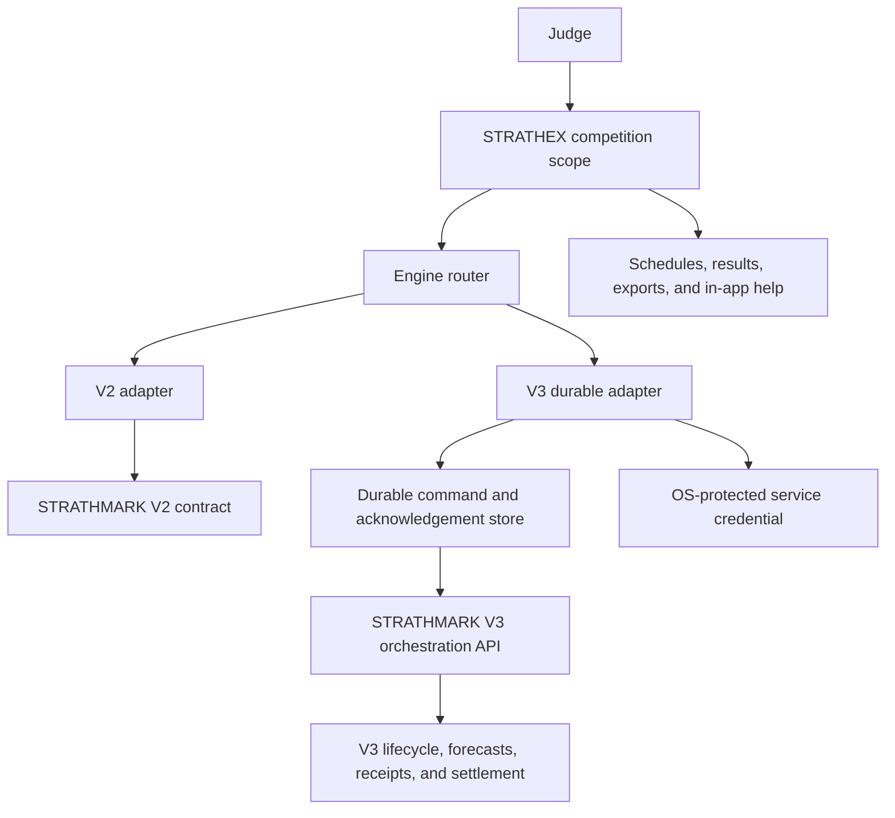
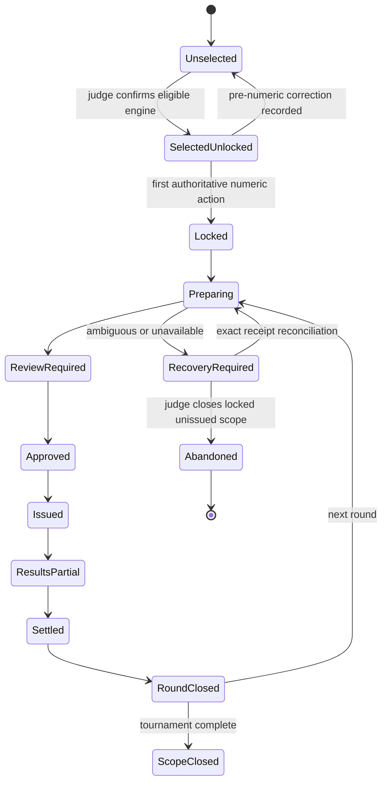
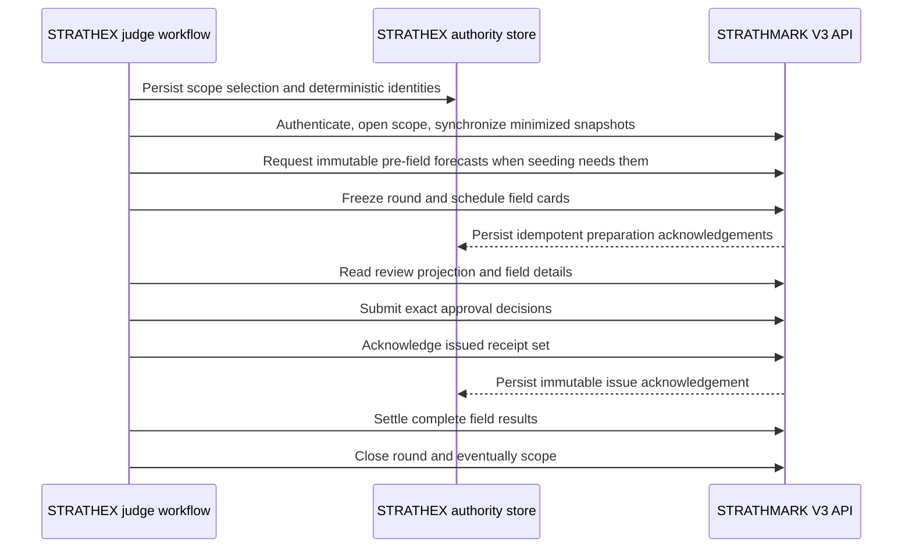
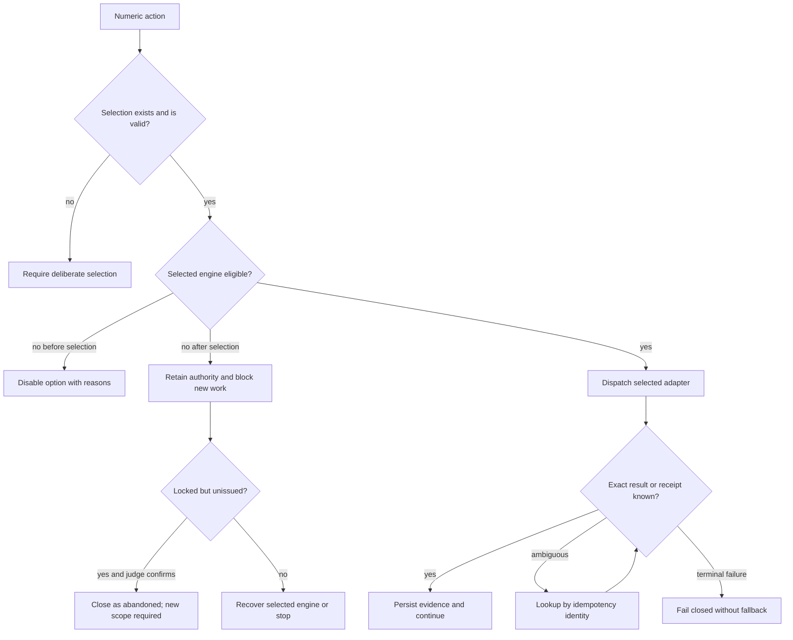

# Competition-Scoped Prediction Engine Selection - Plan

## Goal Capsule

- **Objective:** A judge can deliberately run a single event or an entire tournament with V2 or V3, can always see which engine owns the competition, and cannot accidentally mix engines inside one tournament.
- **Means:** Replace the global V2-to-V3 cutover assumption with competition-scoped single-engine authority, expose the missing supported V3 lifecycle through STRATHMARK, and add an engine-neutral, durable judge workflow to the STRATHEX demo (KTD1-KTD12).
- **Authority:** The judge's scope-level selection in STRATHEX chooses the engine; STRATHMARK owns engine eligibility, calculations, receipts, and V3 lifecycle evidence; issued race results remain authoritative and are never retrospectively re-ranked.
- **Execution profile:** Test-first changes in two repositories. STRATHMARK is the API producer. STRATHEX is the judge-facing consumer and demo.
- **Stop conditions:** Stop rather than issue marks if the selected engine is unavailable, incompatible, ambiguous, or cannot return a complete receipt-bound field. Never invoke the other engine automatically.
- **Tail ownership:** Both repositories' current documentation, wiki sources, release evidence, and STRATHEX in-app help must describe the landed behavior before delivery.

---

## Product Contract

### Summary

Add a deliberate V2/V3 choice to the STRATHEX demo and the supported STRATHMARK interfaces behind it. A single event owns one choice; a tournament owns one choice at its root and every child event and round inherits it.

### Problem Frame

STRATHEX currently has a real V2 consumer and no engine-selection concept. STRATHMARK V3 has extensive internal lifecycle and receipt machinery, but its public consumer API begins after several prerequisites that a real tournament manager cannot currently create. A selector added only to STRATHEX would therefore be cosmetic.

The existing V3 documentation also assumes one global migration that makes V2 audit-only. That assumption conflicts with the approved product behavior: different competition scopes may deliberately use different eligible engines, but one scope must never mix engines. This plan records that pivot without rewriting the historical reasons for either V2 or the original V3 cutover design.

### Actors

- A1. **Judge:** deliberately selects an engine, reviews its readiness and evidence, approves or resolves fields, issues marks, and records results.
- A2. **STRATHEX:** owns competition setup, the human selection, workflow state, durable command recovery, display, and exports.
- A3. **STRATHMARK V2:** supplies the preserved V2 calculation contract.
- A4. **STRATHMARK V3:** supplies eligibility, competition and round lifecycle, component forecasts, field receipts, review projections, issue acknowledgments, and settlement evidence.

### Key Decisions

- **Competition-scoped selection** (session-settled: user-directed — chosen over a global engine switch: judges need real-user comparison without forcing every competition onto one engine). Governs R1-R7, R12-R14.
- **One tournament, one engine** (session-settled: user-directed — chosen over per-event tournament selection: the tournament must remain coherent across heats and finals). Governs R2-R4, R8, R13.
- **The selected engine is authoritative** (session-settled: user-directed — chosen over preview-only V3: the judge is selecting the mechanism that actually creates the marks). Governs R5-R7, R9-R11.
- **No default and no fallback** (session-settled: user-directed — chosen over convenience defaults: selection and any recovery change must remain deliberate and auditable). Governs R1, R6, R10, R15-R17.
- **Both repositories are in scope** (session-settled: user-approved — chosen over STRATHMARK-only API work: the feature must exist in the judge-facing STRATHEX demo as well as the engine service). Governs R18-R25.

### Requirements

**Selection and inheritance**

- R1. A new single-event scope begins with no engine selected and requires the judge to choose V2 or V3 before calculation or prediction-based seeding.
- R2. A new multi-event tournament requires one V2/V3 choice during tournament creation before child events are added.
- R3. Every handicap event, heat, advancing round, bracket prediction, and championship forecast resolves the tournament-root choice; no child event or round may accept an independent override.
- R4. Scratch championship marks remain Mark 3; when forecasts or seeding are used, they come from the selected tournament engine.
- R5. The selected engine creates the authoritative complete-field marks and evidence for that scope; a selector must never relabel another engine's output.
- R6. Neither engine silently invokes the other on failure, timeout, incompatibility, or degraded readiness.
- R7. V2 calculation behavior, byte-compatible projection payloads, historical artifacts, receipts, and rationale remain unchanged. New outer audit records may add the scope selection and requested-versus-returned engine evidence required by R11.

**Lifecycle and auditability**

- R8. The selection persists at the owning scope with engine, scope identity, actor, timestamp, mode, contract/source identity, selection reason, and lock evidence.
- R9. The selection locks at the first authoritative calculation, V3 scope preparation, or prediction-based bracket-seeding request, whichever occurs first.
- R10. Before locking, changing the choice requires explicit confirmation and a reason. After locking, the engine never changes in place: abandoning an unissued scope terminally closes it and preserves its evidence, and any different engine requires a new scope identity. Issued or resulted scopes cannot be abandoned to replace their engine.
- R11. Every calculated, approved, issued, exported, resumed, and settled artifact identifies the requested engine separately from returned engine, model, bundle, calibration, and receipt metadata.
- R12. STRATHMARK exposes a supported typed V3 consumer lifecycle for scope open, data-minimized versioned snapshot synchronization, immutable pre-field forecasts for prediction-based seeding, round freeze and card scheduling, approval reads, round close, and scope close.
- R13. V3 binds the STRATHEX selection identity to the competition and every downstream receipt while enforcing one engine within that scope.
- R14. Separate scopes may use different eligible engines concurrently without weakening storage, identity, or receipt isolation.

**Readiness, recovery, and migration**

- R15. STRATHEX distinguishes V3 production-ready, V3 rehearsal/demo-ready, and unavailable. A non-production V3 scope is permanently and prominently labeled as rehearsal.
- R16. An unavailable option is disabled before selection with an exact operator-readable reason. An already-selected engine that later becomes unavailable retains authority and blocks new numeric work until recovery or explicit abandonment.
- R17. Commands that time out ambiguously enter a judge-visible recovery state and are reconciled by stable idempotency identity or receipt lookup before conflicting work or workflow progression is allowed.
- R18. Legacy scopes without a selection require deliberate migration before new numeric work. Proven V2 history can be bound to V2 after confirmation; absent or inconsistent provenance blocks continuation pending reconciliation.

**Security, compatibility, and learning**

- R19. STRATHEX treats judge actor values as asserted audit metadata under the local single-user OS trust model, never as authentication or authorization. STRATHMARK authority derives only from the credential-bound service principal.
- R20. STRATHEX sends STRATHMARK only pseudonymous stable competitor identifiers and calculation-required sporting facts; display names and unrelated personal data remain in STRATHEX.
- R21. Active scopes pin one exact consumer contract and source identity. An incompatible STRATHMARK upgrade is prohibited while such scopes remain open, and resume fails closed if the pinned contract is not serviceable.
- R22. Each completed scope retains comparison evidence: selected engine and mode, predictions versus settled outcomes, review classifications and interventions, preparation/approval timing, failures and recovery, plus a low-friction optional judge feedback note. Choosing a future default remains a separate human decision after reviewing accumulated evidence.

**Documentation and repository scope**

- R23. STRATHMARK code, tests, API contract, release evidence, current docs, and wiki sources are updated for competition-scoped engine authority without claiming a production V3 cutover.
- R24. STRATHEX demo code, tests, state schema, judge UI, exports, current docs, wiki sources, and in-app help are updated for the complete selection workflow.
- R25. The source-bound cross-repository rehearsal proves both engine choices, tournament inheritance, save/resume, later rounds, unavailable-engine behavior, ambiguous recovery, legacy migration, and no fallback using isolated test data.

### Key Flows

- F1. **New single event**
  - **Actors:** A1, A2, selected A3 or A4.
  - **Steps:** Show no selection; display availability and help; record deliberate choice; lock on first authoritative use; route all later work through it; close with receipt-bound results.
  - **Covered by:** R1, R5-R11, R15-R17.
- F2. **New tournament**
  - **Actors:** A1, A2, selected A3 or A4.
  - **Steps:** Select once during creation; persist at root; inherit across events and rounds; forbid overrides; close the same engine scope after settlement.
  - **Covered by:** R2-R6, R8-R14.
- F3. **Resume or recover**
  - **Actors:** A1, A2, A4 when V3 is selected.
  - **Steps:** Validate persisted authority and pinned compatibility; show readiness or recovery state; reconcile ambiguous commands; retain issued evidence during outages; allow terminal abandonment only for locked unissued scopes.
  - **Covered by:** R8-R11, R16-R18, R21.
- F4. **Legacy migration**
  - **Actors:** A1, A2.
  - **Steps:** Inspect evidence; require explicit V2 binding when provenance proves V2; require a fresh choice only before unstarted numeric work; block inconsistent histories.
  - **Covered by:** R10, R18.
- F5. **Close and compare**
  - **Actors:** A1, A2, selected A3 or A4.
  - **Steps:** Close the settled scope; retain outcome, review, timing, reliability, intervention, and optional judge-feedback evidence; defer any future default-engine decision to human review across completed scopes.
  - **Covered by:** R11, R22, R24-R25.

### Acceptance Examples

- AE1. **Single event selects V3:** Given V3 reports rehearsal readiness, when the judge selects and confirms it, then every mark and later-round prediction comes from V3 and every screen is labeled `V3 REHEARSAL`.
- AE2. **Tournament inherits V2:** Given a tournament selects V2, when five child events and multiple finals are created, then none exposes an engine selector and all numeric calls route to V2.
- AE3. **No fallback:** Given a V3 tournament whose service becomes unavailable, when a field is prepared, then no V2 call occurs and no mark sheet is issued.
- AE4. **Legacy V2 confirmation:** Given a saved tournament with consistent V2 receipts but no selection record, when the judge resumes it, then continued calculation remains blocked until V2 is explicitly confirmed and recorded.
- AE5. **Mixed legacy evidence:** Given a saved scope whose provenance cannot prove one engine, when it loads, then prior records remain readable but new calculations are blocked pending reconciliation.
- AE6. **Lock boundary:** Given an unlocked scope before any numeric action, when the judge changes engines, then the change and reason are recorded. Given a locked but unissued scope, engine replacement requires terminal abandonment and a new scope identity; after issue or results, replacement is rejected.
- AE7. **Ambiguous recovery:** Given a timed-out V3 command, when its outcome is unknown, then the UI disables conflicting actions, shows the stable command identity, and transitions only after exact receipt reconciliation or terminal failure.
- AE8. **Pinned upgrade:** Given an open V3 scope, when an incompatible STRATHMARK contract is offered, then upgrade is blocked and the pinned service remains available until the scope closes or is abandoned.

### Success Criteria

- A judge can determine the selected engine, readiness mode, and lock state from every time-critical screen without opening logs.
- A complete single-event or tournament selection can be made inside the existing sub-ten-minute operating cadence.
- Cross-repository tests prove that requested and returned engine identity cannot diverge and that no failure path calls the unselected engine.
- Current documentation in both repositories names the pivot, the two-repository responsibility split, and the absence of a production V3 cutover.
- Completed scopes produce comparable outcome, review-burden, reliability, timing, and optional judge-feedback evidence without automatically declaring an engine winner.

### Scope Boundaries

**In scope**

- STRATHMARK V3 consumer lifecycle/API, selection binding, scope-level exclusivity, readiness reporting, contract evidence, and documentation.
- STRATHEX demo selection, state authority, engine router, V3 durable integration, judge review/issue/settlement workflow, comparison export, help, and documentation.
- V2 compatibility and full cross-repository rehearsal.

**Outside this delivery**

- Provisioning production CNG keys, service accounts, credentials, OS ACLs, model artifacts, providers, backup infrastructure, or production authorization.
- Enabling a global V3 cutover, making V2 audit-only, deploying to production, or publishing a package/tag.
- Changing handicap winner determination, Mark 3 championship rules, or historical issued results.
- Adding tournament-manager role/RBAC policy inside STRATHMARK.

### Dependencies

- STRATHMARK V3 remains installable in isolated rehearsal mode with exact source-bound contract evidence.
- STRATHEX continues to own official tournament state and judge authority.
- A production-mode V3 option remains disabled until installation-owned readiness evidence exists.

### Sources

- STRATHMARK: `docs/wiki/Handicap-Mark-Math.md`, `ONBOARDING.md`, `docs/PREDICTION_ENGINE_V2.md`, `docs/PREDICTION_ENGINE_V3.md`, `docs/STRATHEX_CONSUMER_MIGRATION.md`, `docs/ARCHITECTURE.md`.
- STRATHMARK historical implementation contract: `docs/plans/2026-08-22-001-feat-adaptive-ensemble-prediction-engine-plan.md`.
- STRATHEX: `docs/CURRENT_RUNTIME_CONTRACT.md`, `docs/ARCHITECTURE.md`, `docs/HANDICAP_SYSTEM_EXPLAINED.md`, `docs/STRATHMARK_2_COMPATIBILITY_EVALUATION.md`, `wiki/Tournament-Workflow.md`, `wiki/Multi-Event-Tournaments.md`, `wiki/Prediction-Methods.md`.

---

## Planning Contract

### Product Contract Preservation

This is a new product contract. It preserves V2 behavior and V3's internal evidence design, but supersedes the prior global-cutover assumption for current multi-engine operation. Historical plans and release records remain unchanged and current documents link to this decision.

### Key Technical Decisions

- KTD1. **Separate scope selection from engine mechanics.** STRATHEX persists one immutable selection receipt at the single-event or tournament root and resolves all numeric work through it. Engine output metadata is evidence, not the requested selector. Implements R1-R8 and R11.
- KTD2. **Route above transport and use authenticated loopback HTTP for V3.** STRATHEX uses an engine-neutral router with independent V2 and V3 adapters. V2 preserves its existing explicit transport modes; V3 uses the authenticated public HTTP contract so timeout ambiguity, process restart, and credential scope are exercised honestly. Transport failure can never become engine fallback. Implements R5-R7, R16-R17, R19, and R21.
- KTD3. **Expose a supported V3 orchestration facade.** STRATHMARK adds typed consumer operations around existing lifecycle, snapshot, rolling-card, approval, issue, settlement, and close authorities instead of exposing raw event-store or internal command access. Implements R12-R14.
- KTD4. **Make exclusivity scope-bound.** STRATHMARK records the selected engine identity on the competition scope and rejects mismatched operations or receipts for that scope while allowing other isolated scopes to select differently. This replaces global mutual exclusion without allowing dual writers for one competition. Implements R3, R6, R13-R14.
- KTD5. **Make the STRATHEX SQLite authority store canonical.** Persist the complete selection and lock receipt, deterministic IDs, idempotency identities, revisions, outbound commands, acknowledgments, and recovery state in SQLite. Workbook/JSON state contains only an immutable scope reference and digest. Commit SQLite before JSON; resume blocks numeric work when a reference is absent, ahead, or mismatched until reconciliation succeeds. Implements R8, R11, R17-R18.
- KTD6. **Separate pre-field forecasts from exact field marks.** Preserve V2's existing all-competitor calculation path. V3 exposes immutable tournament-and-round-bound competitor forecasts for prediction-based seeding, then creates provisional fields, freezes the round, and assembles each exact field because issued marks are field-relative. Pre-field forecasts are never issued marks. Implements R3-R5 and R12.
- KTD7. **Treat readiness mode as evidence.** A V3 selection is enabled only from an exact STRATHMARK eligibility response. Rehearsal execution is allowed in the demo with permanent non-production labeling; no fixture or development receipt can satisfy production readiness. Implements R15-R16 and R23-R25.
- KTD8. **Lock on the first numeric boundary and close on abandonment.** Selection remains correctable only before first authoritative calculation, V3 preparation, or prediction-based seeding. A locked unissued scope may be terminally abandoned with reason and preserved evidence, but its engine never changes; a different engine requires a new scope identity. Issued or resulted scopes are immutable. Implements R9-R10 and R18.
- KTD9. **Pass an immutable execution context through every numeric caller.** STRATHEX mints one opaque root scope ID and carries scope, selection, lock, mode, contract, and authority-store identities through the router. Namespaced tournament, round, field, competitor, and command IDs derive from that root plus stable local entity IDs and revisions. Implements R3, R8-R11, R17-R18.
- KTD10. **Retain pinned contracts until scopes close.** The local V3 deployment refuses an incompatible upgrade while open scopes pin the current consumer contract and source identity. Resume validates compatibility before any new command; rollback keeps the pinned serviceable version rather than translating active receipts. Implements R11, R16, and R21.
- KTD11. **Keep identity and secrets at their proper trust boundaries.** STRATHEX actor fields are display/audit assertions only. V3 credentials come from an external or OS-protected secret provider and never enter state, ledgers, receipts, logs, or exports. Snapshot schemas accept pseudonymous IDs and required sporting facts only. Implements R19-R20.
- KTD12. **Retain evidence for later human comparison.** Scope close produces a comparison record over accuracy, review burden, timing, reliability, interventions, and optional judge notes. It does not automatically select a future default. Implements R22 and R24-R25.

### High-Level Technical Design

**Repository and authority topology**

**Competition lifecycle**

**V3 round sequence**

**Dispatch and failure flow**

### System-Wide Impact

- **Data lifecycle:** STRATHEX gains a scope-level authority record and durable command ledger; STRATHMARK receipts gain selection binding. Migration must not rewrite issued history.
- **API contract:** STRATHMARK's frozen V3 consumer contract and checksum change. The exact STRATHEX pin and compatibility evidence must change with it.
- **Operator workflow:** The setup path gains one deliberate decision and all time-critical screens gain a compact engine banner and direct help.
- **Scheduling:** V3 requires provisional exact field identities before field-relative marks are assembled; V2 retains its current ordering.
- **Recovery:** Restart behavior becomes receipt-aware for V3 and must distinguish terminal failure from ambiguous outcome.
- **Compatibility:** An installed V3 contract cannot be replaced incompatibly while a saved or open scope pins it.
- **Security:** Loopback HTTP uses a credential-derived service principal; actor labels and competitor display identities never cross that authority boundary.
- **Learning:** Closed-scope comparison records retain accuracy, review burden, timing, reliability, interventions, and optional judge notes for a later human engine decision.
- **Documentation:** Current docs and wikis in both repositories must replace sole-V2 or global-cutover statements while preserving historical release documents.

### Risks and Mitigations

| Risk | Mitigation |
|---|---|
| Cosmetic V3 selector produces V2 output | Contract-test requested/returned identity and require V3 lifecycle receipts before marks can issue |
| Tournament events drift to different engines | Store selection only at the tournament root and reject child overrides during validation and routing |
| V3 field-relative math is applied before fields exist | Split V3 preparation into provisional field construction followed by exact field assembly |
| Crash or timeout duplicates an approval, issue, or settlement | Use durable idempotency identities, immutable acknowledgments, and receipt lookup before retry |
| JSON and SQLite disagree after crash, restore, or copied save | Treat SQLite as canonical, reference it by immutable digest from JSON, and block on resume until reconciliation |
| Rehearsal V3 is mistaken for production | Permanent scope banner, exported mode evidence, and production option gated by installation-owned readiness |
| Service credential or personal data leaks through state or exports | Use an OS-protected secret reference, redact every persistence/logging surface, and send only pseudonymous calculation facts |
| Existing global cutover tests/docs conflict | Replace only current authority rules, add scope-isolation tests, and preserve dated historical evidence |
| Legacy saves silently acquire an engine | Require explicit migration confirmation and block inconsistent provenance |
| Active tournament is stranded by an incompatible update | Refuse the update while scopes pin the old contract and verify compatibility at resume |
| V3 seeding needs forecasts before exact fields exist | Expose a pre-field forecast receipt distinct from field-relative issued marks |
| Judge workflow exceeds the heat cadence | Preflight readiness during setup, precompute V3 cards, use exception-first review, and keep the engine banner compact |

### Sequencing

STRATHMARK contract and lifecycle work precedes the V3 STRATHEX adapter. STRATHEX state and V2 routing can proceed against the frozen selection abstraction, but V3 issuance cannot be declared complete until the exact regenerated STRATHMARK contract is pinned and the cross-repository rehearsal passes.

---

## Implementation Units

### U1. Replace global engine cutover with competition-scoped authority

- **Goal:** Establish the normative engine-selection and scope-exclusivity contract in STRATHMARK before extending APIs.
- **Requirements:** R3, R6-R8, R13-R15, R23.
- **Dependencies:** None.
- **Files:** STRATHMARK: `strathmark/v3/contracts/events.py`, `strathmark/v3/contracts/statuses.py`, `strathmark/v3/application/lifecycle.py`, `tests/v3/unit/test_event_contracts.py`, `tests/v3/system/test_v2_v3_cutover.py`, `docs/PREDICTION_ENGINE_V3.md`, `docs/STRATHEX_CONSUMER_MIGRATION.md`, `docs/solutions/architecture-decisions/competition-scoped-engine-authority.md`.
- **Approach:** Add an immutable competition engine-selection fact and make V3 lifecycle authority validate it. Recast current global cutover code as production installation eligibility rather than the selector for all scopes. Preserve old manifests and historical documents.
- **Execution note:** Add failing scope-isolation and mismatch tests before changing authority guards.
- **Patterns to follow:** Immutable event contracts and lifecycle transitions in `strathmark/v3/contracts/events.py` and `strathmark/v3/application/lifecycle.py`.
- **Test scenarios:**
  - Opening a V3 scope with a valid V3 selection binds actor, mode, contract, and source evidence.
  - Repeating the identical open command returns the same authority; changing the selection conflicts.
  - A V2-selected scope rejects V3 lifecycle commands.
  - Two distinct scopes can select different engines without sharing identity, storage rows, or receipts.
  - Existing V2 and historical V3 cutover evidence remains verifiable.
- **Verification:** Scope authority is immutable per competition, cross-scope selection is allowed, and no legacy receipt changes.

### U2. Expose the supported STRATHMARK V3 competition lifecycle

- **Goal:** Let a real STRATHEX consumer create and operate the V3 state currently manufactured only by internal tests.
- **Requirements:** R12-R17, R19-R21, R23, R25.
- **Dependencies:** U1.
- **Files:** STRATHMARK: `strathmark/v3/application/gateway.py`, `strathmark/v3/application/lifecycle.py`, `strathmark/v3/application/approval.py`, `strathmark/v3/application/operations.py`, `strathmark/v3/application/coordinator.py`, `strathmark/v3/application/pipeline_builder.py`, `strathmark/v3/api/router.py`, `strathmark/v3/api/schemas.py`, `strathmark/v3/consumer_contract.py`, `strathmark/v3/contracts/v3_consumer.openapi.json`, `strathmark/v3/contracts/v3_consumer.openapi.sha256`, `tests/v3/integration/test_v3_api.py`, `tests/v3/integration/test_v3_runtime_gateway.py`, `tests/v3/integration/test_v3_consumer_contract.py`, `tests/v3/integration/test_approval_projection.py`, `tests/v3/integration/test_rolling_card_scheduling.py`.
- **Approach:** Add typed operations for scope open, data-minimized versioned snapshot synchronization, immutable pre-field forecasts, round preparation and card scheduling, approval page/detail reads, round close, and scope close. Compose existing authorities; do not expose raw event-store writes or internal command enums. Authenticate every trusted operation with the credential-derived service principal; actor labels never affect authorization.
- **Execution note:** Start with failing API and OpenAPI contract tests, then extend the application gateway behind them.
- **Patterns to follow:** Existing authenticated/idempotent routes in `strathmark/v3/api/router.py` and transactional gateway behavior in `strathmark/v3/application/gateway.py`.
- **Test scenarios:**
  - A complete valid snapshot opens a scope, freezes a round, schedules cards, and returns stable identities.
  - A pre-field forecast returns immutable competitor evidence for seeding without creating or masquerading as issued marks.
  - Snapshot schemas reject display names, unrelated personal data, and unknown identity fields while accepting pseudonymous IDs and required sporting facts.
  - Exact retry returns the original acknowledgment; changed payload with the same idempotency identity conflicts.
  - Stale tournament, round, field, or competitor revisions are rejected without partial writes.
  - Approval page and detail reads bind the same immutable projection identity used by batch decisions.
  - Round close rejects unsettled fields; scope close rejects open rounds.
  - Authentication, namespace isolation, timeout, restart, and ambiguous receipt lookup preserve exact authority.
- **Verification:** A public consumer can complete the lifecycle without direct database access or test-only fixture setup.

### U3. Bind selection and readiness to V3 evidence and regenerate release artifacts

- **Goal:** Make engine mode and eligibility auditable on every V3 receipt without manufacturing production readiness.
- **Requirements:** R8, R11, R13-R16, R21, R23, R25.
- **Dependencies:** U1, U2.
- **Files:** STRATHMARK: `strathmark/v3/composition.py`, `strathmark/v3/contracts/receipts.py`, `strathmark/v3/application/operations.py`, `strathmark/v3/api/schemas.py`, `tests/v3/unit/test_receipt_contracts.py`, `tests/v3/integration/test_v3_consumer_contract.py`, `tests/v3/system/test_release_verifier.py`, `tests/v3/system/test_documented_examples.py`, `benchmarks/v3/release_evidence/`, `docs/DEPLOYMENT.md`, `README.md`, `ONBOARDING.md`, `docs/ARCHITECTURE.md`.
- **Approach:** Extend canonical receipts and readiness output with scope selection and execution mode. Add an active-scope compatibility guard that refuses an incompatible contract/source upgrade until pinned scopes close or are terminally abandoned. Regenerate the frozen contract, source-bound rehearsal evidence, and verifier inputs only after source changes stabilize. Normal verification must pass; production mode must continue rejecting absent production prerequisites.
- **Execution note:** Treat generated evidence as exact outputs, not hand-edited fixtures; use only isolated test and rehearsal paths.
- **Patterns to follow:** Current canonical receipt digests and `scripts/verify_v3_release.py` evidence binding.
- **Test scenarios:**
  - Every preparation, approval, issue, settlement, and close receipt names the same scope selection.
  - A receipt with mismatched engine, mode, contract, or source identity is rejected.
  - Rehearsal readiness enables only a rehearsal-labeled option.
  - Production readiness remains false without installation-owned identity and artifacts.
  - Contract checksum and release verifier detect stale generated evidence.
  - An incompatible update is refused while a scope pins the old contract, and resume succeeds against the retained compatible service.
- **Verification:** Exact regenerated evidence verifies in normal mode and intentionally fails the production gate for the documented missing prerequisites.

### U4. Add STRATHEX engine-selection state and migration rules

- **Goal:** Persist one deliberate, validated selection at the correct competition root and preserve it across every save/resume path.
- **Requirements:** R1-R4, R8-R10, R18, R21, R24-R25.
- **Dependencies:** U1 for the frozen selection vocabulary; implementation may begin from the plan contract.
- **Files:** STRATHEX: `MainProgramV5_2.py`, `woodchopping/ui/multi_event_ui.py`, `woodchopping/ui/state_persistence.py`, `woodchopping/ui/prediction_context.py`, `tests/test_prediction_context_state.py`, `tests/test_atomic_state_persistence.py`, `tests/test_tournament_replay.py`.
- **Approach:** STRATHEX mints and persists one opaque root scope ID at creation. SQLite owns the validated selection, lock, identity derivation, and migration receipt; single-event and tournament JSON store only its stable reference and digest, with child events resolving the tournament root. SQLite commits before JSON, and resume blocks on missing/ahead/mismatched references until reconciliation. Add explicit legacy states and identity-migration receipts rather than inserting defaults.
- **Execution note:** Write failing round-trip, inheritance, invalid-override, and legacy-provenance tests before modifying serializers.
- **Patterns to follow:** Atomic state validation and rollback behavior in `woodchopping/ui/state_persistence.py`.
- **Test scenarios:**
  - New single-event and tournament states reject numeric work while unselected.
  - Valid V2 and V3 selections survive atomic save/load with actor, time, reason, mode, contract, and lock data.
  - A child event override is rejected during mutation and deserialization.
  - A legacy unstarted scope requires a fresh choice.
  - Proven legacy V2 calculations require explicit V2 confirmation; inconsistent provenance becomes read-only/reconciliation-required.
  - A failed save leaves the prior valid authority state intact.
  - A crash between SQLite and JSON commits, a restored backup, and a copied save each block numeric work until the reference is reconciled to canonical authority.
  - Namespaced tournament, round, field, competitor, and command IDs remain stable across save/reload and revision changes produce new deterministic identities.
- **Verification:** Every state entry point resolves exactly one selection or a named blocking migration state.

### U5. Implement the STRATHEX engine router and durable V3 adapter

- **Goal:** Route every numeric operation to the selected engine and provide crash-safe V3 command/acknowledgment handling.
- **Requirements:** R3-R8, R11-R17, R19-R21, R24-R25.
- **Dependencies:** U2-U4.
- **Files:** STRATHEX: `woodchopping/strathmark_adapter.py`, `woodchopping/handicaps/calculator.py`, `woodchopping/engine_selection.py`, `woodchopping/v3_authority_store.py`, `woodchopping/ui/handicap_ui.py`, `woodchopping/ui/multi_event_ui.py`, `woodchopping/ui/tournament_ui.py`, `woodchopping/ui/bracket_ui.py`, `woodchopping/ui/championship_simulator.py`, `MainProgramV5_2.py`, `tests/test_strathmark_v2_integration.py`, `tests/test_strathmark_v3_integration.py`, `tests/test_engine_selection_routing.py`, `tests/test_tournament_replay.py`, `tests/test_bracket_release_workflows.py`.
- **Approach:** Put an engine router above separate V2 and V3 adapters and require one immutable execution context containing scope, selection, lock, mode, contract, and authority-store identities at every numeric call. Preserve V2 response semantics. The V3 adapter uses authenticated loopback HTTP, deterministic IDs, an OS-protected secret reference, and the canonical SQLite command ledger for exact retry, lookup, acknowledgment, and restart recovery. Use pre-field forecasts for prediction-based seeding, then prepare exact fields before field-relative marks are assembled.
- **Execution note:** Characterize V2 calls first, then add failing no-fallback and V3 restart tests before implementing routing.
- **Patterns to follow:** Existing V2 boundary validation in `woodchopping/strathmark_adapter.py` and state rollback tests.
- **Test scenarios:**
  - V2-selected work produces byte-compatible V2 projections and never calls V3.
  - V3-selected work opens and prepares exact fields and never calls V2.
  - Requested/returned engine mismatch aborts the entire field.
  - V3 timeout reconciles by idempotency or receipt identity after restart without duplicate issue or settlement.
  - Credentials are injected through the secret provider and never appear in workbook, JSON, SQLite, receipts, logs, errors, or exports; rotation and revocation fail closed.
  - Partial field response, stale revision, unavailable service, and terminal error issue no marks and do not invoke fallback.
  - Later rounds inherit the original scope, accept only prior-round settled evidence, and preserve same-round isolation.
  - Championship marks remain 3 while selected-engine forecasts drive only supported predictions or seeding.
- **Verification:** All numeric call sites resolve through the router, V2 is unchanged, and the V3 adapter survives a simulated crash at each durable command boundary.

### U6. Add the judge-facing selector, status, review, and help workflow

- **Goal:** Make engine choice and V3 exception handling fast, deliberate, and understandable in the STRATHEX demo.
- **Requirements:** R1-R6, R9-R11, R15-R19, R22, R24-R25.
- **Dependencies:** U4, U5.
- **Files:** STRATHEX: `MainProgramV5_2.py`, `woodchopping/ui/multi_event_ui.py`, `woodchopping/ui/prediction_display.py`, `woodchopping/ui/schedule_printout.py`, `woodchopping/ui/engine_comparison.py`, `explanation_system_functions.py`, `tests/test_strathmark_v2_ui_paths.py`, `tests/test_prediction_engine_selector_ui.py`, `tests/test_engine_comparison_report.py`, `tests/test_bracket_release_workflows.py`.
- **Approach:** Add a no-default selector to single-event setup and tournament creation only, with a required low-friction reason code and optional note. Its readiness state model covers checking, production-ready, rehearsal-ready, ineligible, status-check-failed, and retry. Show permanent rehearsal labeling, selected engine, lock state, and returned evidence on calculation, review, issue, results, resume, and export surfaces. Add explicit judge-visible flows for ambiguous-command recovery, legacy migration, and terminal abandonment of locked unissued scopes. Extend exception-first review so mass approval remains fast and flagged fields remain individually actionable.
- **Execution note:** Drive changes with input/output tests, including invalid keys, help, cancellation, unavailable options, and the under-ten-minute happy path.
- **Patterns to follow:** Existing wood-species selection flow, prediction display, and in-app explanation menu.
- **Test scenarios:**
  - Pressing Enter or invalid input cannot select an engine; help returns to the choice without mutation; initial selection and pre-lock correction record a reason code and optional note.
  - V3 unavailable is disabled with operator-readable reasons; rehearsal readiness shows permanent non-production labeling.
  - Tournament child-event setup never displays an engine selector.
  - Every operational screen and export shows requested engine separately from returned engine/model evidence.
  - A pre-numeric unlocked correction records the new choice and reason; it cannot coexist with calculated marks or other numeric evidence.
  - A locked unissued scope can be terminally abandoned with confirmation and reason, preserves all evidence, and requires a new scope before choosing another engine.
  - RecoveryRequired identifies the affected command, disables conflicting actions, and resolves to exact success or terminal failure without fallback.
  - Legacy resume shows provenance, permits V2 confirmation only when proven, permits a fresh choice only before numeric work, and keeps inconsistent history read-only.
  - Readiness checking, status-fetch failure, and retry cannot preselect or mutate the engine.
  - Green/amber fields support compact batch review while red fields require individual disposition.
  - Closing a scope produces a comparison record with predictions versus outcomes, review actions, timing, failures/recovery, and optional judge feedback without choosing a winner.
- **Verification:** A judge can select, verify, operate, resume, and explain the engine without leaving the application or inspecting logs.

### U7. Reconcile documentation and record the authority pivot in both repositories

- **Goal:** Make every current source describe competition-scoped selection and preserve historical evidence without contradiction.
- **Requirements:** R7, R15, R18-R25.
- **Dependencies:** U1-U6.
- **Files:** STRATHMARK: `README.md`, `ONBOARDING.md`, `docs/PREDICTION_ENGINE_V3.md`, `docs/ARCHITECTURE.md`, `docs/DEPLOYMENT.md`, `docs/STRATHEX_CONSUMER_MIGRATION.md`, `docs/wiki/Choosing-the-Prediction-Engine.md`; STRATHEX: `README.md`, `docs/CURRENT_RUNTIME_CONTRACT.md`, `docs/ARCHITECTURE.md`, `docs/HANDICAP_SYSTEM_EXPLAINED.md`, `docs/PROJECT_STRUCTURE.md`, `docs/SYSTEM_STATUS.md`, `docs/INDEX.md`, `docs/solutions/architecture-decisions/competition-scoped-prediction-engine.md`, `wiki/Choosing-the-Prediction-Engine.md`, `wiki/Home.md`, `wiki/Quick-Start.md`, `wiki/Tournament-Workflow.md`, `wiki/Multi-Event-Tournaments.md`, `wiki/Prediction-Methods.md`, `wiki/FAQ.md`, `wiki/Troubleshooting.md`, `wiki/Architecture.md`, `wiki/Data-Model.md`, `wiki/Bracket-Tournaments.md`, `wiki/Championship-Simulator.md`, `wiki/_Sidebar.md`.
- **Approach:** State why global cutover no longer matches the evaluation workflow, define repository responsibilities, explain selection/inheritance/locking/readiness/no-fallback behavior, and link historical V2/V3 artifacts rather than rewriting them. Keep in-app help synchronized with the wiki.
- **Test scenarios:**
  - Documentation tests find the two-repository scope, single-event versus tournament behavior, lock rules, readiness modes, and no-fallback rule.
  - Current docs contain no claim that selecting V3 globally makes V2 audit-only.
  - Historical release and plan documents remain byte-unchanged and are labeled historical from current navigation.
  - In-app help and wiki terminology agree with persisted state and visible UI labels.
- **Verification:** A documentation scrub finds no active contradiction and a new agent can identify both repositories and their authority boundaries from onboarding material.

### U8. Prove the integrated V2/V3 competition workflows

- **Goal:** Demonstrate that the exact pinned repositories implement the full selection contract under realistic race-day and recovery conditions.
- **Requirements:** R1-R25.
- **Dependencies:** U1-U7.
- **Files:** STRATHMARK: `tests/v3/system/test_installed_wheel_v3.py`, `tests/v3/system/test_release_verifier.py`, `benchmarks/v3/release_evidence/`; STRATHEX: `pyproject.toml`, `tests/test_strathmark_integration.py`, `tests/test_strathmark_v3_integration.py`, `tests/test_tournament_replay.py`, `tests/test_versioning.py`, `docs/STRATHMARK_ENGINE_COMPATIBILITY_EVALUATION.md`.
- **Approach:** Pin STRATHEX to the exact STRATHMARK source and frozen contract. Start the authenticated loopback V3 rehearsal service with an ephemeral development credential supplied outside persisted state. Run isolated V2 and V3 single events and tournaments, then exercise save/resume, later rounds, outage, ambiguous response, process restart, legacy migration, abandoned-scope recreation, and blocked incompatible upgrade. Record rehearsal and comparison evidence without claiming production qualification.
- **Execution note:** Use disposable databases, test workbooks, and explicit test environment variables before importing either application.
- **Test scenarios:**
  - End-to-end V2 single event and tournament preserve current results and evidence.
  - End-to-end V3 rehearsal single event and tournament complete scope open through settlement and close.
  - Five-event tournament inheritance survives save/reload and every later round.
  - Service loss and ambiguous response recover without duplicate or fallback.
  - Legacy V2 and inconsistent legacy states follow their distinct migration paths.
  - Exact pin or contract mismatch fails before numeric work.
  - Normal STRATHMARK release verification passes while production-mode verification intentionally rejects absent prerequisites.
- **Verification:** Both repositories' focused and full portable suites pass; the isolated consumer rehearsal is source-bound to exact commits and the production cutover remains disabled.

---

## Verification Contract

All tests must use explicit disposable paths. Set `STRATHMARK_TEST_DB=1`, a temporary `STRATHMARK_DB_PATH`, a separate temporary `STRATHMARK_V3_DB_PATH`, and pytest `--basetemp` before importing STRATHMARK. STRATHEX tests must use temporary workbook/state and authority-store paths.

| Gate | Repository | Coverage | Done signal |
|---|---|---|---|
| Contract and authority | STRATHMARK | Selection facts, scope isolation, lifecycle API, OpenAPI freeze, receipt binding | Focused unit and integration suites pass with no production database access |
| V3 system and release | STRATHMARK | Installed wheel, documented examples, source-bound evidence, normal/production verifier modes | Normal verifier passes; production mode rejects only documented unprovisioned prerequisites |
| Selection and persistence | STRATHEX | No-default selection, root inheritance, locking, migration, atomic save/load | Focused state and UI suites pass using disposable files |
| Routing and durability | STRATHEX | V2 compatibility, V3 exact lifecycle, no fallback, idempotency, restart | Adapter and recovery suites pass with forced timeout/crash cases |
| Trust boundaries | Both | Credential redaction, credential-derived authority, asserted actor metadata, pseudonymous snapshot ingress | Security-focused tests prove secrets and display identities never cross prohibited persistence/export boundaries |
| Compatibility | Both | Pinned contract retention, blocked incompatible upgrade, exact resume | Active scopes continue on their pinned contract and mismatches fail before commands |
| Full integration | Both | Single event, tournament, later rounds, championship, bracket, export, resume | Exact pinned cross-repository rehearsal completes for V2 and V3 |
| Learning evidence | STRATHEX | Accuracy, review burden, timing, reliability, interventions, optional judge note | Every closed scope produces a comparable record without automatic engine selection |
| Documentation | Both | Current docs, wiki, in-app help, historical preservation | Documentation checks pass and active-source search finds no contradictory authority claim |
| Regression | Both | Complete portable suites, lint, format, packaging | All required CI checks are green on unchanged candidate trees |

---

## Definition of Done

- The STRATHEX demo requires a deliberate engine choice for new scopes and never presents an event-level selector inside a tournament.
- The selection is visible, persisted, locked, inherited, exported, and auditable according to R1-R18.
- STRATHMARK exposes the complete supported V3 consumer lifecycle and binds selection identity to every receipt.
- V2 remains behavior-compatible and available for separately selected scopes.
- No error, timeout, incompatibility, or degraded path invokes the unselected engine.
- V3 rehearsal is clearly labeled; V3 production mode remains unavailable until real installation evidence exists.
- Legacy state migration is deliberate and never rewrites issued or completed history.
- Locked-scope abandonment terminally preserves the old scope and requires a newly identified scope for a different engine.
- Authenticated loopback HTTP is the V3 consumer boundary; secrets are externally supplied and personal display data remains in STRATHEX.
- Incompatible STRATHMARK upgrades cannot strand open scopes because the pinned contract stays serviceable until close or abandonment.
- Closed scopes retain comparable operational and outcome evidence for a later human V2/V3 decision.
- Exact cross-repository V2 and V3 rehearsals pass with isolated data and source-bound evidence.
- Current code, README, onboarding, architecture, deployment, wiki, in-app help, and compatibility documents agree in both repositories.
- Historical plans, releases, receipts, and evidence remain preserved.
- All abandoned experiments, temporary source changes, stale generated artifacts, and dead code created during implementation are removed before review.
- Both feature branches are reviewed and ready for independent PRs; neither merge enables a global V3 production cutover or publishes a package/tag.
